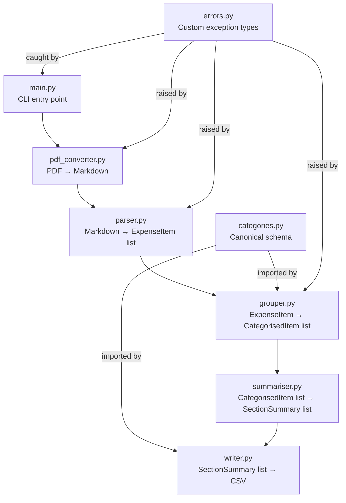
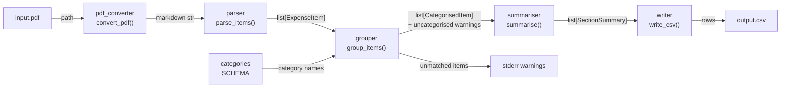
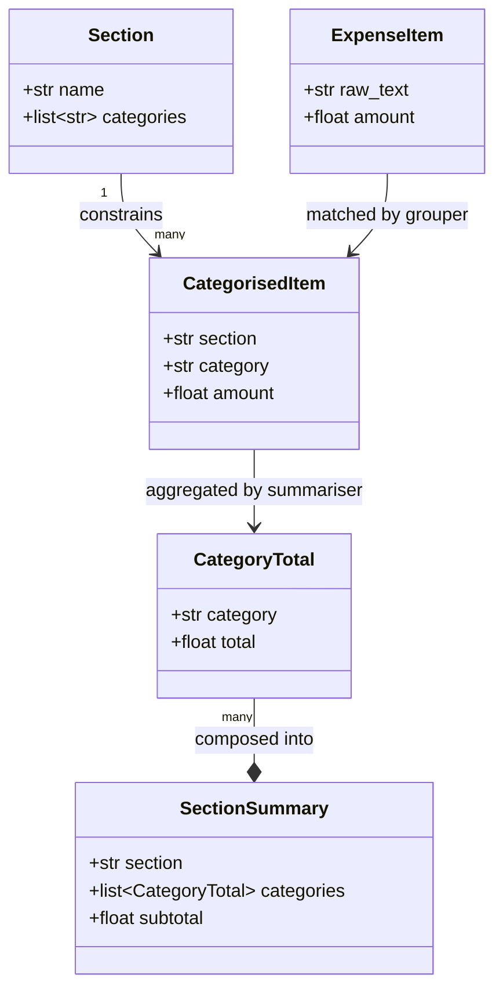
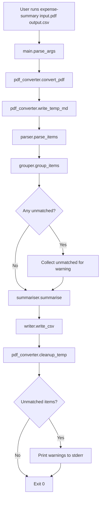
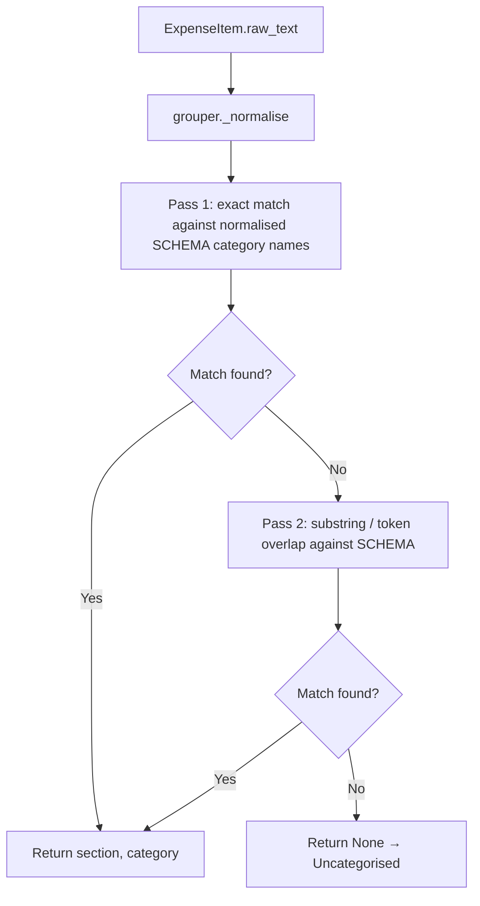
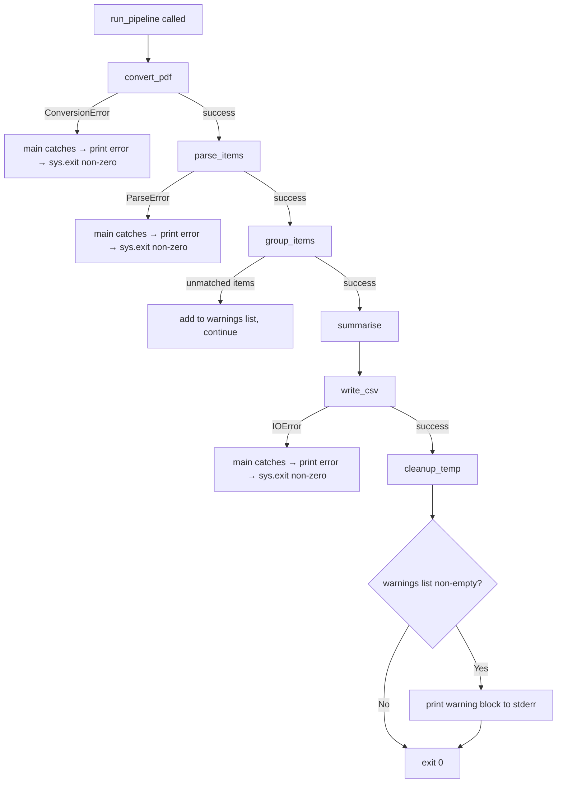

# Design Document — expense-summary

## Overview

`expense-summary` is a single-file-in, single-file-out CLI pipeline. It accepts a PDF personal expense report, converts it to Markdown, extracts raw line items, maps each item to a fixed canonical category schema, computes totals at three levels (category, section, grand total), and writes a structured three-column CSV.

The design is intentionally linear: each stage is a pure function that accepts the previous stage's output. There is no shared state between stages and no I/O except at the two ends (PDF in, CSV out) and in the temporary Markdown file. All category knowledge lives in one module (`categories.py`) and all matching logic lives in one function (`grouper.py`).

---

## Architecture Design

### System Architecture Diagram



### Data Flow Diagram



---

## Component Design

### `main.py` — CLI entry point

- **Responsibilities:** Parse two positional CLI arguments (`input_pdf`, `output_csv`). Call `run_pipeline()`. Catch all custom exceptions and print human-readable messages to stderr. Call `sys.exit()` with appropriate codes. Never contain business logic.
- **Interfaces:**
  ```python
  def main() -> None: ...
  def run_pipeline(input_path: str, output_path: str) -> None: ...
  ```
- **Dependencies:** `argparse`, `sys`, `pdf_converter`, `parser`, `grouper`, `summariser`, `writer`, `errors`

---

### `pdf_converter.py` — PDF → Markdown

- **Responsibilities:** Accept a PDF file path. Extract all text and numeric content using `pdfplumber`. Format the result as a plain Markdown string (one line per detected row). Fall back to `pdfminer.six` if `pdfplumber` yields no usable text. Write the Markdown to a temp file and return its path. Clean up the temp file when called to do so.
- **Interfaces:**
  ```python
  def convert_pdf(pdf_path: str) -> str:
      """Convert PDF to Markdown string. Raises ConversionError on failure."""

  def write_temp_md(content: str) -> str:
      """Write content to a temp file. Returns the temp file path."""

  def cleanup_temp(path: str) -> None:
      """Delete the temp file. Silent if already gone."""
  ```
- **Dependencies:** `pdfplumber`, `pdfminer.six` (fallback), `tempfile`, `os`, `errors`
- **Design decision:** `pdfplumber` is preferred because it handles tabular layouts better, which is common in expense reports. The fallback is documented in a code comment and only triggered if `pdfplumber` returns an empty or whitespace-only string.

---

### `parser.py` — Markdown → `ExpenseItem` list

- **Responsibilities:** Accept the Markdown string. Scan each line for a numeric amount (using a regex pattern that strips `£`, `$`, commas, and spaces before the number). Capture the remainder of the line as `raw_text`. Return a list of `ExpenseItem` objects. Raise `ParseError` if the list is empty.
- **Interfaces:**
  ```python
  def parse_items(markdown: str) -> list[ExpenseItem]:
      """Parse Markdown into ExpenseItem list. Raises ParseError if none found."""

  def parse_amount(text: str) -> float | None:
      """Extract a float from a string, or return None if not parseable."""
  ```
- **Dependencies:** `re`, `dataclasses`, `errors`
- **Design decision:** The regex matches a currency-symbol-prefixed or bare decimal number at any position in the line, not just the end. This is more robust against varied PDF layouts where the amount may appear mid-line.

---

### `categories.py` — Canonical schema

- **Responsibilities:** Declare the complete, ordered list of sections and their categories as Python data structures. Export `SCHEMA`, `INCOME_SECTIONS`, and `OUTFLOW_SECTIONS` constants. Be the single source of truth — no other module defines or duplicates category strings.
- **Interfaces:**
  ```python
  @dataclass
  class Section:
      name: str
      categories: list[str]

  SCHEMA: list[Section] = [...]          # full ordered schema
  INCOME_SECTIONS: list[str] = [...]     # section names that count toward Total Income
  OUTFLOW_SECTIONS: list[str] = [...]    # section names that count toward Total Expenditure
  ```
- **Dependencies:** `dataclasses` only
- **Design decision:** A simple dataclass list is sufficient. No need for enums or a config file — the schema is fixed and small enough to live in source.

---

### `grouper.py` — Category matching

- **Responsibilities:** Accept a list of `ExpenseItem`. For each item, attempt to match `raw_text` to a canonical category via two passes (exact normalised match, then substring/token overlap). Return a list of `CategorisedItem`. Items with no match are assigned section `"Uncategorised"`, category `"Uncategorised"`, and collected for warning output. Never raise an exception for unmatched items.
- **Interfaces:**
  ```python
  def group_items(items: list[ExpenseItem]) -> tuple[list[CategorisedItem], list[ExpenseItem]]:
      """
      Returns (categorised_items, unmatched_items).
      unmatched_items are those that could not be assigned to any known category.
      """

  def match_category(item_text: str) -> tuple[str, str] | None:
      """
      Two-pass match against SCHEMA.
      Returns (section_name, category_name) or None.
      item_text is the raw description from the PDF — no explicit labels.
      """

  def _normalise(text: str) -> str:
      """Lowercase, collapse whitespace, strip punctuation."""
  ```
- **Dependencies:** `categories`, `dataclasses`, `errors`
- **Design decision:** Two-pass matching (exact → substring) is kept in plain Python deliberately — no `rapidfuzz` or similar library. This keeps dependencies minimal and matching logic transparent and testable. The normalisation helper is private and tested independently.

---

### `summariser.py` — Totals computation

- **Responsibilities:** Accept a list of `CategorisedItem`. Group by `(section, category)` and sum amounts. Build a `SectionSummary` for each section in `SCHEMA` order (including sections with zero items). Compute section subtotals. Compute `Total Income` and `Total Expenditure` grand totals.
- **Interfaces:**
  ```python
  def summarise(items: list[CategorisedItem]) -> list[SectionSummary]:
      """
      Returns SectionSummary list in SCHEMA order.
      Sections with no matched items are included with zero totals.
      """
  ```
- **Dependencies:** `categories`, `dataclasses`
- **Design decision:** Iterating `SCHEMA` to build summaries (rather than iterating `items`) guarantees canonical order and ensures zero-value categories are always present in the output.

---

### `writer.py` — CSV output

- **Responsibilities:** Accept a list of `SectionSummary` and an output path. Write a CSV with columns `section`, `category`, `total_amount`. For each section: write one row per category, then one subtotal row. After all outflow sections, write the `Total Expenditure` row. After all inflow sections, write the `Total Income` row. Format all amounts to 2 decimal places.
- **Interfaces:**
  ```python
  def write_csv(summaries: list[SectionSummary], output_path: str) -> None:
      """Write CSV to output_path. Raises IOError if path is not writable."""
  ```
- **Dependencies:** `csv` (stdlib), `categories`

---

### `errors.py` — Exception types

- **Responsibilities:** Define the three custom exception classes used across the pipeline.
- **Interfaces:**
  ```python
  class ConversionError(Exception): pass
  class ParseError(Exception): pass
  class GroupingError(Exception): pass
  ```
- **Dependencies:** None

---

## Data Model

### Core data structure definitions

```python
# categories.py
@dataclass
class Section:
    name: str
    categories: list[str]

SCHEMA: list[Section] = [
    Section("Regular Inflows",    ["Salary"]),
    Section("Irregular Inflows",  ["Carry Over", "Unexpected / Refund", "Loan"]),
    Section("Asset Liquidation",  ["Savings", "Stocks & Shares"]),
    Section("Regular Outflows",   ["Rent", "Bill - Council Tax", "Bill - Electricity & Gas",
                                   "Bill - Phone & Internet", "Food Supplies", "Debt", "Car & Gas"]),
    Section("Irregular Outflows", ["Charity / Donations", "Gifts, Entertainment & Misc",
                                   "Sundry", "Holidays & Travel", "Education", "Eating Out"]),
    Section("Assets",             ["Active Savings", "Lifetime ISA",
                                   "Stocks & Shares ISA", "Dividend Portfolio"]),
]
INCOME_SECTIONS  = ["Regular Inflows", "Irregular Inflows", "Asset Liquidation"]
OUTFLOW_SECTIONS = ["Regular Outflows", "Irregular Outflows", "Assets"]

# parser.py
@dataclass
class ExpenseItem:
    raw_text: str    # item description extracted from PDF
    amount: float

# grouper.py
@dataclass
class CategorisedItem:
    section: str     # e.g. "Regular Inflows"
    category: str    # e.g. "Salary" — always a value from SCHEMA, or "Uncategorised"
    amount: float

# summariser.py
@dataclass
class CategoryTotal:
    category: str
    total: float

@dataclass
class SectionSummary:
    section: str
    categories: list[CategoryTotal]   # in SCHEMA order; zero-value entries included
    subtotal: float
```

### Data model diagram



---

## Business Process

### Process 1: Happy path — full pipeline



### Process 2: Category matching — two-pass strategy



### Process 3: Error handling path



---

## Error Handling Strategy

| Situation | Exception / Handling | User-visible message |
|---|---|---|
| Input file does not exist | `argparse` / pre-check in `main` | `Error: input file not found: <path>` |
| Input file is not a `.pdf` | Pre-check in `main` | `Error: input must be a .pdf file` |
| PDF cannot be read by either library | `ConversionError` raised in `pdf_converter` | `Could not convert PDF: <detail>` |
| Markdown yields no parseable items | `ParseError` raised in `parser` | `Could not parse expenses: no expense rows found` |
| One or more items unmatched | Warning (non-fatal) collected in `grouper` | Warning block printed to stderr after CSV is written |
| Output path not writable | `IOError` caught in `main` | `Could not write output: <path>` |
| Unexpected/unhandled exception | Bare `except Exception` in `main` | `Unexpected error: <message>` + exit non-zero |

**Temp file lifecycle:** The temp Markdown file is created by `write_temp_md` and deleted by `cleanup_temp`. `cleanup_temp` is called inside a `finally` block in `run_pipeline` so it executes on both success and failure paths.

---

## Testing Strategy

| Module | Test file | Coverage focus |
|---|---|---|
| `parser.py` | `test_parser.py` | Parses well-formed lines; skips lines with no amount; strips `£`/`$`/commas; raises `ParseError` on empty input |
| `grouper.py` | `test_grouper.py` | Exact match for every canonical category; case/whitespace variants; substring match; unrecognised text returns `None`; all 21 categories covered |
| `summariser.py` | `test_summariser.py` | Per-category sums; section subtotals; `Total Income` = sum of inflow subtotals; `Total Expenditure` = sum of outflow subtotals; zero-value categories present |
| `categories.py` | (inline assertions) | SCHEMA contains all 6 sections; all 21 categories present; `INCOME_SECTIONS` and `OUTFLOW_SECTIONS` are mutually exclusive and together cover all sections |

**Fixtures:** All tests use in-memory fixture strings or dataclass instances — no real PDFs. The unhappy path (malformed input, zero rows, non-parseable amounts) is covered in every module's test file.

**Test-driven sequencing:** `categories.py` and `errors.py` are implemented and verified first. `parser.py` tests are written before the implementation. `grouper.py` tests cover all 21 categories before the matching logic is written. `summariser.py` tests pin the total computation logic before the aggregation code is written.
