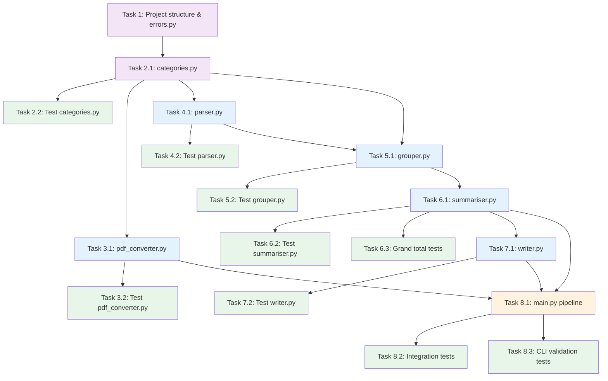

# Implementation Plan — expense-summary

- [ ] 1. Set up project structure and foundation modules
  - Create the directory layout: `src/`, `tests/`, `requirements.txt`, `README.md`
  - Create empty `__init__.py` files in `src/` and `tests/`
  - Create `src/errors.py` with `ConversionError`, `ParseError`, and `GroupingError` exception classes
  - Create `requirements.txt` with `pdfplumber`, `pdfminer.six`, and `pytest`
  - _Requirements: 9.3_

- [ ] 2. Implement the canonical category schema
- [ ] 2.1 Write `src/categories.py` with the full `Section` dataclass and `SCHEMA` constant
  - Define the `Section` dataclass with `name: str` and `categories: list[str]`
  - Declare all 6 sections and 21 categories in canonical order matching the schema in `product.md`
  - Export `INCOME_SECTIONS` and `OUTFLOW_SECTIONS` list constants
  - _Requirements: 5.1, 5.3_

- [ ] 2.2 Write tests for `categories.py`
  - Assert `SCHEMA` contains exactly 6 sections
  - Assert each section contains its expected category names (all 21 total)
  - Assert `INCOME_SECTIONS` and `OUTFLOW_SECTIONS` together cover all section names and have no overlap
  - _Requirements: 5.1, 5.3_

- [ ] 3. Implement the PDF-to-Markdown converter
- [ ] 3.1 Write `src/pdf_converter.py` with `convert_pdf()`, `write_temp_md()`, and `cleanup_temp()`
  - Use `pdfplumber` as primary extraction method; fall back to `pdfminer.six` if result is empty/whitespace — document fallback in a comment
  - `write_temp_md()` writes to `tempfile.mkstemp()` and returns the path
  - `cleanup_temp()` deletes the temp file silently if it no longer exists
  - Raise `ConversionError` with a descriptive message if both libraries fail
  - _Requirements: 2.1, 2.4, 9.4_

- [ ] 3.2 Write tests for `pdf_converter.py`
  - Test `write_temp_md()` creates a file in the system temp directory with expected content
  - Test `cleanup_temp()` removes the file and does not raise if the file is already gone
  - Test `convert_pdf()` raises `ConversionError` when given a non-existent path
  - Mock `pdfplumber` to simulate empty extraction and assert fallback is triggered
  - _Requirements: 2.4, 9.4_

- [ ] 4. Implement the Markdown expense parser
- [ ] 4.1 Write `src/parser.py` with `parse_items()` and `parse_amount()`
  - Define the `ExpenseItem` dataclass with `raw_text: str` and `amount: float`
  - `parse_amount()` uses a regex to find a currency-symbol-prefixed or bare decimal number; strips `£`, `$`, commas before parsing
  - `parse_items()` iterates lines, calls `parse_amount()`, skips lines with no match, returns a `list[ExpenseItem]`
  - Raise `ParseError` if the returned list is empty
  - _Requirements: 3.1, 3.2, 3.3, 3.4_

- [ ] 4.2 Write tests for `parser.py`
  - Test a well-formed line with a `£` prefix produces the correct `ExpenseItem`
  - Test a line with a bare decimal amount is parsed correctly
  - Test a line with commas in the amount (e.g. `1,200.00`) is parsed correctly
  - Test a line with no numeric content is skipped
  - Test that an input string with zero parseable lines raises `ParseError`
  - Test that PDF subtotal rows (e.g. `"Total Regular Inflows £3,500.00"`) are parsed as items (not skipped)
  - _Requirements: 3.1, 3.2, 3.3, 3.4, 3.5_

- [ ] 5. Implement the category grouper
- [ ] 5.1 Write `src/grouper.py` with `_normalise()`, `match_category()`, and `group_items()`
  - Define the `CategorisedItem` dataclass with `section: str`, `category: str`, `amount: float`
  - `_normalise()` lowercases, collapses whitespace, strips punctuation
  - `match_category()` performs Pass 1 (exact normalised match against all category names in `SCHEMA`) then Pass 2 (substring/token overlap); returns `(section, category)` tuple or `None`
  - `group_items()` calls `match_category()` for each item; unmatched items are collected separately and returned as the second element of a tuple; all category names imported from `categories.py`
  - _Requirements: 4.1, 4.2, 4.3, 4.4, 4.5, 4.6_

- [ ] 5.2 Write tests for `grouper.py`
  - Test `_normalise()` handles uppercase, extra spaces, and punctuation
  - Test `match_category()` returns the correct `(section, category)` for all 21 canonical category names (exact match)
  - Test `match_category()` matches a lowercase variant (e.g. `"salary"` → `"Regular Inflows", "Salary"`)
  - Test `match_category()` matches a whitespace variant (e.g. `"carry  over"`)
  - Test `match_category()` returns `None` for a completely unrecognised string
  - Test `group_items()` returns unmatched items in the second tuple element without raising
  - Test `group_items()` with all unmatched items still returns an empty categorised list and non-empty unmatched list
  - _Requirements: 4.1, 4.2, 4.3, 4.4, 4.5, 4.6_

- [ ] 6. Implement the summariser
- [ ] 6.1 Write `src/summariser.py` with `summarise()`
  - Define `CategoryTotal` dataclass with `category: str` and `total: float`
  - Define `SectionSummary` dataclass with `section: str`, `categories: list[CategoryTotal]`, `subtotal: float`
  - `summarise()` iterates `SCHEMA` (not `items`) to guarantee canonical order; for each section, builds a `CategoryTotal` per category (defaulting to `0.0` if no items matched); computes `subtotal` as the sum of category totals
  - Returns a `list[SectionSummary]` in `SCHEMA` order
  - _Requirements: 5.2, 6.1, 6.2_

- [ ] 6.2 Write tests for `summariser.py`
  - Test that a single matched item produces the correct `CategoryTotal` and section `subtotal`
  - Test that multiple items in the same category are summed correctly
  - Test that a category with no matched items appears in the output with `total = 0.0`
  - Test that all 6 sections appear in the output regardless of input
  - Test that `subtotal` equals the sum of all `CategoryTotal.total` values in that section
  - _Requirements: 5.2, 6.1, 6.2_

- [ ] 6.3 Write tests for grand total computation
  - Create a helper `compute_grand_totals(summaries)` in `summariser.py` that returns `(total_income, total_expenditure)`
  - Test `total_income` equals the sum of subtotals for the three `INCOME_SECTIONS`
  - Test `total_expenditure` equals the sum of subtotals for the three `OUTFLOW_SECTIONS`
  - Test both grand totals are `0.0` when all `SectionSummary` objects have `subtotal = 0.0`
  - _Requirements: 6.3, 6.4_

- [ ] 7. Implement the CSV writer
- [ ] 7.1 Write `src/writer.py` with `write_csv()`
  - `write_csv()` accepts `list[SectionSummary]` and `output_path: str`
  - Writes header row: `section,category,total_amount`
  - For each section: writes one row per `CategoryTotal`, then one subtotal row (`section`, `Total <Section Name>`, subtotal)
  - After inflow sections, writes the `Total Income` grand total row (empty `section` column)
  - After outflow sections, writes the `Total Expenditure` grand total row (empty `section` column)
  - Formats all amounts to 2 decimal places
  - Calls `compute_grand_totals()` from `summariser.py` to get grand total values
  - Raises `IOError` if the file cannot be written
  - _Requirements: 7.1, 7.2, 7.3, 7.4, 7.5, 7.6_

- [ ] 7.2 Write tests for `writer.py`
  - Test output CSV has correct header row
  - Test category rows appear in canonical section order
  - Test subtotal row uses `Total <Section Name>` as the category and repeats the section name
  - Test `Total Income` row has an empty `section` column
  - Test `Total Expenditure` row has an empty `section` column
  - Test all amounts are formatted to exactly 2 decimal places
  - Test `IOError` is raised when output path is a non-writable directory
  - _Requirements: 7.1, 7.2, 7.3, 7.4, 7.5, 7.6_

- [ ] 8. Wire the pipeline and implement the CLI entry point
- [ ] 8.1 Write `src/main.py` with `run_pipeline()` and `main()`
  - `main()` uses `argparse` to accept exactly two positional arguments: `input_pdf` and `output_csv`
  - Validate that `input_pdf` exists and has a `.pdf` extension before calling the pipeline; print a clear error and exit non-zero if not
  - `run_pipeline()` calls each module in order: `convert_pdf` → `write_temp_md` → `parse_items` → `group_items` → `summarise` → `write_csv`
  - Wraps `cleanup_temp()` in a `finally` block so temp files are always removed
  - Catches `ConversionError`, `ParseError`, `GroupingError`, and `IOError`; prints a human-readable message to stderr for each; exits non-zero
  - After writing the CSV, prints any unmatched-item warnings to stderr (non-fatal; exit 0)
  - _Requirements: 1.1, 1.2, 1.3, 1.4, 2.2, 2.3, 2.5, 2.6, 8.1, 8.2, 8.3, 8.4_

- [ ] 8.2 Write integration tests for the full pipeline using fixture data
  - Create a fixture Markdown string that contains one item per canonical category
  - Call `parse_items()` → `group_items()` → `summarise()` → `write_csv()` in sequence
  - Assert the output CSV contains all 6 sections, all 21 category rows, 6 subtotal rows, and both grand total rows
  - Assert `Total Income` equals the sum of the three inflow subtotals
  - Assert `Total Expenditure` equals the sum of the three outflow subtotals
  - _Requirements: 6.3, 6.4, 7.1, 7.2_

- [ ] 8.3 Write CLI argument validation tests
  - Test that running `main()` with zero arguments prints usage and exits non-zero
  - Test that a non-`.pdf` input path prints a clear error and exits non-zero
  - Test that a missing input file prints a clear error and exits non-zero
  - _Requirements: 1.3, 1.4, 2.2, 2.3, 8.4_

---

## Tasks Dependency Diagram

> **Legend:** Purple = foundation, Blue = implementation, Green = tests, Orange = wiring
