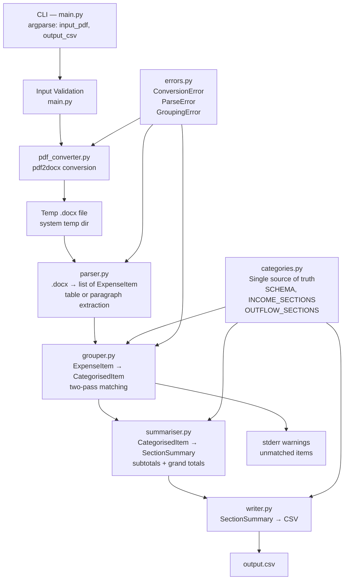
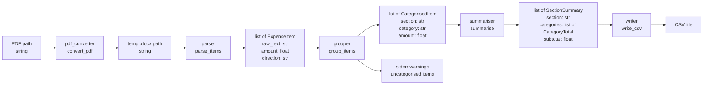
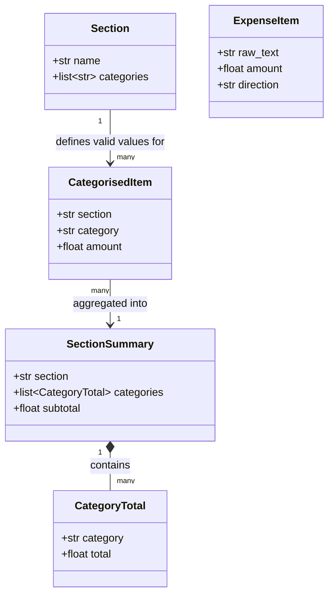
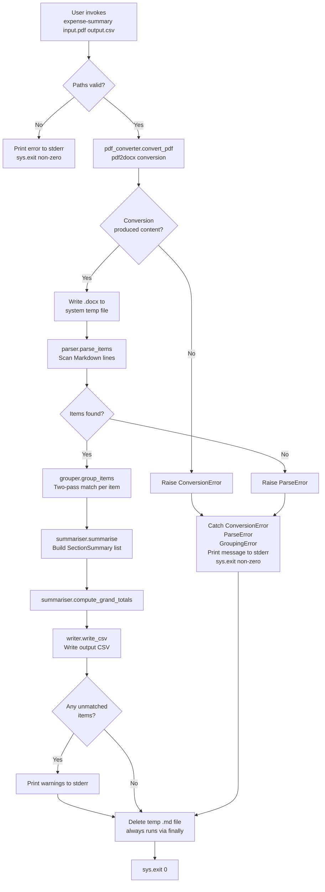
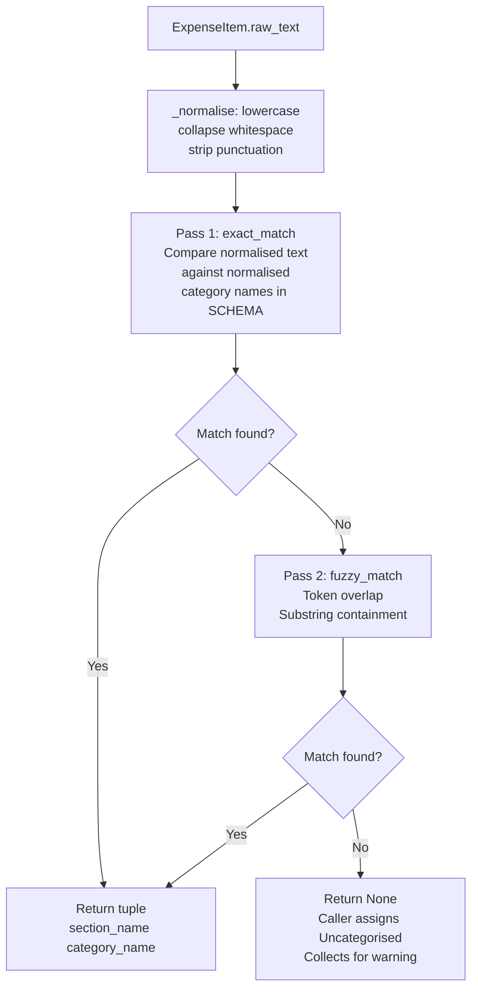
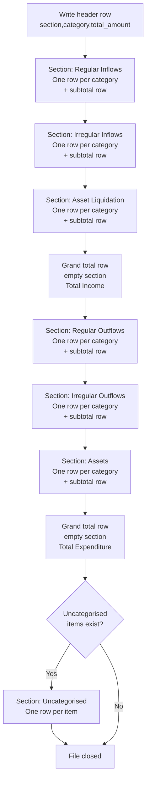
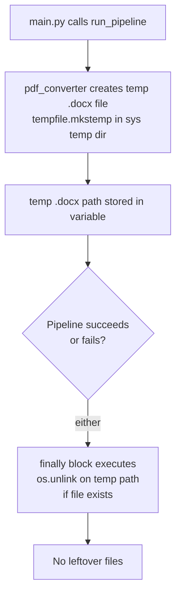

# Design Document — expense-summary-cli

## Overview

`expense-summary` is a single-command CLI tool that converts a personal PDF expense report into a
structured CSV file. The tool operates entirely offline (no network, no LLMs, no GUI, no database)
and passes data through a fixed, linear pipeline:

```
PDF file → Word .docx file → list[ExpenseItem] → list[CategorisedItem] → list[SectionSummary] → CSV file
```

Every pipeline stage maps to exactly one source module. All category and section names are defined
in one place (`categories.py`) and are never duplicated. The tool exits cleanly with a human-readable
message on any expected failure.

---

## Architecture Design

### System Architecture Diagram



### Data Flow Diagram



---

## Component Design

### main.py — CLI Entry Point

Responsibilities:
- Parse exactly two positional CLI arguments (`input_pdf`, `output_csv`) via `argparse`
- Validate input path (exists, `.pdf` extension) and output path (writable location)
- Call `run_pipeline(input_path, output_path)` which orchestrates all stages
- Catch `ConversionError`, `ParseError`, `GroupingError` and print human-readable messages to stderr
- Emit unmatched-item warnings to stderr (received from `grouper` via return value)
- Be the only module that calls `sys.exit` or writes to stdout/stderr

Interfaces:

```python
def validate_paths(input_path: str, output_path: str) -> None:
    """Raise SystemExit with a descriptive message if either path is invalid."""

def run_pipeline(input_path: str, output_path: str) -> None:
    """Orchestrate the full conversion pipeline. Raises ConversionError, ParseError,
    or GroupingError on failure."""

def main() -> None:
    """CLI entry point: parse args, validate, run pipeline, handle errors."""
```

Dependencies: `pdf_converter`, `parser`, `grouper`, `summariser`, `writer`, `errors`

---

### pdf_converter.py — PDF to Word Conversion

Responsibilities:
- Accept a PDF file path and convert it to a Word `.docx` file using `pdf2docx`
- Write the `.docx` to a temporary file in the system temp directory
- Return the temp `.docx` file path so the caller can pass it to `parser.py` and then delete it
- Raise `ConversionError` if `pdf2docx` fails or produces an empty document

Interfaces:

```python
def convert_pdf(pdf_path: str) -> str:
    """Convert PDF to a temp .docx file; return the temp file path.
    Raises ConversionError if conversion fails or yields an empty document."""

def _convert_with_pdf2docx(pdf_path: str, docx_path: str) -> bool:
    """Run pdf2docx conversion; return True on success, False on failure."""

def _docx_has_content(docx_path: str) -> bool:
    """Return True if the .docx contains at least one table row or non-empty paragraph."""
```

Dependencies: `pdf2docx`, `python-docx`, `tempfile` (stdlib), `errors`

Temp-file lifecycle note: `main.py` wraps `run_pipeline` in a `try/finally` that deletes the temp
`.docx` file regardless of success or failure. `pdf_converter` creates the file and returns its path;
cleanup responsibility sits with the caller (`main.py`).

---

### parser.py — Word Document to ExpenseItem List

Responsibilities:
- Accept a `.docx` file path
- Attempt table-based extraction first: scan Word tables for a header row with Money In / Money Out
  columns; extract each data row as an `ExpenseItem` with the appropriate `direction`
- If no valid table is found, fall back to paragraph extraction: scan each paragraph for a
  description + amount pattern, set `direction='out'`
- Return a `list[ExpenseItem]`
- Raise `ParseError` if no items are found after scanning the entire document
- Skip rows/paragraphs that do not yield both a description and a numeric amount

Interfaces:

```python
def parse_items(docx_path: str) -> list[ExpenseItem]:
    """Parse a .docx file into a list of ExpenseItem objects.
    Tries table extraction first, then paragraph extraction.
    Raises ParseError if the result is empty."""

def _extract_from_tables(doc: Document) -> list[ExpenseItem]:
    """Extract items from Word tables. Detects Money In / Money Out header columns."""

def _extract_from_paragraphs(doc: Document) -> list[ExpenseItem]:
    """Fallback: scan paragraphs for description + amount patterns."""

def _parse_text_line(line: str) -> ExpenseItem | None:
    """Extract a description and amount from a single text line; returns None if no match."""

def _normalise_amount(raw: str) -> float:
    """Strip currency symbols and commas, then convert to float.
    Raises ValueError on unparseable input."""
```

Dependencies: `python-docx`, `re` (stdlib), `errors`

Table detection strategy: a table row is considered a transaction row if the header row contains
a column whose text matches `money in` / `credit` (case-insensitive) and another matching
`money out` / `debit`. The description column is the one matching `description` / `details`.
If neither pattern is found, the table is skipped.

---

### categories.py — Canonical Schema

Responsibilities:
- Define the single source of truth for all section names, category names, and their order
- Export `SCHEMA`, `INCOME_SECTIONS`, `OUTFLOW_SECTIONS`, and the `Section` dataclass
- Never contain business logic; only data declarations

Data declarations:

```python
@dataclass(frozen=True)
class Section:
    name: str
    categories: list[str]

SCHEMA: list[Section] = [
    Section(name="Regular Inflows",    categories=["Salary"]),
    Section(name="Irregular Inflows",  categories=["Carry Over", "Unexpected / Refund", "Loan"]),
    Section(name="Asset Liquidation",  categories=["Savings", "Stocks & Shares"]),
    Section(name="Regular Outflows",   categories=[
        "Rent", "Bill - Council Tax", "Bill - Electricity & Gas",
        "Bill - Phone & Internet", "Food Supplies", "Debt", "Car & Gas",
    ]),
    Section(name="Irregular Outflows", categories=[
        "Charity / Donations", "Gifts Entertainment & Misc",
        "Sundry", "Holidays & Travel", "Education", "Eating Out",
    ]),
    Section(name="Assets", categories=[
        "Active Savings", "Lifetime ISA", "Stocks & Shares ISA", "Dividend Portfolio",
    ]),
]

INCOME_SECTIONS:  list[str] = ["Regular Inflows", "Irregular Inflows", "Asset Liquidation"]
OUTFLOW_SECTIONS: list[str] = ["Regular Outflows", "Irregular Outflows", "Assets"]
```

Dependencies: none (zero imports)

---

### grouper.py — Category Matching and Assignment

Responsibilities:
- Accept `list[ExpenseItem]` and return `list[CategorisedItem]`
- Run three-pass matching per item (exact → keyword → fuzzy) using `item.raw_text` and `item.direction`
- Assign unmatched items to section `"Uncategorised"`, category `"Uncategorised"`
- Collect all unmatched items and return them alongside the matched list so `main.py` can emit warnings
- Never import from `main.py`; never print to stdout/stderr directly

Interfaces:

```python
def group_items(
    items: list[ExpenseItem],
) -> tuple[list[CategorisedItem], list[ExpenseItem]]:
    """Match each ExpenseItem to a (section, category) pair.
    Returns (all_categorised, unmatched_items)."""

def match_category(item_text: str, direction: str = 'out') -> tuple[str, str] | None:
    """Return (section_name, category_name) or None if no match found.
    Pass 1: exact normalised match. Pass 2: keyword pattern match.
    Pass 3: fuzzy token/substring match biased by direction."""

def _normalise(text: str) -> str:
    """Lowercase, collapse whitespace, strip punctuation."""

def _exact_match(normalised_text: str) -> tuple[str, str] | None:
    """Compare normalised item text against each normalised category name."""

def _keyword_match(normalised_text: str) -> tuple[str, str] | None:
    """Check normalised text against built-in bank description keyword patterns."""

def _fuzzy_match(normalised_text: str, direction: str = 'out') -> tuple[str, str] | None:
    """Token overlap and substring heuristics — pure Python, direction-biased."""
```

Dependencies: `categories`, `errors`

Three-pass matching detail:

Pass 1 — Exact match:
- Normalise item text with `_normalise`
- Compare against each normalised category name in `SCHEMA`; first exact match wins

Pass 2 — Keyword match:
- Check normalised text for substring membership in `_KEYWORD_PATTERNS` table
- Table maps common bank description fragments to `(section, category)` pairs
- Examples: `"regular sav"` → Active Savings, `"trading 212"` → Stocks & Shares ISA, `"lloyds bank"` → Debt

Pass 3 — Fuzzy match (only reached if passes 1–2 find nothing):
- Split normalised item text into tokens; for each category name do the same
- Token set overlap ≥ 1 AND ratio ≥ 50% of category tokens → candidate
- Substring containment → candidate
- Tie-break: highest overlap ratio, then `SCHEMA` order
- Direction bias: for `direction='in'`, check income sections first; for `direction='out'`, check outflow sections first

---

### summariser.py — Totalling and Grand Totals

Responsibilities:
- Accept `list[CategorisedItem]` and return `list[SectionSummary]`
- Produce one `SectionSummary` per section in `SCHEMA` order, including sections with zero items
- Within each summary, produce one `CategoryTotal` per category in that section's canonical order,
  defaulting to `0.0` for categories with no matched items
- Compute `subtotal` as the sum of all `CategoryTotal.total` values in that section
- Append an additional `SectionSummary` for `"Uncategorised"` if any uncategorised items exist
- Compute grand totals (`Total Income`, `Total Expenditure`) as sums of section subtotals per
  `INCOME_SECTIONS` / `OUTFLOW_SECTIONS`

Interfaces:

```python
def summarise(items: list[CategorisedItem]) -> list[SectionSummary]:
    """Aggregate CategorisedItems into SectionSummary objects in canonical order.
    Always includes every category from SCHEMA (zero-filled when no items match)."""

def compute_grand_totals(
    summaries: list[SectionSummary],
) -> tuple[float, float]:
    """Return (total_income, total_expenditure) by summing the relevant section subtotals."""

def _build_category_totals(
    section_name: str,
    items: list[CategorisedItem],
) -> list[CategoryTotal]:
    """Return one CategoryTotal per category in the section, in canonical order."""
```

Dependencies: `categories`

---

### writer.py — CSV Output

Responsibilities:
- Accept `list[SectionSummary]`, `float` (total income), `float` (total expenditure), and an
  output file path
- Write a UTF-8 CSV with header `section,category,total_amount`
- For each `SectionSummary`, write category rows then the section subtotal row
- After all income sections, write the `Total Income` grand total row (empty section column)
- After all outflow sections, write the `Total Expenditure` grand total row (empty section column)
- If an `"Uncategorised"` summary exists, append it at the end, after the grand totals
- Format all amounts to exactly 2 decimal places
- Use `csv.writer` from stdlib only

Interfaces:

```python
def write_csv(
    summaries: list[SectionSummary],
    total_income: float,
    total_expenditure: float,
    output_path: str,
) -> None:
    """Write the full CSV to output_path. Raises OSError on write failure."""

def _write_section(
    writer: csv.writer,
    summary: SectionSummary,
) -> None:
    """Write category rows and the subtotal row for one section."""

def _fmt(amount: float) -> str:
    """Format a float to a 2-decimal-place string."""
```

Dependencies: `csv` (stdlib), `categories`

---

### errors.py — Custom Exceptions

```python
class ConversionError(Exception):
    """Raised by pdf_converter when neither PDF library can extract usable text."""

class ParseError(Exception):
    """Raised by parser when no ExpenseItem objects are found in the Markdown."""

class GroupingError(Exception):
    """Raised by grouper for a structural/programming error (not for unmatched items)."""
```

Note: unmatched items are not exceptional — they are returned as the second element of
`group_items` and result in stderr warnings from `main.py`, not exceptions.

---

## Data Model

### Core Data Structures

```python
# categories.py
@dataclass(frozen=True)
class Section:
    name: str
    categories: list[str]

# parser.py
@dataclass
class ExpenseItem:
    raw_text: str    # description extracted from PDF (no explicit labels)
    amount: float
    direction: str   # 'in' (Money In) or 'out' (Money Out); default 'out'

# grouper.py
@dataclass
class CategorisedItem:
    section: str    # e.g. "Regular Inflows"
    category: str   # e.g. "Salary" — always a value from SCHEMA or "Uncategorised"
    amount: float

# summariser.py
@dataclass
class CategoryTotal:
    category: str
    total: float

@dataclass
class SectionSummary:
    section: str
    categories: list[CategoryTotal]
    subtotal: float
```

### Data Model Diagram



---

## Business Process

### Process 1: Full Pipeline Execution



### Process 2: Two-Pass Category Matching (per item)



### Process 3: CSV Row Emission Order



### Process 4: Temp File Lifecycle



---

## Error Handling Strategy

### Error Taxonomy

| Error type | Raised in | Caught in | User message |
|---|---|---|---|
| `SystemExit` (invalid paths) | `main.py` | `main.py` | Descriptive path error to stderr |
| `ConversionError` | `pdf_converter.py` | `main.py` | "Could not convert PDF to Word: {detail}" |
| `ParseError` | `parser.py` | `main.py` | "Could not parse expenses: {detail}" |
| `GroupingError` | `grouper.py` | `main.py` | "Could not group expenses: {detail}" |
| Unmatched items (warning) | `grouper.py` (returned) | `main.py` | Printed to stderr; tool continues |
| `OSError` on CSV write | `writer.py` | `main.py` | Propagates as unhandled; wraps in message |

### Principles

- No raw Python tracebacks are shown to the user under normal operation.
- Only `main.py` writes to stdout or stderr and calls `sys.exit`.
- Unmatched items never cause a crash; they are collected, returned, and reported as warnings:

```
Warning: 2 item(s) could not be matched to a known category:
  - "Misc refund" (£12.50)
  - "TfL" (£4.80)
```

- Temp file cleanup is unconditional: wrapped in a `try/finally` in `run_pipeline` so cleanup runs
  even when an exception propagates.
- If the output CSV path is not writable, the error is detected during input validation (before any
  processing starts), not at write time.

---

## Testing Strategy

### Test Coverage Map

| Test file | Module under test | Key scenarios |
|---|---|---|
| `test_pdf_converter.py` | `pdf_converter.py` | Successful pdf2docx conversion, failure raises `ConversionError`, temp file created in system temp dir |
| `test_parser.py` | `parser.py` | Table extraction with Money In/Out columns sets direction correctly, paragraph fallback works, `ParseError` on empty document |
| `test_grouper.py` | `grouper.py` | Exact match for every category in `SCHEMA`, case-insensitive, keyword match patterns, direction-biased fuzzy match, unrecognised text returns `None` |
| `test_summariser.py` | `summariser.py` | Per-category totals, section subtotals, `Total Income` grand total, `Total Expenditure` grand total, zero-filled categories when no items present |

### Design Decisions for Testability

- `parse_items` accepts a plain string — no file I/O needed in tests.
- `group_items` accepts `list[ExpenseItem]` — no PDF or Markdown needed in tests.
- `match_category` is a standalone pure function — trivially unit-testable.
- `summarise` accepts `list[CategorisedItem]` — fully in-memory.
- No global mutable state in any module.
- Tests use small, hand-authored fixture strings and dataclass instances; no real PDFs.

### Test Fixtures Pattern

```python
# test_parser.py
SAMPLE_MD = """\
Salary £3,500.00
Rent 900.00
Unknown item £12.50
not a valid line
"""

def test_parse_items_returns_expected_count():
    items = parse_items(SAMPLE_MD)
    assert len(items) == 3  # "not a valid line" skipped

def test_parse_items_raises_on_empty():
    with pytest.raises(ParseError):
        parse_items("no amounts here\nanother blank line")
```

```python
# test_grouper.py
def test_exact_match_salary():
    assert match_category("Salary") == ("Regular Inflows", "Salary")

def test_exact_match_case_insensitive():
    assert match_category("salary") == ("Regular Inflows", "Salary")

def test_unrecognised_returns_none():
    assert match_category("completely unknown xyz") is None
```

```python
# test_summariser.py
def test_section_subtotal():
    items = [
        CategorisedItem("Regular Inflows", "Salary", 3500.00),
        CategorisedItem("Regular Inflows", "Salary", 200.00),
    ]
    summaries = summarise(items)
    ri = next(s for s in summaries if s.section == "Regular Inflows")
    assert ri.subtotal == 3700.00

def test_grand_totals():
    # ... build items across income and outflow sections
    _, total_income, total_expenditure = summarise(items), *compute_grand_totals(summaries)
    assert total_income == expected_income
    assert total_expenditure == expected_expenditure
```

---

## Design Decisions and Rationale

| Decision | Rationale |
|---|---|
| `pdf2docx` as the single PDF converter | Converts PDF to a structured Word document preserving table layout, which is ideal for bank statements; single-library approach simplifies the dependency chain |
| Intermediate `.docx` file (not a text string) | Preserves table structure (Money In / Money Out columns) that plain text extraction loses; `python-docx` can read tables cell-by-cell to extract direction and amounts cleanly |
| Temp file deleted in `finally` block | Guarantees cleanup on both success and failure paths without relying on context managers across module boundaries |
| Two-pass matching (exact then fuzzy) in `grouper.py` | Exact matching is deterministic and O(n) in category count; fuzzy matching only runs when exact fails, keeping the common case fast and predictable |
| `categories.py` with zero imports | Makes it safe for all other modules to import from it without circular dependency risk |
| Unmatched items returned, not raised | Keeps the tool useful even with partial coverage; the user sees a warning and still receives a CSV for the matched items |
| Categories zero-filled when missing | Ensures the CSV always has a consistent, comparable structure across monthly reports |
| `csv` stdlib only | Avoids pandas as a dependency; the output format is simple enough for stdlib |
| Functions capped at ~30 lines | Keeps each function independently testable and readable without scrolling |
