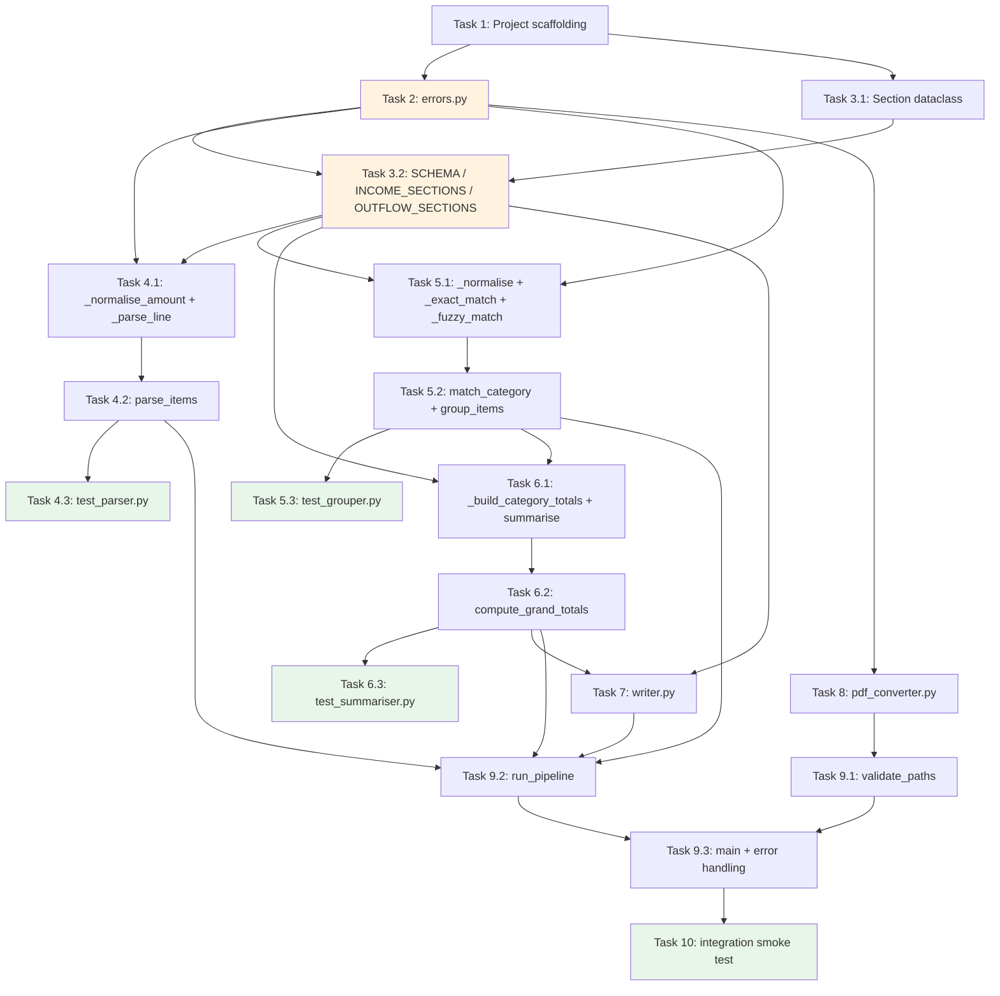

# Implementation Plan

- [x] 1. Set up project structure and core scaffolding
  - Create the `src/` and `tests/` directories
  - Create empty `__init__.py` files in both `src/` and `tests/` so they are recognised as packages
  - Create `pyproject.toml` (or `setup.cfg`) declaring Python 3.8+, listing `pdfplumber` and `pdfminer.six` as dependencies, and configuring `pytest` as the test runner
  - Create a top-level `expense_summary` entry point script (or `[project.scripts]` entry) that calls `src.main:main`
  - _Requirements: 10.1, 11.1_

- [x] 2. Implement `src/errors.py` — custom exception classes
  - Write `ConversionError`, `ParseError`, and `GroupingError` as plain `Exception` subclasses with docstrings matching the design
  - _Requirements: 9.1, 9.2, 9.3_

- [x] 3. Implement `src/categories.py` — canonical schema
- [x] 3.1 Define the `Section` frozen dataclass
  - Declare `Section(name: str, categories: list[str])` as a `@dataclass(frozen=True)`
  - _Requirements: 6.1, 6.2, 10.1_

- [x] 3.2 Declare `SCHEMA`, `INCOME_SECTIONS`, and `OUTFLOW_SECTIONS`
  - Populate `SCHEMA` with all six sections and their categories in canonical order exactly as specified
  - Set `INCOME_SECTIONS` and `OUTFLOW_SECTIONS` to the correct section-name lists
  - Verify zero imports in this file
  - _Requirements: 5.5, 5.6, 6.1, 6.2, 10.1_

- [x] 4. Implement `src/parser.py` and write `tests/test_parser.py`
- [x] 4.1 Implement `_normalise_amount` and `_parse_line`
  - Write `_normalise_amount(raw: str) -> float` stripping `£`, `$`, `€`, commas, and optional whitespace before converting to `float`; raise `ValueError` on unparseable input
  - Write `_parse_line(line: str) -> ExpenseItem | None` using the regex pattern `[£$€]?\s*[\d,]+(\.\d{1,2})?` to locate the amount token; treat all remaining text as the description; return `None` if the pattern is absent or the description is empty
  - _Requirements: 4.1, 4.4, 4.5_

- [x] 4.2 Implement `parse_items`
  - Write `parse_items(markdown_text: str) -> list[ExpenseItem]` iterating over lines, calling `_parse_line`, collecting non-`None` results
  - Raise `ParseError` (imported from `errors`) when the result list is empty
  - _Requirements: 4.1, 4.2, 4.3, 9.2_

- [x] 4.3 Write `tests/test_parser.py`
  - Test that a markdown string with three valid expense lines and one invalid line returns exactly three `ExpenseItem` objects
  - Test `_normalise_amount` with `£3,500.00`, `$1,200`, `€ 99.9`, and a bare `42` — assert correct `float` values
  - Test that lines without any amount token are skipped (no error)
  - Test that `parse_items("")` and `parse_items("no amounts here")` raise `ParseError`
  - Test that currency symbols `£`, `$`, `€` are all handled
  - _Requirements: 4.1, 4.2, 4.4, 4.5, 10.3_

- [x] 5. Implement `src/grouper.py` and write `tests/test_grouper.py`
- [x] 5.1 Implement `_normalise`, `_exact_match`, and `_fuzzy_match`
  - Write `_normalise(text: str) -> str`: lowercase, collapse whitespace, strip punctuation
  - Write `_exact_match(normalised_text: str) -> tuple[str, str] | None`: iterate over `SCHEMA`, normalise each category name, return `(section, category)` on equality
  - Write `_fuzzy_match(normalised_text: str) -> tuple[str, str] | None`: token-set overlap >= 1 covering >= 50% of the category's tokens, or full-substring containment; tie-break by overlap ratio then `SCHEMA` order
  - Import only from `categories` and `errors`; never print or call `sys.exit`
  - _Requirements: 5.1, 5.2, 5.3, 5.4, 5.6, 11.3_

- [x] 5.2 Implement `match_category` and `group_items`
  - Write `match_category(item_text: str) -> tuple[str, str] | None`: run `_exact_match` first, fall back to `_fuzzy_match`, return `None` if both fail
  - Write `group_items(items: list[ExpenseItem]) -> tuple[list[CategorisedItem], list[ExpenseItem]]`: call `match_category` per item; build `CategorisedItem` for matches; collect unmatched items in a separate list; assign unmatched to section `"Uncategorised"`, category `"Uncategorised"` in the first return list; return `(all_categorised, unmatched)`
  - _Requirements: 5.1, 5.2, 5.3, 5.4, 9.5_

- [x] 5.3 Write `tests/test_grouper.py`
  - Test `match_category("Salary")` returns `("Regular Inflows", "Salary")`
  - Test every category in `SCHEMA` with exact text returns the correct `(section, category)` pair
  - Test case-insensitive variant: `match_category("salary")` returns `("Regular Inflows", "Salary")`
  - Test whitespace variant: `match_category("  bill - council tax  ")` matches correctly
  - Test fuzzy partial match: e.g., `match_category("council tax bill")` matches `"Bill - Council Tax"`
  - Test `match_category("completely unknown xyz abc")` returns `None`
  - Test `group_items` returns unmatched items in the second element of the tuple
  - Test `group_items` assigns unmatched items to `"Uncategorised"` in the first element
  - _Requirements: 5.1, 5.2, 5.3, 5.4, 5.6, 10.3_

- [ ] 6. Implement `src/summariser.py` and write `tests/test_summariser.py`
- [ ] 6.1 Implement `_build_category_totals` and `summarise`
  - Write `_build_category_totals(section_name: str, items: list[CategorisedItem]) -> list[CategoryTotal]`: for each canonical category in the section, sum amounts from matching items; default to `0.0` when no items match
  - Write `summarise(items: list[CategorisedItem]) -> list[SectionSummary]`: produce one `SectionSummary` per section in `SCHEMA` order; append an `"Uncategorised"` `SectionSummary` if any uncategorised items exist; set `subtotal` as the sum of the section's `CategoryTotal.total` values
  - Import only from `categories`
  - _Requirements: 7.1, 7.2, 7.4, 7.5, 7.6, 10.1_

- [ ] 6.2 Implement `compute_grand_totals`
  - Write `compute_grand_totals(summaries: list[SectionSummary]) -> tuple[float, float]`: sum subtotals of sections in `INCOME_SECTIONS` for `total_income`; sum subtotals of sections in `OUTFLOW_SECTIONS` for `total_expenditure`
  - _Requirements: 7.3, 7.5_

- [ ] 6.3 Write `tests/test_summariser.py`
  - Test that a single `CategorisedItem` for `"Salary"` produces a `SectionSummary` for `"Regular Inflows"` with `subtotal == item.amount`
  - Test that two items for the same category sum correctly in `CategoryTotal.total`
  - Test that all canonical categories appear in every `SectionSummary`, zero-filled when no items match
  - Test `compute_grand_totals` with items in both income and outflow sections; assert `total_income` and `total_expenditure` are correct
  - Test that uncategorised items produce an appended `"Uncategorised"` `SectionSummary`
  - _Requirements: 7.1, 7.2, 7.3, 7.4, 7.5, 10.3_

- [ ] 7. Implement `src/writer.py`
  - Write `_fmt(amount: float) -> str` returning a 2-decimal-place string
  - Write `_write_section(writer, summary: SectionSummary) -> None`: emit one row per `CategoryTotal` then a `Subtotal` row using `_fmt` for amounts
  - Write `write_csv(summaries, total_income, total_expenditure, output_path) -> None`: open the output path in UTF-8 write mode with `csv.writer`; write the header `section,category,total_amount`; iterate `summaries`, calling `_write_section` for each; after all income sections emit the `Total Income` grand-total row; after all outflow sections emit the `Total Expenditure` grand-total row; append any `"Uncategorised"` summary last; use only `csv` stdlib
  - _Requirements: 8.1, 8.2, 8.3, 8.4, 8.5, 8.6, 11.4_

- [ ] 8. Implement `src/pdf_converter.py`
  - Write `_extract_with_pdfplumber(pdf_path: str) -> str | None`: open the PDF with `pdfplumber`; concatenate text from all pages; return `None` if result is empty or whitespace-only
  - Write `_extract_with_pdfminer(pdf_path: str) -> str | None`: use `pdfminer.six` high-level `extract_text`; return `None` on empty or exception
  - Write `_write_temp_markdown(content: str) -> str`: use `tempfile.mkstemp(suffix=".md")` to create a temp file in the system temp dir; write `content` to it; return the file path
  - Write `convert_pdf(pdf_path: str) -> str`: call `_extract_with_pdfplumber` first; if `None`, call `_extract_with_pdfminer`; if still `None`, raise `ConversionError`; otherwise call `_write_temp_markdown`, return the temp file path
  - _Requirements: 3.1, 3.2, 3.3, 3.4, 3.6, 9.1, 11.2, 11.6_

- [ ] 9. Implement `src/main.py` — CLI entry point and pipeline orchestration
- [ ] 9.1 Implement `validate_paths`
  - Write `validate_paths(input_path: str, output_path: str) -> None`: check the input file exists and ends with `.pdf`; check the output directory exists and is writable; call `sys.exit(1)` with a descriptive `stderr` message if either check fails
  - _Requirements: 1.1, 2.1, 2.2, 2.3, 1.5_

- [ ] 9.2 Implement `run_pipeline`
  - Write `run_pipeline(input_path: str, output_path: str) -> None`: call `convert_pdf` inside a `try/finally` that unconditionally deletes the temp markdown file via `os.unlink`; call `parse_items` with the temp file's text content; call `group_items`; call `summarise`; call `compute_grand_totals`; call `write_csv`; return `unmatched_items` to the caller (or handle warnings here)
  - Ensure no `print` or `sys.exit` calls are made in any imported module; all such calls stay within `main.py`
  - _Requirements: 3.4, 3.5, 1.2, 1.3, 11.6_

- [ ] 9.3 Implement `main` and wire up error handling
  - Write `main() -> None`: use `argparse` to accept exactly two positional arguments `input_pdf` and `output_csv`; call `validate_paths`; wrap `run_pipeline` in a `try/except` catching `ConversionError`, `ParseError`, `GroupingError`, and `OSError`; print human-readable messages to `stderr` and call `sys.exit(1)` on any caught error; call `sys.exit(0)` on success; print `stderr` warnings for any unmatched items using the format specified in the design
  - _Requirements: 1.1, 1.2, 1.3, 1.4, 1.5, 9.4, 9.5_

- [ ] 10. Integration smoke test with a synthetic PDF fixture
  - Create a minimal test PDF programmatically (using `reportlab` or a pre-committed tiny binary fixture) containing at least three recognisable expense lines
  - Write `tests/test_integration.py` that calls `run_pipeline` directly with the fixture PDF path and a temp output CSV path; assert the output CSV file exists, contains the header row, contains a `Total Income` row, and contains a `Total Expenditure` row
  - Assert exit behaviour: confirm `main()` exits `0` on valid inputs by calling it via `subprocess` or by patching `sys.exit`
  - _Requirements: 1.2, 1.3, 7.3, 8.1, 8.4_

---

## Task Dependency Diagram

