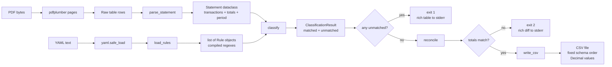
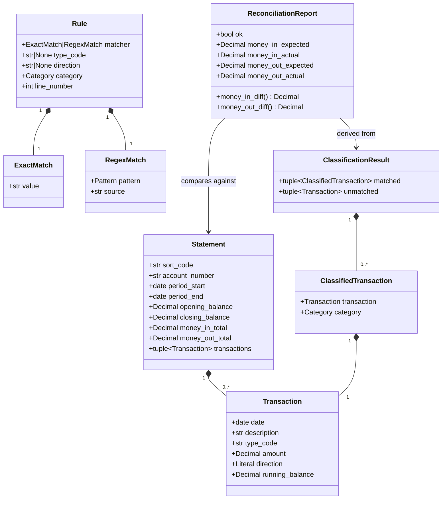
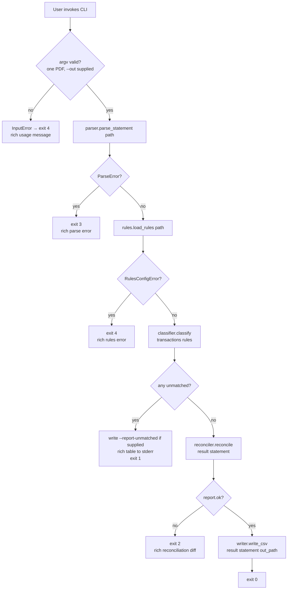
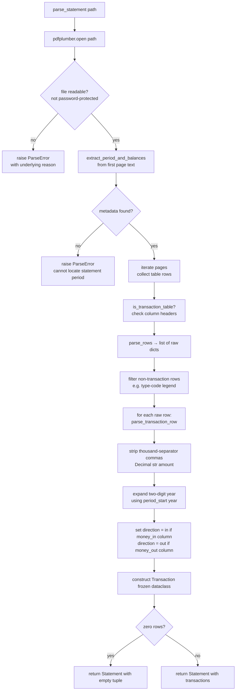
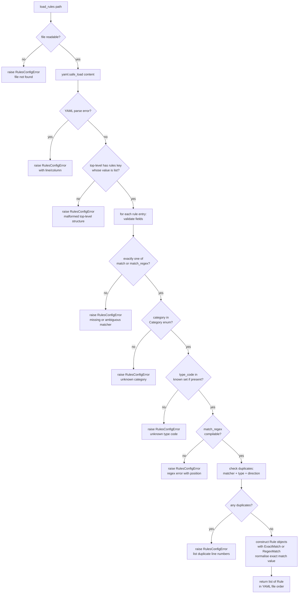
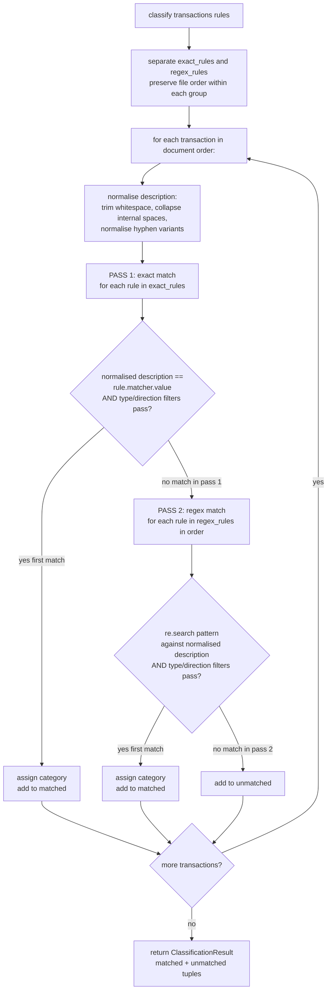
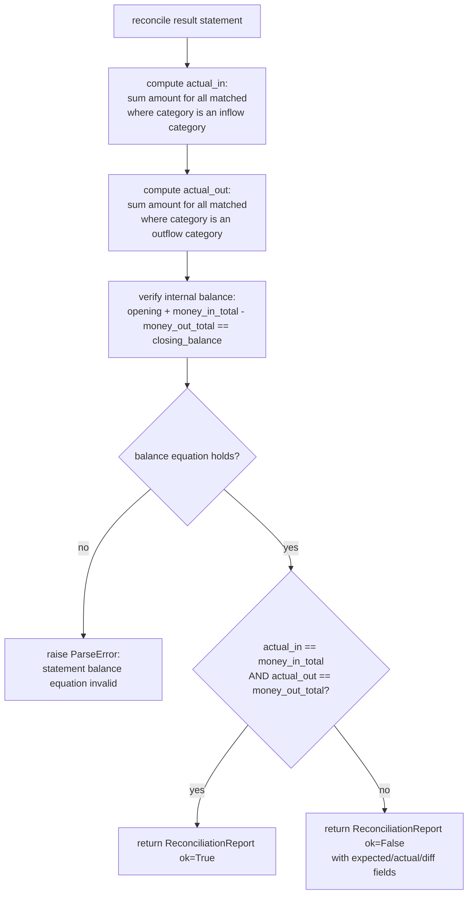
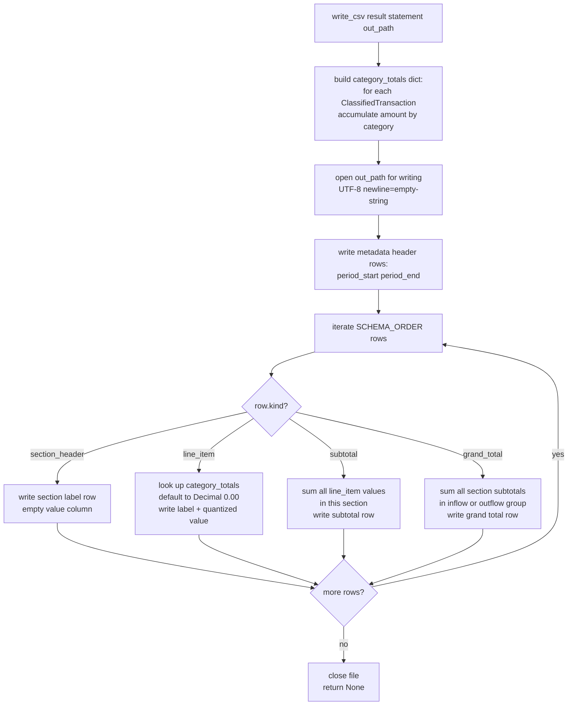

# Design Document: Lloyds Expense Tool

## Overview

The Lloyds Expense Tool is a single-invocation CLI that transforms one Lloyds Bank Classic personal-account statement PDF into a categorised monthly cash-flow CSV. The design is a strict linear pipeline: parse PDF -> load rules -> classify transactions -> reconcile totals -> write CSV. Each stage is an isolated module with a single public function; the CLI wires the stages together and is the only module allowed to touch I/O boundaries (argv, stdout, stderr, sys.exit).

The design principles are:
- Every monetary value is `decimal.Decimal` from parse boundary to CSV write.
- All data objects are `frozen=True` dataclasses — mutation is never needed after construction.
- Errors surface as typed exceptions; the CLI layer is the sole exception handler and exit-code mapper.
- Output is deterministic: same inputs always produce a byte-identical CSV.

---

## Architecture Design

### System Architecture Diagram

```mermaid
graph TB
    User([User]) -->|"lloyds-expense statement.pdf --rules rules.yaml --out budget.csv"| CLI

    subgraph "src/lloyds_expense/"
        CLI[cli.py\ntyper app\nI/O boundary]
        Parser[parser.py\npdfplumber\nPDF → Statement]
        Rules[rules.py\nPyYAML\nYAML → Rule list]
        Classifier[classifier.py\npure function\ntransactions × rules → ClassificationResult]
        Reconciler[reconciler.py\npure function\nClassificationResult → ReconciliationReport]
        Writer[writer.py\npure function\nClassificationResult → CSV file]
        Schema[schema.py\nCategory enum\nrow order constants]
        Errors[errors.py\nexception hierarchy]
    end

    PDF[(statement.pdf)] -->|Path| Parser
    YAML[(rules.yaml)] -->|Path| Rules
    Parser -->|Statement| CLI
    Rules -->|list[Rule]| CLI
    CLI -->|transactions, rules| Classifier
    Classifier -->|ClassificationResult| CLI
    CLI -->|ClassificationResult, statement totals| Reconciler
    Reconciler -->|ReconciliationReport| CLI
    CLI -->|ClassificationResult, period metadata, Path| Writer
    Writer -->|CSV file| CSV[(budget.csv)]

    Schema -.->|imported by| Classifier
    Schema -.->|imported by| Rules
    Schema -.->|imported by| Writer
    Errors -.->|imported by| Parser
    Errors -.->|imported by| Rules
    Errors -.->|imported by| Classifier
    Errors -.->|imported by| Reconciler
```

### Data Flow Diagram



---

## Component Design

### `schema.py` — Budget Shape Definition

- **Responsibilities:** Define the closed enumeration of all valid categories, declare the canonical output row order, expose the section-to-category mapping, and provide iteration helpers.
- **Interfaces:**
  - `Category(enum.Enum)` — all leaf categories as enum members (e.g. `Category.SALARY`, `Category.FOOD_SUPPLIES`).
  - `Section(enum.Enum)` — section headers (`REGULAR_INFLOWS`, `IRREGULAR_INFLOWS`, `ASSET_LIQUIDATION`, `REGULAR_OUTFLOWS`, `IRREGULAR_OUTFLOWS`, `ASSETS`).
  - `SCHEMA_ORDER: list[SchemaRow]` — ordered list of `SchemaRow` objects defining every row the CSV must emit (section headers, line items, subtotals, grand totals).
  - `category_display_name(category: Category) -> str` — human-readable name for CSV output.
  - `section_for_category(category: Category) -> Section` — look up which section owns a category.
- **Dependencies:** stdlib only (`enum`). No other project modules.

### `errors.py` — Exception Hierarchy

- **Responsibilities:** Define all typed exceptions used across the codebase. No logic.
- **Interfaces:**
  - `StatementToCsvError(Exception)` — base class.
  - `ParseError(StatementToCsvError)` — raised by `parser.py` for any PDF parse failure.
  - `RulesConfigError(StatementToCsvError)` — raised by `rules.py` for invalid or unloadable rules.
  - `UnmatchedTransactionsError(StatementToCsvError)` — raised by `classifier.py` (or CLI) when unmatched transactions remain.
  - `ReconciliationError(StatementToCsvError)` — raised by the CLI when reconciliation fails.
  - `InputError(StatementToCsvError)` — raised by the CLI for bad command-line arguments.
- **Dependencies:** stdlib only.

### `parser.py` — PDF to Typed Transactions

- **Responsibilities:** Accept a PDF file path, extract the transaction table and statement metadata, return a typed `Statement` dataclass.
- **Interfaces:**
  - `parse_statement(path: Path) -> Statement`
  - `Statement` (frozen dataclass): `sort_code: str`, `account_number: str`, `period_start: date`, `period_end: date`, `opening_balance: Decimal`, `closing_balance: Decimal`, `money_in_total: Decimal`, `money_out_total: Decimal`, `transactions: tuple[Transaction, ...]`.
  - `Transaction` (frozen dataclass): `date: date`, `description: str`, `type_code: str`, `amount: Decimal`, `direction: Literal["in", "out"]`, `running_balance: Decimal`.
- **Dependencies:** `pdfplumber`, `decimal`, `datetime`, `pathlib`; raises `ParseError`.

### `rules.py` — YAML to Rule Objects

- **Responsibilities:** Load, validate, and compile the rules YAML into an ordered list of `Rule` objects. Validate categories against `schema.py`.
- **Interfaces:**
  - `load_rules(path: Path) -> list[Rule]`
  - `Rule` (frozen dataclass): `matcher: ExactMatch | RegexMatch`, `type_code: str | None`, `direction: Literal["in", "out"] | None`, `category: Category`, `line_number: int`.
  - `ExactMatch` (frozen dataclass): `value: str`.
  - `RegexMatch` (frozen dataclass): `pattern: re.Pattern[str]`, `source: str`.
- **Dependencies:** `yaml`, `re`, `schema.py`; raises `RulesConfigError`.

### `classifier.py` — Two-Pass Matching

- **Responsibilities:** Accept transactions and rules; return a `ClassificationResult` containing matched and unmatched transactions. Pure function, no I/O.
- **Interfaces:**
  - `classify(transactions: tuple[Transaction, ...], rules: list[Rule]) -> ClassificationResult`
  - `ClassifiedTransaction` (frozen dataclass): `transaction: Transaction`, `category: Category`.
  - `ClassificationResult` (frozen dataclass): `matched: tuple[ClassifiedTransaction, ...]`, `unmatched: tuple[Transaction, ...]`.
- **Dependencies:** `schema.py`, `errors.py` (for type imports only).

### `reconciler.py` — Arithmetic Verification

- **Responsibilities:** Sum classified inflows and outflows; compare to the statement's reported totals. Return a structured report — does not raise, does not exit.
- **Interfaces:**
  - `reconcile(result: ClassificationResult, statement: Statement) -> ReconciliationReport`
  - `ReconciliationReport` (frozen dataclass): `ok: bool`, `money_in_expected: Decimal`, `money_in_actual: Decimal`, `money_out_expected: Decimal`, `money_out_actual: Decimal`.
  - Derived properties: `money_in_diff: Decimal`, `money_out_diff: Decimal` (computed as `actual - expected`).
- **Dependencies:** `decimal`, `schema.py` (to know inflow vs outflow categories).

### `writer.py` — ClassificationResult to CSV

- **Responsibilities:** Iterate the canonical schema row order, compute per-category totals, emit every row to a CSV file (zero-filled when no activity).
- **Interfaces:**
  - `write_csv(result: ClassificationResult, statement: Statement, out: Path) -> None`
- **Dependencies:** `csv`, `decimal`, `schema.py`.

### `cli.py` — Entry Point and I/O Boundary

- **Responsibilities:** Parse argv via `typer`, invoke the pipeline stages in order, catch all `StatementToCsvError` subclasses, map them to exit codes, and produce `rich`-formatted output on stderr.
- **Interfaces:**
  - `app = typer.Typer()` — the typer application object.
  - `main(statement_pdf: Path, rules: Optional[Path], out: Path, report_unmatched: Optional[Path])` — the single typer command.
- **Dependencies:** `typer`, `rich`, all other project modules.

### `__main__.py`

- Imports `app` from `cli.py` and calls `app()`. Enables `python -m lloyds_expense`.

---

## Data Models

### Core Data Structure Definitions

```python
# schema.py
from enum import Enum
from dataclasses import dataclass
from typing import Literal

class Category(Enum):
    # Inflows
    SALARY = "Salary"
    UNEXPECTED_REFUND = "Unexpected / Refund"
    LOAN = "Loan"
    SAVINGS = "Savings"
    STOCKS_AND_SHARES = "Stocks & Shares"
    # Outflows
    RENT = "Rent"
    BILL_COUNCIL_TAX = "Bill - Council Tax"
    BILL_ELECTRICITY_GAS = "Bill - Electricity & Gas"
    BILL_PHONE_INTERNET = "Bill - Phone & Internet"
    FOOD_SUPPLIES = "Food Supplies"
    DEBT = "Debt"
    CAR_AND_GAS = "Car & Gas"
    CHARITY_DONATIONS = "Charity / Donations"
    GIFTS_ENTERTAINMENT_MISC = "Gifts/Entertainment/Misc"
    SUNDRY = "Sundry"
    HOLIDAYS_TRAVEL = "Holidays & Travel"
    EDUCATION = "Education"
    EATING_OUT = "Eating Out"
    ACTIVE_SAVINGS = "Active Savings"
    LIFETIME_ISA = "Lifetime ISA"
    STOCKS_SHARES_ISA = "Stocks & Shares ISA"
    DIVIDEND_PORTFOLIO = "Dividend Portfolio"

class Section(Enum):
    REGULAR_INFLOWS = "Regular Inflows"
    IRREGULAR_INFLOWS = "Irregular Inflows"
    ASSET_LIQUIDATION = "Asset Liquidation"
    REGULAR_OUTFLOWS = "Regular Outflows"
    IRREGULAR_OUTFLOWS = "Irregular Outflows"
    ASSETS = "Assets"

@dataclass(frozen=True)
class SchemaRow:
    kind: Literal["section_header", "line_item", "subtotal", "grand_total"]
    section: Section | None       # None for grand_total rows
    category: Category | None     # populated only for line_item rows
    label: str                    # exact string written to CSV col 0

# parser.py
from dataclasses import dataclass
from datetime import date
from decimal import Decimal
from typing import Literal

@dataclass(frozen=True)
class Transaction:
    date: date
    description: str
    type_code: str
    amount: Decimal
    direction: Literal["in", "out"]
    running_balance: Decimal

@dataclass(frozen=True)
class Statement:
    sort_code: str
    account_number: str
    period_start: date
    period_end: date
    opening_balance: Decimal
    closing_balance: Decimal
    money_in_total: Decimal
    money_out_total: Decimal
    transactions: tuple[Transaction, ...]

# rules.py
import re
from dataclasses import dataclass
from typing import Literal

@dataclass(frozen=True)
class ExactMatch:
    value: str                    # normalised at load time

@dataclass(frozen=True)
class RegexMatch:
    pattern: re.Pattern[str]      # compiled at load time
    source: str                   # original pattern string for dedup checks

@dataclass(frozen=True)
class Rule:
    matcher: ExactMatch | RegexMatch
    type_code: str | None
    direction: Literal["in", "out"] | None
    category: Category
    line_number: int              # 1-based, for error messages

# classifier.py
from dataclasses import dataclass

@dataclass(frozen=True)
class ClassifiedTransaction:
    transaction: Transaction
    category: Category

@dataclass(frozen=True)
class ClassificationResult:
    matched: tuple[ClassifiedTransaction, ...]
    unmatched: tuple[Transaction, ...]

# reconciler.py
from dataclasses import dataclass
from decimal import Decimal

@dataclass(frozen=True)
class ReconciliationReport:
    ok: bool
    money_in_expected: Decimal
    money_in_actual: Decimal
    money_out_expected: Decimal
    money_out_actual: Decimal

    @property
    def money_in_diff(self) -> Decimal:
        return self.money_in_actual - self.money_in_expected

    @property
    def money_out_diff(self) -> Decimal:
        return self.money_out_actual - self.money_out_expected
```

### Data Model Relationships



---

## Business Process

### Process 1: CLI Invocation and Pipeline Orchestration



### Process 2: PDF Parsing Detail



### Process 3: Rules Loading and Validation



### Process 4: Two-Pass Classification



### Process 5: Reconciliation Check



### Process 6: CSV Output



---

## Error Handling Strategy

### Exception Hierarchy

```
StatementToCsvError (base)
├── ParseError              — exit code 3
│   Attributes: message: str, page: int | None
├── RulesConfigError        — exit code 4
│   Attributes: message: str, line_number: int | None, violations: list[str]
├── UnmatchedTransactionsError — exit code 1
│   Attributes: unmatched: tuple[Transaction, ...]
├── ReconciliationError     — exit code 2
│   Attributes: report: ReconciliationReport
└── InputError              — exit code 4
    Attributes: message: str
```

### Exit Code Mapping

| Exit Code | Condition | Exception |
|-----------|-----------|-----------|
| 0 | All stages passed, CSV written | (no exception) |
| 1 | One or more unmatched transactions | `UnmatchedTransactionsError` |
| 2 | Reconciliation mismatch | `ReconciliationError` |
| 3 | PDF parse failure or balance equation invalid | `ParseError` |
| 4 | Bad input (missing file, malformed YAML, unknown category/type, invalid CLI args) | `InputError`, `RulesConfigError` |

### Error Handling Principles

1. Library modules (`parser`, `rules`, `classifier`, `reconciler`, `writer`) raise typed exceptions. They never call `print`, `sys.exit`, or access `sys.stderr`.
2. `cli.py` wraps each pipeline call in a `try/except StatementToCsvError` block, formats the error via `rich` to stderr, and calls `raise typer.Exit(code=N)`.
3. For `RulesConfigError` with multiple violations (e.g. duplicate rules), the `violations` list is populated so all failures can be reported at once rather than one at a time.
4. Unexpected exceptions (bugs, library failures) propagate uncaught to Python's default traceback handler. This is intentional — a crash with a traceback is more diagnosable than a swallowed exception.
5. The balance equation check (`opening + money_in - money_out == closing`) is performed inside `reconciler.reconcile`, and a failure raises `ParseError` rather than `ReconciliationError` because it indicates a parser fault, not a classification fault.

---

## Key Algorithms

### PDF Table Extraction Strategy

Lloyds Classic statements have a consistent tabular layout rendered by the bank's PDF generator. The extraction approach:

1. **Page detection.** Use `pdfplumber`'s `page.extract_tables()` to detect tables on each page. A table is considered the transaction table when its header row matches the expected column set: `["Date", "Description", "Type", "Money in", "Money out", "Balance"]` (case-insensitive, normalised).

2. **Multi-page concatenation.** If a statement spans multiple pages, `extract_tables()` is called on each page in order. Rows from all pages are concatenated into a single list before any parsing occurs, preserving document top-to-bottom order.

3. **Non-transaction table filtering.** The final page of Lloyds statements typically contains a type-code legend table (e.g. "BGC: Bank Giro Credit"). This table has a different column structure (two columns: code, description) and is excluded by the header-row check above.

4. **Column value extraction.** For each row, values are extracted positionally:
   - Column 0: date string (e.g. `"01 Apr 26"`)
   - Column 1: description string
   - Column 2: type code string
   - Column 3: money-in amount (empty string if this row is money-out)
   - Column 4: money-out amount (empty string if this row is money-in)
   - Column 5: running balance

5. **Amount parsing.** For a given row, exactly one of columns 3 or 4 is non-empty. The direction is set accordingly. Amount strings have thousand-separator commas stripped, then are passed to `Decimal(str(cleaned))`.

6. **Two-digit year expansion.** The statement period (e.g. `"01 Mar 26 to 31 Mar 26"`) is extracted from the first page's text using a regex pattern. The four-digit year (`2026`) is stored at parse time. When a transaction date string has a two-digit year (e.g. `"01 Apr 26"`), it is expanded using the century prefix from the statement period year. This is never derived from the current system date.

7. **Metadata extraction.** The first page text is searched for:
   - Statement period: regex matching `DD Mon YY to DD Mon YY`
   - Opening balance, closing balance, Money In total, Money Out total: extracted from the summary section (labelled fields in the header area of the PDF)

### Two-Pass Classification Algorithm

Classification is executed in two distinct passes over the rule set for each transaction. The separation ensures that a specific exact match always beats a broader regex match, regardless of their relative order in the rules file.

**Normalisation (applied to both transaction description and exact rule values):**
```
normalised = description.strip()
normalised = re.sub(r'\s+', ' ', normalised)
normalised = normalised.replace('‐', '-')   # hyphen
normalised = normalised.replace('‑', '-')   # non-breaking hyphen
normalised = normalised.replace('‒', '-')   # figure dash
normalised = normalised.replace('–', '-')   # en dash
normalised = normalised.replace('—', '-')   # em dash
```

**Pass 1 — Exact matching:**
- Iterate all rules whose `matcher` is `ExactMatch`.
- For each rule, check: `normalised_description == rule.matcher.value`.
- Also check optional filters: `rule.type_code is None or rule.type_code == transaction.type_code` and `rule.direction is None or rule.direction == transaction.direction`.
- On the first match, record the category and skip Pass 2 for this transaction.

**Pass 2 — Regex matching:**
- Iterate all rules whose `matcher` is `RegexMatch`, in YAML file order.
- For each rule, check: `rule.matcher.pattern.search(normalised_description) is not None`.
- Also check optional type and direction filters.
- On the first match, record the category. File order determines priority — the user is responsible for ordering general patterns after specific ones.

**No match:** The transaction is added to the unmatched list.

### CSV Row Ordering Algorithm

The CSV writer uses the `SCHEMA_ORDER` list defined in `schema.py`. This list is a compile-time constant — an ordered sequence of `SchemaRow` objects. The writer iterates it exactly once in sequence, never sorting or reordering.

The `SCHEMA_ORDER` list encodes the complete output structure:

```
[section_header "Regular Inflows",
 line_item SALARY,
 subtotal "Regular Inflows subtotal",
 section_header "Irregular Inflows",
 line_item UNEXPECTED_REFUND,
 line_item LOAN,
 subtotal "Irregular Inflows subtotal",
 section_header "Asset Liquidation",
 line_item SAVINGS,
 line_item STOCKS_AND_SHARES,
 subtotal "Asset Liquidation subtotal",
 grand_total "Total Income",
 section_header "Regular Outflows",
 line_item RENT,
 line_item BILL_COUNCIL_TAX,
 line_item BILL_ELECTRICITY_GAS,
 line_item BILL_PHONE_INTERNET,
 line_item FOOD_SUPPLIES,
 line_item DEBT,
 line_item CAR_AND_GAS,
 subtotal "Regular Outflows subtotal",
 section_header "Irregular Outflows",
 line_item CHARITY_DONATIONS,
 line_item GIFTS_ENTERTAINMENT_MISC,
 line_item SUNDRY,
 line_item HOLIDAYS_TRAVEL,
 line_item EDUCATION,
 line_item EATING_OUT,
 subtotal "Irregular Outflows subtotal",
 section_header "Assets",
 line_item ACTIVE_SAVINGS,
 line_item LIFETIME_ISA,
 line_item STOCKS_SHARES_ISA,
 line_item DIVIDEND_PORTFOLIO,
 subtotal "Assets subtotal",
 grand_total "Total Expenditure"]
```

**Subtotal computation:** When a `subtotal` row is encountered, the writer sums all `line_item` amounts accumulated since the last `section_header` for that section. Values default to `Decimal("0.00")` for categories with no transactions.

**Grand total computation:** When a `grand_total` row is encountered, the writer sums the subtotals of all sections in the same group (inflows or outflows).

**Decimal quantization:** All amounts are formatted as `str(value.quantize(Decimal("0.01")))` at write time, never before.

---

## Testing Strategy

### Test Module Layout

Each source module has a corresponding test module:

| Source module | Test module | Primary focus |
|---|---|---|
| `schema.py` | `test_schema.py` (implicit via others) | Enum completeness, row order coverage |
| `errors.py` | (tested via integration) | Exception hierarchy correctness |
| `parser.py` | `test_parser.py` | PDF parsing correctness, edge cases |
| `rules.py` | `test_rules.py` | YAML loading, validation, error paths |
| `classifier.py` | `test_classifier.py` | Matching logic, pass order, normalisation |
| `reconciler.py` | `test_reconciler.py` | Arithmetic, pass/fail cases |
| `writer.py` | `test_writer.py` | Schema order, zero-fill, golden file |
| `cli.py` | `test_cli.py` | End-to-end, exit codes, stderr |

### Test Fixtures

`tests/fixtures/` contains:
- `statement_minimal.pdf` — a minimal valid Lloyds Classic PDF with three transactions (one money-in, two money-out), used for fast unit tests.
- `statement_full.pdf` — a realistic PDF spanning two pages with ~20 transactions, used for integration and end-to-end tests.
- `rules_example.yaml` — a representative rules file covering all fixture transactions plus deliberate gaps for testing unmatched paths.

These fixtures are checked in and tests never reach the network or the filesystem outside of `tmp_path`.

### Unit Test Approach per Module

**`test_parser.py`**
- Parse `statement_minimal.pdf`; assert `len(transactions) == 3`, correct `Decimal` amounts, correct directions, correct dates with year expansion.
- Assert `opening_balance + money_in_total - money_out_total == closing_balance` holds for both fixtures.
- Supply a non-PDF file; assert `ParseError` is raised.
- Supply a password-protected PDF stub; assert `ParseError` with appropriate message.
- Assert that the type-code legend table on the final page produces no `Transaction` records.
- Assert amounts with thousand separators (`1,000.00`) parse as `Decimal("1000.00")`.

**`test_rules.py`**
- Load a valid rules file; assert `Rule` objects in file order with correct matchers, types, directions.
- Supply a file with a duplicate exact rule; assert `RulesConfigError` naming both line numbers.
- Supply a rule with an unknown category; assert `RulesConfigError`.
- Supply a rule with an invalid regex; assert `RulesConfigError` with pattern source.
- Supply a YAML file missing the `rules` key; assert `RulesConfigError`.
- Supply a rule with both `match` and `match_regex`; assert `RulesConfigError`.
- Assert that `ExactMatch.value` has been normalised at load time (whitespace collapsed).

**`test_classifier.py`**
- Exact match takes priority over a regex match for the same description, regardless of YAML order.
- Type filter: a rule with `type: DD` does not match a `BGC` transaction with the same description.
- Direction filter: a rule with `direction: out` does not match a money-in transaction.
- First regex in file order wins when multiple regex rules match.
- Transaction with no matching rule appears in `result.unmatched`.
- Hyphen normalisation: `OMASIRICHI OKWU-BO` matches a rule defined as `OMASIRICHI OKWU BO`.
- Document order of matched transactions is preserved in `result.matched`.

**`test_reconciler.py`**
- `reconcile` returns `ok=True` when computed totals match statement totals exactly.
- `reconcile` returns `ok=False` with correct diffs when either total differs by `Decimal("0.01")`.
- `reconcile` raises `ParseError` when `opening + in - out != closing`.
- All arithmetic uses `Decimal`; no float comparison.

**`test_writer.py`**
- Golden file test: a known `ClassificationResult` + `Statement` produces a CSV that matches `tests/fixtures/expected_output.csv` byte-for-byte.
- Zero-fill test: a `ClassificationResult` with no transactions in a category still emits that category's row with `"0.00"`.
- All 34 schema rows are present in output (section headers, line items, subtotals, grand totals) plus metadata header rows.
- `\n` line endings are used (not `\r\n`).
- CSV uses `csv.QUOTE_MINIMAL` — no unnecessary quoting.

**`test_cli.py`** (via `typer.testing.CliRunner`)
- Happy path: `statement_minimal.pdf` + `rules_example.yaml` → exit 0, CSV written to `tmp_path`.
- Unmatched transactions: rules file missing one transaction's rule → exit 1, rich table on stderr, no CSV written.
- Reconciliation mismatch: fixture with tampered totals → exit 2, diff on stderr.
- Non-existent PDF → exit 4, descriptive error on stderr.
- Missing `--out` → exit 4, usage message on stderr.
- `--report-unmatched <path>` with unmatched transactions → exit 1, report file written at path.
- `--help` → exit 0, all options listed.

### Coverage Target

Coverage is measured by `pytest-cov` on the non-CLI source modules (`schema`, `errors`, `parser`, `rules`, `classifier`, `reconciler`, `writer`). The minimum floor is **90% line coverage**. `cli.py` is excluded from the floor because its I/O-heavy paths are covered by `test_cli.py` integration tests rather than unit tests.

Coverage is enforced in CI via:
```
pytest --cov=lloyds_expense --cov-fail-under=90 --cov-omit="*/cli.py"
```

### Determinism Test

A dedicated test asserts that running the full pipeline twice with the same inputs produces byte-identical output files. This guards against any accidental non-determinism (e.g. dict ordering, timestamp injection, float rounding).
