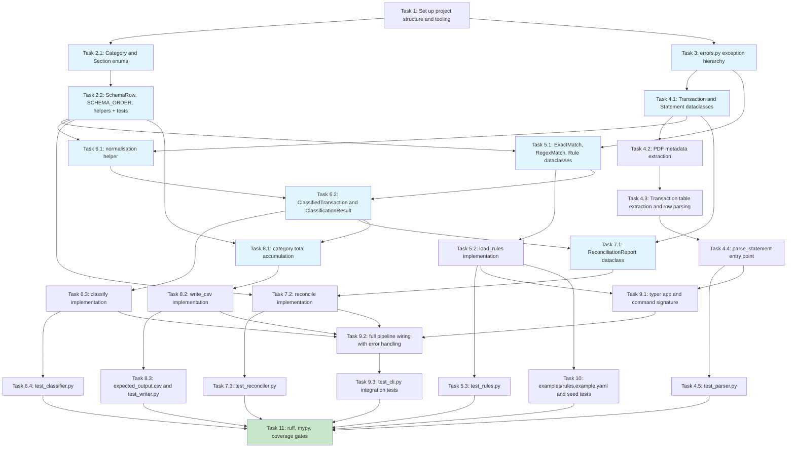

# Implementation Plan: Lloyds Expense Tool

- [ ] 1. Set up project structure and tooling
  - Create the `src/lloyds_expense/` package directory with `__init__.py` and `__main__.py`
  - Create `tests/` and `tests/fixtures/` directories
  - Create `pyproject.toml` declaring all runtime dependencies (`pdfplumber`, `PyYAML`, `typer`, `rich`) and dev dependencies (`pytest`, `pytest-cov`, `mypy`, `ruff`) managed with `uv`
  - Configure `ruff` (lint + format) and `mypy --strict` sections in `pyproject.toml`
  - Configure `pytest` with `--cov=lloyds_expense --cov-fail-under=90 --cov-omit="*/cli.py"` in `pyproject.toml`
  - _Requirements: R10.1, R13.1, R13.2, R13.3, R13.4_

- [ ] 2. Implement `schema.py` — budget shape definition
- [ ] 2.1 Define `Category` and `Section` enums
  - Write the `Category(enum.Enum)` with all 22 leaf category members matching the exact display names from the CSV schema
  - Write the `Section(enum.Enum)` with all 6 section members
  - _Requirements: R7.3, R10.1, R10.3_

- [ ] 2.2 Define `SchemaRow` dataclass and `SCHEMA_ORDER` constant
  - Write the `SchemaRow(frozen=True)` dataclass with `kind`, `section`, `category`, and `label` fields
  - Write the `SCHEMA_ORDER: list[SchemaRow]` constant encoding all 34 rows (section headers, 22 line items, 6 subtotals, 2 grand totals) in the exact fixed output order from R7.3
  - Implement `category_display_name(category: Category) -> str` and `section_for_category(category: Category) -> Section` helpers
  - Write `test_schema.py` asserting enum completeness (22 categories, 6 sections), `SCHEMA_ORDER` length (34 rows), and that every `Category` member appears exactly once as a line item
  - _Requirements: R7.3, R7.5, R7.6, R10.3_

- [ ] 3. Implement `errors.py` — typed exception hierarchy
  - Write `StatementToCsvError(Exception)` base class
  - Write `ParseError` with attributes `message: str` and `page: int | None`
  - Write `RulesConfigError` with attributes `message: str`, `line_number: int | None`, and `violations: list[str]`
  - Write `UnmatchedTransactionsError` with attribute `unmatched: tuple[Transaction, ...]` (forward reference)
  - Write `ReconciliationError` with attribute `report: ReconciliationReport` (forward reference)
  - Write `InputError` with attribute `message: str`
  - _Requirements: R10.1, R10.4_

- [ ] 4. Implement `parser.py` — PDF to typed transactions
- [ ] 4.1 Define `Transaction` and `Statement` frozen dataclasses
  - Write `Transaction(frozen=True)` with fields `date: date`, `description: str`, `type_code: str`, `amount: Decimal`, `direction: Literal["in", "out"]`, `running_balance: Decimal`
  - Write `Statement(frozen=True)` with fields `sort_code`, `account_number`, `period_start`, `period_end`, `opening_balance`, `closing_balance`, `money_in_total`, `money_out_total`, and `transactions: tuple[Transaction, ...]`
  - _Requirements: R2.1, R2.3, R2.4, R10.5_

- [ ] 4.2 Implement metadata extraction from PDF first page
  - Write `_extract_metadata(page_text: str, four_digit_year: int) -> dict` that uses regex to parse the statement period (`DD Mon YY to DD Mon YY` format), opening balance, closing balance, Money In total, and Money Out total from the first page text
  - Ensure statement period year is stored as a four-digit integer for later two-digit year expansion
  - Raise `ParseError` with descriptive message when metadata cannot be located
  - _Requirements: R2.6, R6.3, R10.5_

- [ ] 4.3 Implement transaction table extraction and row parsing
  - Write `_is_transaction_table(table: list) -> bool` that checks the header row for the expected column set `["Date", "Description", "Type", "Money in", "Money out", "Balance"]` (case-insensitive, normalised)
  - Write `_parse_transaction_row(row: list, four_digit_year: int) -> Transaction` that positionally extracts each column, strips thousand-separator commas from amounts, constructs `Decimal(str(cleaned))`, sets `direction` based on which amount column is populated, and expands the two-digit year using `four_digit_year` (never `datetime.today()`)
  - Write `_is_non_transaction_row(row: list) -> bool` to identify and skip type-code legend rows
  - Raise `ParseError` with page number when a row cannot be parsed
  - _Requirements: R2.1, R2.2, R2.3, R2.4, R2.5, R2.6, R2.8, R2.9, R2.10, R2.11_

- [ ] 4.4 Implement `parse_statement(path: Path) -> Statement`
  - Open the PDF with `pdfplumber`, iterate pages in document order, concatenate all valid transaction table rows across pages, construct the `Statement` dataclass
  - Handle unreadable / password-protected PDFs by catching `pdfplumber` exceptions and re-raising as `ParseError`
  - Return `Statement` with an empty `transactions` tuple when zero rows are found (per R2.12)
  - _Requirements: R1.2, R1.3, R1.5, R2.7, R2.11, R2.12, R10.5_

- [ ] 4.5 Write `test_parser.py` unit tests
  - Create `tests/fixtures/statement_minimal.pdf` — a minimal synthetic Lloyds Classic PDF with 3 transactions (1 money-in, 2 money-out) including one amount with a thousand-separator comma and a two-digit year date
  - Create `tests/fixtures/statement_full.pdf` — a realistic two-page PDF with ~20 transactions including a type-code legend table on the final page
  - Write tests: correct transaction count, correct `Decimal` amounts, correct `direction` values, correct date year expansion, balance equation holds, thousand-separator stripping, legend table produces no `Transaction` records, non-PDF file raises `ParseError`, empty statement returns valid `Statement` with empty tuple
  - _Requirements: R2.1–R2.12, R1.2, R1.3, R1.5_

- [ ] 5. Implement `rules.py` — YAML to validated Rule objects
- [ ] 5.1 Define `ExactMatch`, `RegexMatch`, and `Rule` frozen dataclasses
  - Write `ExactMatch(frozen=True)` with `value: str` (normalised at load time)
  - Write `RegexMatch(frozen=True)` with `pattern: re.Pattern[str]` and `source: str`
  - Write `Rule(frozen=True)` with `matcher: ExactMatch | RegexMatch`, `type_code: str | None`, `direction: Literal["in", "out"] | None`, `category: Category`, and `line_number: int`
  - Define the closed set of known Lloyds type codes as a module-level constant: `{FPO, FPI, DD, DEB, BGC, BP, CHG, CHQ, COR, CPT, DEP, FEE, MPI, MPO, PAY, SO, TFR}`
  - _Requirements: R3.4, R3.6, R10.6_

- [ ] 5.2 Implement `load_rules(path: Path) -> list[Rule]`
  - Read the file and call `yaml.safe_load`; raise `RulesConfigError` on missing file or YAML parse error with line/column information
  - Validate top-level structure: must be a mapping with a `rules` key whose value is a list; raise `RulesConfigError` otherwise
  - For each rule entry: validate exactly one of `match` / `match_regex` present, validate `category` against `Category` enum, validate `type_code` against the known set when present, compile regex patterns and catch compile errors
  - Normalise `ExactMatch.value` using the same whitespace and hyphen normalisation as classification
  - Detect duplicate rules (same matcher + `type_code` + `direction`); collect all duplicates and raise `RulesConfigError` with all duplicate line numbers
  - Preserve YAML file order; attach `line_number` (1-based) to each `Rule`
  - _Requirements: R3.1, R3.2, R3.3, R3.4, R3.5, R3.6, R3.7, R3.8, R3.9, R3.10, R9.2_

- [ ] 5.3 Write `test_rules.py` unit tests
  - Write tests: valid file produces `Rule` list in file order with correct matchers and types; duplicate exact rule raises `RulesConfigError` naming both line numbers; unknown category raises `RulesConfigError`; invalid regex raises `RulesConfigError` with pattern source; missing `rules` key raises `RulesConfigError`; both `match` and `match_regex` present raises `RulesConfigError`; `ExactMatch.value` is normalised at load time; unknown type code raises `RulesConfigError`
  - _Requirements: R3.4–R3.10_

- [ ] 6. Implement `classifier.py` — two-pass transaction matching
- [ ] 6.1 Implement description normalisation helper
  - Write `_normalise(text: str) -> str` that trims whitespace, collapses internal whitespace runs to a single space, and replaces all hyphen-dash Unicode variants (`‐`, `‑`, `‒`, `–`, `—`) with ASCII hyphen-minus
  - _Requirements: R4.1_

- [ ] 6.2 Implement `ClassifiedTransaction` and `ClassificationResult` dataclasses
  - Write `ClassifiedTransaction(frozen=True)` with `transaction: Transaction` and `category: Category`
  - Write `ClassificationResult(frozen=True)` with `matched: tuple[ClassifiedTransaction, ...]` and `unmatched: tuple[Transaction, ...]`
  - _Requirements: R10.7_

- [ ] 6.3 Implement `classify(transactions, rules) -> ClassificationResult`
  - Separate rules into `exact_rules` and `regex_rules` lists (preserving file order within each group)
  - For each transaction in document order: normalise description, run Pass 1 (exact match with optional type/direction filters), run Pass 2 only if Pass 1 failed (regex match in file order with optional type/direction filters), add to `unmatched` if both passes fail
  - Return `ClassificationResult` with tuples preserving document order
  - _Requirements: R4.1, R4.2, R4.3, R4.4, R4.5, R4.6, R4.7, R10.7_

- [ ] 6.4 Write `test_classifier.py` unit tests
  - Write tests: exact match takes priority over regex for the same description regardless of YAML order; type filter rejects mismatched type code; direction filter rejects mismatched direction; first regex in file order wins when multiple patterns match; unmatched transaction appears in `result.unmatched`; hyphen normalisation — `OMASIRICHI OKWU-BO` matches rule defined as `OMASIRICHI OKWU BO`; document order is preserved in `result.matched`
  - _Requirements: R4.1–R4.7_

- [ ] 7. Implement `reconciler.py` — arithmetic verification
- [ ] 7.1 Implement `ReconciliationReport` dataclass
  - Write `ReconciliationReport(frozen=True)` with `ok: bool`, `money_in_expected`, `money_in_actual`, `money_out_expected`, `money_out_actual` as `Decimal` fields
  - Add `@property` computed attributes `money_in_diff` and `money_out_diff` (actual minus expected)
  - _Requirements: R10.8_

- [ ] 7.2 Implement `reconcile(result, statement) -> ReconciliationReport`
  - Determine which `Category` members are inflows vs outflows by using `schema.section_for_category`; inflow sections are `REGULAR_INFLOWS`, `IRREGULAR_INFLOWS`, `ASSET_LIQUIDATION`; outflow sections are `REGULAR_OUTFLOWS`, `IRREGULAR_OUTFLOWS`, `ASSETS`
  - Sum `transaction.amount` for all matched transactions whose category is an inflow category (`actual_in`) and all whose category is an outflow category (`actual_out`)
  - Verify the balance equation `opening_balance + money_in_total - money_out_total == closing_balance` using `Decimal` equality; raise `ParseError` on failure (not `ReconciliationError`)
  - Return `ReconciliationReport(ok=True)` when `actual_in == money_in_total` and `actual_out == money_out_total`; return `ReconciliationReport(ok=False)` with diff fields otherwise
  - _Requirements: R6.1, R6.2, R6.3, R6.4, R6.5, R6.6, R10.8_

- [ ] 7.3 Write `test_reconciler.py` unit tests
  - Write tests: returns `ok=True` when computed totals match exactly; returns `ok=False` with correct `money_in_diff` when in-total differs by `Decimal("0.01")`; returns `ok=False` with correct `money_out_diff` when out-total differs; raises `ParseError` when balance equation fails; all arithmetic uses `Decimal` (assert no `float` types in report)
  - _Requirements: R6.1–R6.6_

- [ ] 8. Implement `writer.py` — ClassificationResult to CSV
- [ ] 8.1 Implement category total accumulation
  - Write `_build_category_totals(result: ClassificationResult) -> dict[Category, Decimal]` that iterates all `ClassifiedTransaction` objects and sums `amount` per category, defaulting absent categories to `Decimal("0.00")`
  - _Requirements: R7.4, R7.5_

- [ ] 8.2 Implement `write_csv(result, statement, out) -> None`
  - Open `out` for writing with `encoding="utf-8"`, `newline=""`, and use `csv.writer` with `csv.QUOTE_MINIMAL`
  - Write the metadata header rows with `statement.period_start` and `statement.period_end`
  - Iterate `SCHEMA_ORDER` once: for `section_header` rows write label with empty value column; for `line_item` rows look up category total (default `Decimal("0.00")`) and write label + `str(value.quantize(Decimal("0.01")))`; for `subtotal` rows sum the line item values accumulated since the last section header; for `grand_total` rows sum all section subtotals in the inflow or outflow group
  - Overwrite `out` silently if it already exists
  - _Requirements: R7.1, R7.2, R7.3, R7.4, R7.5, R7.6, R7.7, R7.8, R10.9_

- [ ] 8.3 Create `tests/fixtures/expected_output.csv` and write `test_writer.py`
  - Create `tests/fixtures/expected_output.csv` — the golden CSV output corresponding to `statement_minimal.pdf` + all transactions matched
  - Write tests: golden file test asserts byte-for-byte match against `expected_output.csv`; zero-fill test asserts a category with no transactions emits `"0.00"`; all 34 schema rows present plus metadata header; output uses `\n` line endings; output uses `csv.QUOTE_MINIMAL` (no unnecessary quoting); determinism test runs the pipeline twice and asserts byte-identical files
  - _Requirements: R7.1–R7.8_

- [ ] 9. Implement `cli.py` — entry point and I/O boundary
- [ ] 9.1 Set up `typer` app and command signature
  - Create `app = typer.Typer()` and define the `main` command with positional `statement_pdf: Path` and options `--rules: Optional[Path] = None`, `--out: Path` (required), `--report-unmatched: Optional[Path] = None`
  - Validate `--out` is supplied (exit 4 with usage message if not)
  - Resolve the default rules path to `~/.config/lloyds-expense/rules.yaml` when `--rules` is not provided
  - Validate that `statement_pdf` exists and is readable (exit 4 with `rich` error if not)
  - Validate that only one PDF argument was supplied (exit 4 if more)
  - Wire `__main__.py` to call `app()` from `cli.py`
  - _Requirements: R9.1, R9.2, R9.3, R9.4, R9.5, R9.6, R1.1, R1.2, R1.4, R10.2_

- [ ] 9.2 Wire the full pipeline with error handling
  - Call `parser.parse_statement`, catch `ParseError`, format error with `rich` to stderr, exit 3
  - Call `rules.load_rules`, catch `RulesConfigError`, format error with `rich` to stderr, exit 4
  - Call `classifier.classify`; if `result.unmatched` is non-empty: format `rich` table to stderr (date, description, type, amount, direction columns), write plain-text report to `--report-unmatched` path if supplied, exit 1
  - Call `reconciler.reconcile`; if `report.ok` is `False`: format `rich` reconciliation diff (expected, actual, difference) to stderr, exit 2; if `ParseError` raised: format to stderr, exit 3
  - Call `writer.write_csv`; exit 0 on success
  - Ensure all `rich` output goes to stderr and stdout remains clean
  - _Requirements: R5.1, R5.2, R5.3, R5.4, R6.4, R6.5, R6.6, R8.1, R8.2, R9.5, R9.6, R10.2, R11.1–R11.5_

- [ ] 9.3 Write `test_cli.py` integration tests using `typer.testing.CliRunner`
  - Write tests: happy path with `statement_minimal.pdf` + `rules_example.yaml` → exit 0, CSV written to `tmp_path`; unmatched transactions (rules file missing one rule) → exit 1, rich table on stderr, no CSV written; reconciliation mismatch (tampered statement totals fixture) → exit 2, diff on stderr; non-existent PDF → exit 4 with descriptive error; missing `--out` → exit 4 with usage message; `--report-unmatched <path>` with unmatched transactions → exit 1, report file written; `--help` → exit 0, all options listed; zero-transaction statement with zero totals → exit 0 with all-zero CSV
  - _Requirements: R5.1–R5.4, R8.1, R8.2, R9.1–R9.6, R1.1–R1.5_

- [ ] 10. Create example rules file and seed data
  - Create `examples/rules.example.yaml` with the following specific rules:
    - Description `OMASIRICHI OKWU BO`, type `FPO`, direction `out` → category `Food Supplies`
    - Description `NATIONAL SERV M/W`, type `BGC`, direction `in` → category `Salary`
    - Description `HLAM REGULAR SAVIN`, type `DD`, direction `out` → category `Active Savings`
    - Description `Trading 212`, type `DEB`, direction `out` → category `Stocks & Shares ISA`
    - Do NOT include a generic personal-name FPI regex rule
  - Write a test in `test_rules.py` (or a dedicated `test_examples.py`) that loads `rules.example.yaml` and asserts each of the four rules loads correctly with the specified matcher, type, direction, and category
  - _Requirements: R12.1, R12.2, R12.3, R12.4, R12.5_

- [ ] 11. Enforce code quality and coverage gates
  - Run `ruff check` and `ruff format --check` across all source files; fix any reported issues
  - Run `mypy --strict src/lloyds_expense/` and resolve all type errors, including any `tuple[Transaction, ...]` forward references in `errors.py`
  - Run `pytest --cov=lloyds_expense --cov-fail-under=90 --cov-omit="*/cli.py"` and add tests for any uncovered lines in `schema`, `errors`, `parser`, `rules`, `classifier`, `reconciler`, `writer` until the 90% floor is met
  - Confirm all exit-code paths in `cli.py` are exercised by `test_cli.py`
  - _Requirements: R13.1, R13.2, R13.3_

---

## Task Dependency Diagram

