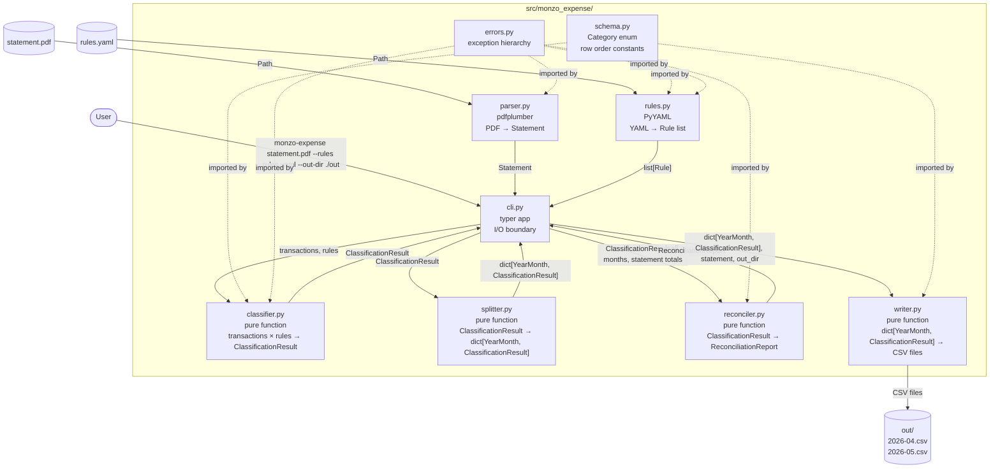
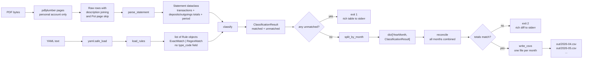
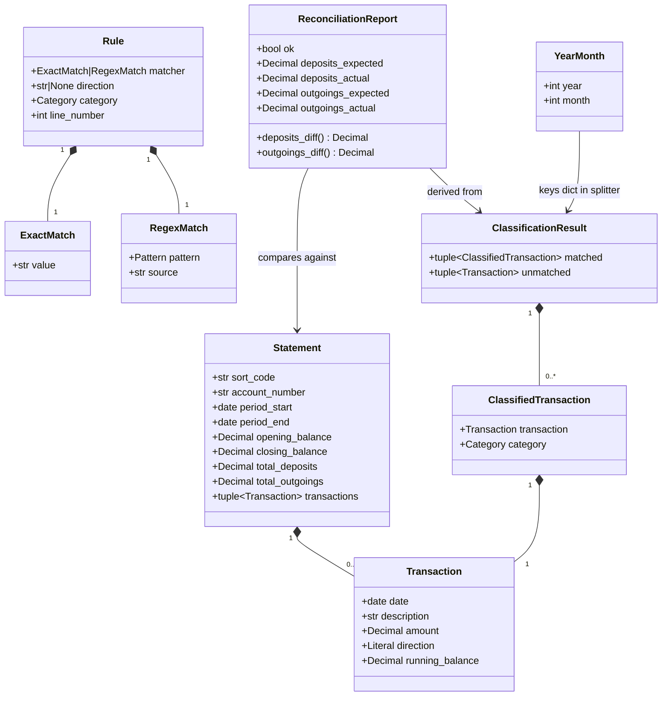
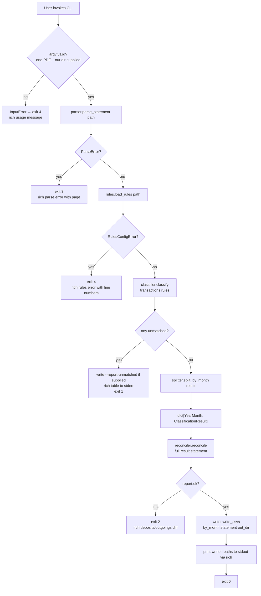
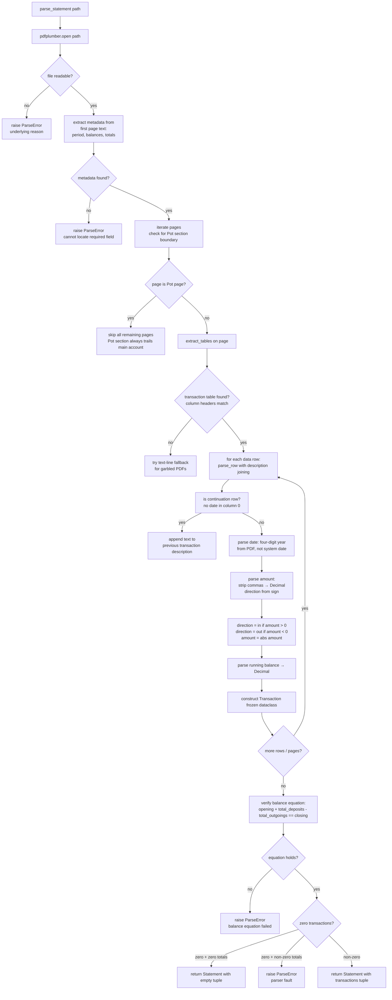
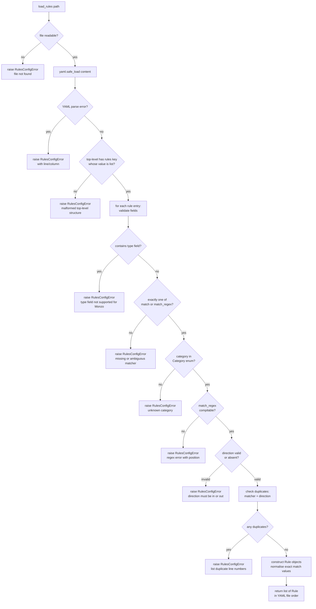
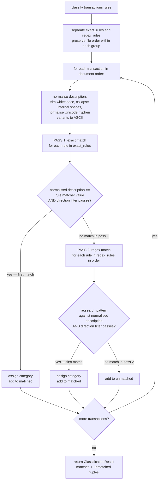
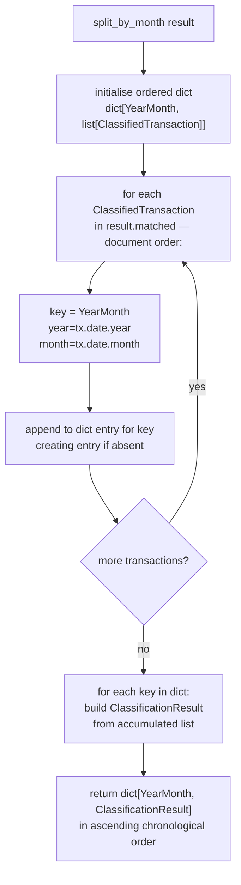
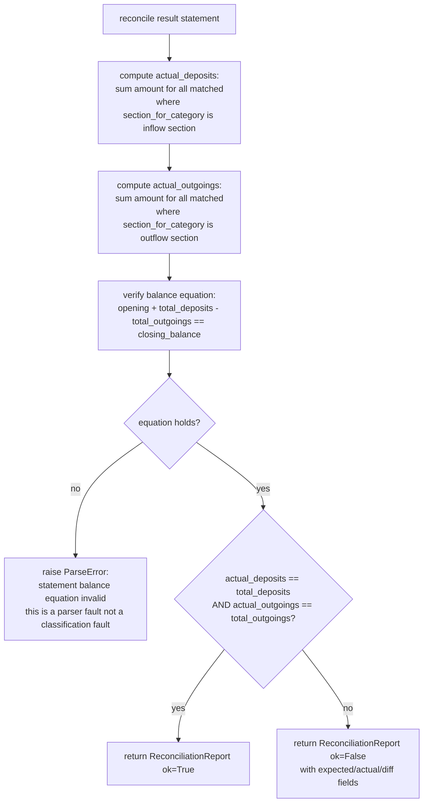
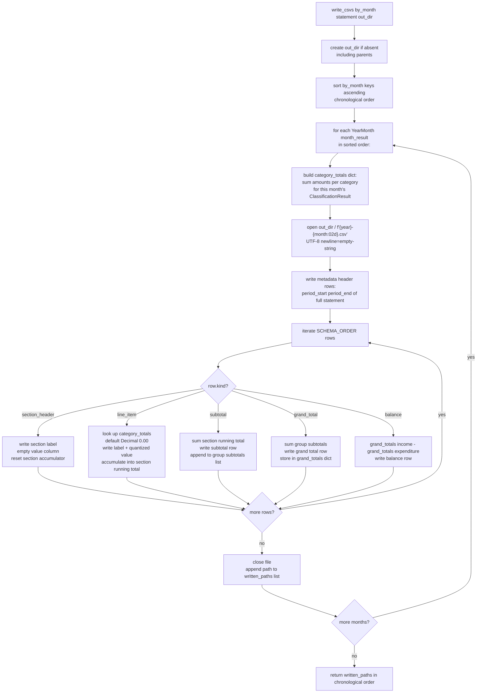

# Design Document: Monzo Expense Tool

## Overview

The Monzo Expense Tool is a single-invocation CLI that transforms one Monzo personal-account statement PDF into one categorised monthly cash-flow CSV per calendar month covered by the statement. The design is a strict linear pipeline: parse PDF → load rules → classify transactions → split by calendar month → reconcile totals → write CSVs. Each stage is an isolated module with a single public function; the CLI wires the stages together and is the only module allowed to touch I/O boundaries (argv, stdout, stderr, sys.exit).

The tool is a deliberate sibling of `lloyds-expense`, not a generalisation of it. The two share output schema shape and pipeline structure, but differ in every parsing detail: Monzo has no transaction-type codes, encodes direction in the sign of a single amount column, wraps descriptions across multiple PDF rows, appends Pot pages that must be ignored, and may cover multiple calendar months per PDF — requiring the new `splitter.py` stage and a multi-file writer.

Design principles:
- Every monetary value is `decimal.Decimal` from parse boundary to CSV write.
- All data objects are `frozen=True` dataclasses — mutation is never needed after construction.
- Errors surface as typed exceptions; the CLI layer is the sole exception handler and exit-code mapper.
- Output is deterministic: same inputs always produce byte-identical CSVs.

---

## Architecture Design

### System Architecture Diagram



### Data Flow Diagram



---

## Component Design

### `schema.py` — Budget Shape Definition

- **Responsibilities:** Define the closed enumeration of all valid categories (including the Monzo-only `MAIN_ACCOUNT_INFLOW`), declare the canonical output row order, expose the section-to-category mapping, and provide iteration helpers.
- **Interfaces:**
  - `Category(enum.Enum)` — all leaf categories as enum members. Adds `MAIN_ACCOUNT_INFLOW = "Main Account Inflow"` in the Irregular Inflows group; all other members are identical to `lloyds_expense.schema.Category`.
  - `Section(enum.Enum)` — section headers (`REGULAR_INFLOWS`, `IRREGULAR_INFLOWS`, `ASSET_LIQUIDATION`, `REGULAR_OUTFLOWS`, `IRREGULAR_OUTFLOWS`, `ASSETS`).
  - `SCHEMA_ORDER: list[SchemaRow]` — ordered list of `SchemaRow` objects defining every row the CSV must emit. Differs from the Lloyds equivalent only by the addition of the `MAIN_ACCOUNT_INFLOW` line item in the Irregular Inflows section.
  - `category_display_name(category: Category) -> str` — human-readable name for CSV output.
  - `section_for_category(category: Category) -> Section` — look up which section owns a category.
- **Dependencies:** stdlib only (`enum`, `dataclasses`). No other project modules.

### `errors.py` — Exception Hierarchy

- **Responsibilities:** Define all typed exceptions used across the codebase. No logic.
- **Interfaces:**
  - `StatementToCsvError(Exception)` — base class.
  - `ParseError(StatementToCsvError)` — raised by `parser.py` for any PDF parse failure. Attributes: `message: str`, `page: int | None`.
  - `RulesConfigError(StatementToCsvError)` — raised by `rules.py` for invalid or unloadable rules. Attributes: `message: str`, `line_number: int | None`, `violations: list[str]`.
  - `UnmatchedTransactionsError(StatementToCsvError)` — raised by the CLI when unmatched transactions remain.
  - `ReconciliationError(StatementToCsvError)` — raised by the CLI when reconciliation fails.
  - `InputError(StatementToCsvError)` — raised by the CLI for bad command-line arguments.
- **Dependencies:** stdlib only.

### `parser.py` — PDF to Typed Transactions

- **Responsibilities:** Accept a PDF file path, extract the transaction table from the personal-account section only (skipping Pot pages), re-join wrapped description lines, return a typed `Statement` dataclass. All Monzo-specific PDF layout knowledge lives here and nowhere else.
- **Interfaces:**
  - `parse_statement(path: Path) -> Statement`
  - `Statement` (frozen dataclass): `sort_code: str`, `account_number: str`, `period_start: date`, `period_end: date`, `opening_balance: Decimal`, `closing_balance: Decimal`, `total_deposits: Decimal`, `total_outgoings: Decimal`, `transactions: tuple[Transaction, ...]`.
  - `Transaction` (frozen dataclass): `date: date`, `description: str`, `amount: Decimal`, `direction: Literal["in", "out"]`, `running_balance: Decimal`. **No `type_code` field.**
- **Dependencies:** `pdfplumber`, `decimal`, `datetime`, `pathlib`; raises `ParseError`.

### `rules.py` — YAML to Rule Objects

- **Responsibilities:** Load, validate, and compile the rules YAML into an ordered list of `Rule` objects. Validate categories against `schema.py`. Reject rules that contain a `type` field (Lloyds-only).
- **Interfaces:**
  - `load_rules(path: Path) -> list[Rule]`
  - `Rule` (frozen dataclass): `matcher: ExactMatch | RegexMatch`, `direction: Literal["in", "out"] | None`, `category: Category`, `line_number: int`. **No `type_code` field.**
  - `ExactMatch` (frozen dataclass): `value: str` (normalised at load time).
  - `RegexMatch` (frozen dataclass): `pattern: re.Pattern[str]`, `source: str`.
- **Dependencies:** `yaml`, `re`, `schema.py`; raises `RulesConfigError`.

### `classifier.py` — Two-Pass Matching

- **Responsibilities:** Accept transactions and rules; return a `ClassificationResult` containing matched and unmatched transactions. Pure function, no I/O. Direction filter is the only optional filter (no type-code filter).
- **Interfaces:**
  - `classify(transactions: tuple[Transaction, ...], rules: list[Rule]) -> ClassificationResult`
  - `ClassifiedTransaction` (frozen dataclass): `transaction: Transaction`, `category: Category`.
  - `ClassificationResult` (frozen dataclass): `matched: tuple[ClassifiedTransaction, ...]`, `unmatched: tuple[Transaction, ...]`.
- **Dependencies:** `schema.py`, `errors.py` (type imports only).

### `splitter.py` — Calendar Month Grouping

- **Responsibilities:** Accept a `ClassificationResult` and group its matched transactions by `(year, month)` of their transaction date. Return a `dict[YearMonth, ClassificationResult]`. Pure function, no I/O. Monzo-only module.
- **Interfaces:**
  - `split_by_month(result: ClassificationResult) -> dict[YearMonth, ClassificationResult]`
  - `YearMonth` (NamedTuple): `year: int`, `month: int`.
- **Dependencies:** `classifier.py` (for `ClassificationResult` type); no schema dependency.

### `reconciler.py` — Arithmetic Verification

- **Responsibilities:** Sum classified inflows and outflows across all months combined; compare to the statement's `total_deposits` and `total_outgoings`. Return a structured report — does not raise, does not exit. Reconciliation is always period-level because Monzo PDFs only print period totals.
- **Interfaces:**
  - `reconcile(result: ClassificationResult, statement: Statement) -> ReconciliationReport`
  - `ReconciliationReport` (frozen dataclass): `ok: bool`, `deposits_expected: Decimal`, `deposits_actual: Decimal`, `outgoings_expected: Decimal`, `outgoings_actual: Decimal`.
  - Derived properties: `deposits_diff: Decimal`, `outgoings_diff: Decimal` (computed as `actual - expected`).
- **Dependencies:** `decimal`, `schema.py` (to determine inflow vs outflow sections).

### `writer.py` — Multi-Month CSV Output

- **Responsibilities:** For each calendar month in the split result, iterate the canonical schema row order, compute per-category totals, emit every row to a CSV file (zero-filled when no activity). Create the output directory if absent. Return the list of written paths in chronological order.
- **Interfaces:**
  - `write_csvs(by_month: dict[YearMonth, ClassificationResult], statement: Statement, out_dir: Path) -> list[Path]`
- **Dependencies:** `csv`, `decimal`, `pathlib`, `schema.py`.

### `cli.py` — Entry Point and I/O Boundary

- **Responsibilities:** Parse argv via `typer`, invoke the pipeline stages in order, catch all `StatementToCsvError` subclasses, map them to exit codes, produce `rich`-formatted output on stderr, and print written file paths to stdout on success.
- **Interfaces:**
  - `app = typer.Typer()` — the typer application object.
  - `main(statement_pdf: Path, rules: Optional[Path], out_dir: Path, report_unmatched: Optional[Path])` — the single typer command.
- **Dependencies:** `typer`, `rich`, all other project modules.

### `__main__.py`

- Imports `app` from `cli.py` and calls `app()`. Enables `python -m monzo_expense`.

---

## Data Models

### Core Data Structure Definitions

```python
# schema.py
from enum import Enum
from dataclasses import dataclass
from typing import Literal

class Category(Enum):
    # Inflows
    SALARY = "Salary"
    UNEXPECTED_REFUND = "Unexpected / Refund"
    LOAN = "Loan"
    MAIN_ACCOUNT_INFLOW = "Main Account Inflow"   # Monzo-only
    SAVINGS = "Savings"
    STOCKS_AND_SHARES = "Stocks & Shares"
    # Outflows
    RENT = "Rent"
    BILL_COUNCIL_TAX = "Bill - Council Tax"
    BILL_ELECTRICITY_GAS = "Bill - Electricity & Gas"
    BILL_PHONE_INTERNET = "Bill - Phone & Internet"
    FOOD_SUPPLIES = "Food Supplies"
    DEBT = "Debt"
    CAR_AND_GAS = "Car & Gas"
    CHARITY_DONATIONS = "Charity / Donations"
    GIFTS_ENTERTAINMENT_MISC = "Gifts/Entertainment/Misc"
    SUNDRY = "Sundry"
    HOLIDAYS_TRAVEL = "Holidays & Travel"
    EDUCATION = "Education"
    EATING_OUT = "Eating Out"
    ACTIVE_SAVINGS = "Active Savings"
    LIFETIME_ISA = "Lifetime ISA"
    STOCKS_SHARES_ISA = "Stocks & Shares ISA"
    DIVIDEND_PORTFOLIO = "Dividend Portfolio"

class Section(Enum):
    REGULAR_INFLOWS = "Regular Inflows"
    IRREGULAR_INFLOWS = "Irregular Inflows"
    ASSET_LIQUIDATION = "Asset Liquidation"
    REGULAR_OUTFLOWS = "Regular Outflows"
    IRREGULAR_OUTFLOWS = "Irregular Outflows"
    ASSETS = "Assets"

@dataclass(frozen=True)
class SchemaRow:
    kind: Literal["section_header", "line_item", "subtotal", "grand_total", "balance"]
    section: Section | None
    category: Category | None
    label: str
    group: Literal["income", "expenditure"] | None

# parser.py
from dataclasses import dataclass
from datetime import date
from decimal import Decimal
from typing import Literal

@dataclass(frozen=True)
class Transaction:
    date: date
    description: str
    # No type_code field — Monzo statements carry no transaction-type codes.
    amount: Decimal
    direction: Literal["in", "out"]
    running_balance: Decimal

@dataclass(frozen=True)
class Statement:
    sort_code: str
    account_number: str
    period_start: date
    period_end: date
    opening_balance: Decimal
    closing_balance: Decimal
    total_deposits: Decimal    # "Total deposits" from page 1 summary
    total_outgoings: Decimal   # "Total outgoings" from page 1 summary
    transactions: tuple[Transaction, ...]

# rules.py
import re
from dataclasses import dataclass
from typing import Literal

@dataclass(frozen=True)
class ExactMatch:
    value: str                 # normalised at load time

@dataclass(frozen=True)
class RegexMatch:
    pattern: re.Pattern[str]   # compiled at load time
    source: str                # original pattern string for dedup checks

@dataclass(frozen=True)
class Rule:
    matcher: ExactMatch | RegexMatch
    # No type_code field — Monzo has no transaction-type codes.
    direction: Literal["in", "out"] | None
    category: Category
    line_number: int           # 1-based, for error messages

# classifier.py
from dataclasses import dataclass

@dataclass(frozen=True)
class ClassifiedTransaction:
    transaction: Transaction
    category: Category

@dataclass(frozen=True)
class ClassificationResult:
    matched: tuple[ClassifiedTransaction, ...]
    unmatched: tuple[Transaction, ...]

# splitter.py
from typing import NamedTuple

class YearMonth(NamedTuple):
    year: int
    month: int

# reconciler.py
from dataclasses import dataclass
from decimal import Decimal

@dataclass(frozen=True)
class ReconciliationReport:
    ok: bool
    deposits_expected: Decimal
    deposits_actual: Decimal
    outgoings_expected: Decimal
    outgoings_actual: Decimal

    @property
    def deposits_diff(self) -> Decimal:
        return self.deposits_actual - self.deposits_expected

    @property
    def outgoings_diff(self) -> Decimal:
        return self.outgoings_actual - self.outgoings_expected
```

### Data Model Relationships



---

## Business Process

### Process 1: CLI Invocation and Pipeline Orchestration



### Process 2: PDF Parsing Detail



### Process 3: Rules Loading and Validation



### Process 4: Two-Pass Classification



### Process 5: Calendar Month Splitting



### Process 6: Reconciliation Check



### Process 7: Multi-Month CSV Output



---

## Error Handling Strategy

### Exception Hierarchy

```
StatementToCsvError (base)
├── ParseError              — exit code 3
│   Attributes: message: str, page: int | None
├── RulesConfigError        — exit code 4
│   Attributes: message: str, line_number: int | None, violations: list[str]
├── UnmatchedTransactionsError — exit code 1
│   Attributes: unmatched: tuple[Transaction, ...]
├── ReconciliationError     — exit code 2
│   Attributes: report: ReconciliationReport
└── InputError              — exit code 4
    Attributes: message: str
```

### Exit Code Mapping

| Exit Code | Condition | Exception |
|---|---|---|
| 0 | All stages passed, CSVs written | (no exception) |
| 1 | One or more unmatched transactions | `UnmatchedTransactionsError` |
| 2 | Reconciliation mismatch | `ReconciliationError` |
| 3 | PDF parse failure or balance equation invalid | `ParseError` |
| 4 | Bad input (missing file, malformed YAML, unknown category, `type` field in rule, invalid CLI args) | `InputError`, `RulesConfigError` |

### Error Handling Principles

1. Library modules (`parser`, `rules`, `classifier`, `splitter`, `reconciler`, `writer`) raise typed exceptions. They never call `print`, `sys.exit`, or access `sys.stderr`.
2. `cli.py` wraps each pipeline call in a `try/except StatementToCsvError` block, formats the error via `rich` to stderr, and calls `raise typer.Exit(code=N)`.
3. `RulesConfigError.violations` is populated for multi-violation errors (duplicate rules) so all failures are reported at once.
4. The balance equation check (`opening + total_deposits - total_outgoings == closing`) is performed inside `reconciler.reconcile`, and a failure raises `ParseError` (not `ReconciliationError`) because it indicates a parser fault — the statement's own page-1 summary figures are internally inconsistent.
5. Unexpected exceptions (bugs, library failures) propagate uncaught to Python's default traceback handler. A crash with a traceback is more diagnosable than a swallowed exception.

---

## Key Algorithms

### Monzo PDF Table Extraction Strategy

Monzo personal-account PDFs have a simpler columnar structure than Lloyds — one amount column instead of two — but introduce two complications: description wrapping and Pot pages.

**Column layout:**

| Col | Content |
|---|---|
| 0 | Date (e.g. `"01 Apr 2026"`) |
| 1 | Description |
| 2 | Amount (positive = deposit, negative = withdrawal) |
| 3 | Running balance |

**Page iteration:**

`pdfplumber.open(path)` is called. Pages are iterated in order. Each page is tested for the Pot section boundary before any table extraction is attempted; once a Pot page is detected, all subsequent pages are skipped.

**Transaction table detection:**

A table is recognised as the transaction table when its first row contains the expected header set (case-insensitive): `{"date", "description", "amount", "balance"}`. Tables with different column structures are ignored.

**Amount parsing and direction derivation:**

```
raw = cell.replace(",", "")       # strip thousand separators
value = Decimal(raw)               # never via float
if value >= 0:
    direction = "in"
    amount = value
else:
    direction = "out"
    amount = -value                # stored as positive Decimal
```

**Date parsing:**

Monzo PDFs include four-digit years in the transaction table (e.g. `"01 Apr 2026"`). No year-expansion heuristic is needed. Dates are parsed with `datetime.strptime(date_str, "%d %b %Y")`.

### Description Line-Joining Algorithm

Monzo Faster Payments entries and currency-conversion transactions frequently produce continuation rows in the extracted table — rows where the date cell is empty and the description cell contains a reference line (e.g. `"Reference: School fees April"`) or a currency annotation (e.g. `"Amount: CAD -335.00. Exchange rate: 1.833105."`).

Detection and joining:

1. A row is a **continuation row** when its date cell is empty (or matches no date pattern) AND its description cell is non-empty.
2. When a continuation row is encountered, its description text is appended to the `description` of the most recently constructed `Transaction` candidate, separated by a single space.
3. The continuation row's amount and balance cells must be empty; if they are non-empty, the row is treated as a new transaction, not a continuation.
4. A `Transaction` dataclass is only instantiated once the next true transaction row (non-empty date) is seen — or the table ends — so all continuation text is collected before construction.

```
pending_date = None
pending_desc_parts: list[str] = []
pending_amount = None
pending_balance = None

for row in table_rows:
    if has_date(row):
        if pending_date is not None:
            emit Transaction(pending_date, " ".join(pending_desc_parts), ...)
        pending_date = parse_date(row[0])
        pending_desc_parts = [row[1].strip()]
        pending_amount = parse_amount(row[2])
        pending_balance = parse_balance(row[3])
    else:
        # continuation row
        if row[1]:
            pending_desc_parts.append(row[1].strip())

if pending_date is not None:
    emit Transaction(pending_date, " ".join(pending_desc_parts), ...)
```

### Pot Page Detection

Monzo PDFs append one or more "Pot" account sections after the main personal-account section. These pages begin with a section heading that identifies the pot by name (e.g. `"Savings Pot"`, `"Bills Pot"`).

Detection strategy:

1. For each page, extract the full page text using `page.extract_text()`.
2. Test whether the text contains a Pot-section marker. The marker is defined as a heading line matching the pattern `r"^[A-Z][A-Za-z\s]+ Pot\b"` appearing near the top of the page text (within the first 20% of lines), or a line that reads `"Pots"` as a standalone header.
3. On the first page where this marker is detected, set a flag `_in_pot_section = True` and stop processing pages. All subsequent pages are also skipped because Pot pages always trail the main account section.
4. The marker test is applied before `extract_tables()` on each page, so no table parsing is attempted for Pot pages.

This detection is conservative by design: if a future Monzo layout does not match the marker, the Pot page may be parsed as a transaction page and likely raise a `ParseError` (unrecognised column structure), which is the correct failure mode — visible and diagnosable.

### Two-Pass Classification Algorithm

Classification is identical in structure to `lloyds_expense.classifier`, with one simplification: there is no `type_code` filter.

**Normalisation** (applied to both the transaction description and exact rule values at load/classify time):

```
normalised = description.strip()
normalised = re.sub(r'\s+', ' ', normalised)
normalised = re.sub(r'[‐-—]', '-', normalised)  # Unicode dashes → ASCII hyphen-minus
```

**Pass 1 — Exact matching:** Iterate `exact_rules` in YAML file order. For each rule:
- Check `normalised_description == rule.matcher.value`.
- Check `rule.direction is None or rule.direction == transaction.direction`.
- On the first match, record the category and move to the next transaction.

**Pass 2 — Regex matching:** Run only when Pass 1 found no match. Iterate `regex_rules` in YAML file order. For each rule:
- Check `rule.matcher.pattern.search(normalised_description) is not None`.
- Check `rule.direction is None or rule.direction == transaction.direction`.
- On the first match, record the category. File order determines priority.

**No match:** The transaction is added to the unmatched list.

### Calendar Month Splitting Algorithm

```python
def split_by_month(result: ClassificationResult) -> dict[YearMonth, ClassificationResult]:
    buckets: dict[YearMonth, list[ClassifiedTransaction]] = {}
    for ct in result.matched:
        key = YearMonth(ct.transaction.date.year, ct.transaction.date.month)
        buckets.setdefault(key, []).append(ct)
    return {
        key: ClassificationResult(matched=tuple(cts), unmatched=())
        for key, cts in sorted(buckets.items())
    }
```

Key properties:
- Iteration order over `result.matched` is document order, so each bucket's list is also in document order.
- `sorted(buckets.items())` yields months in ascending chronological order.
- Each output `ClassificationResult` has `unmatched=()` — unmatched transactions were handled before the split.
- The function is pure: no mutation of the input, no I/O.

### CSV Row Ordering Algorithm

Each monthly CSV is written by iterating `SCHEMA_ORDER` exactly once, in sequence. The same constant list is used for every month's file, ensuring identical structure across all output files.

The `SCHEMA_ORDER` list for the Monzo schema:

```
[section_header "Regular Inflows",
 line_item SALARY,
 subtotal "Regular Inflows subtotal",
 section_header "Irregular Inflows",
 line_item UNEXPECTED_REFUND,
 line_item LOAN,
 line_item MAIN_ACCOUNT_INFLOW,       ← Monzo-only addition
 subtotal "Irregular Inflows subtotal",
 section_header "Asset Liquidation",
 line_item SAVINGS,
 line_item STOCKS_AND_SHARES,
 subtotal "Asset Liquidation subtotal",
 grand_total "Total Income",
 section_header "Regular Outflows",
 line_item RENT,
 line_item BILL_COUNCIL_TAX,
 line_item BILL_ELECTRICITY_GAS,
 line_item BILL_PHONE_INTERNET,
 line_item FOOD_SUPPLIES,
 line_item DEBT,
 line_item CAR_AND_GAS,
 subtotal "Regular Outflows subtotal",
 section_header "Irregular Outflows",
 line_item CHARITY_DONATIONS,
 line_item GIFTS_ENTERTAINMENT_MISC,
 line_item SUNDRY,
 line_item HOLIDAYS_TRAVEL,
 line_item EDUCATION,
 line_item EATING_OUT,
 subtotal "Irregular Outflows subtotal",
 section_header "Assets",
 line_item ACTIVE_SAVINGS,
 line_item LIFETIME_ISA,
 line_item STOCKS_SHARES_ISA,
 line_item DIVIDEND_PORTFOLIO,
 subtotal "Assets subtotal",
 grand_total "Total Expenditure",
 balance "Balance"]
```

**Subtotal computation:** When a `subtotal` row is emitted, the writer sums all `line_item` amounts accumulated since the last `section_header`. Values default to `Decimal("0.00")` for categories with no transactions in that month.

**Grand total computation:** When a `grand_total` row is emitted, the writer sums the subtotals of all sections in the same group (`income` or `expenditure`).

**Balance computation:** `Total Income − Total Expenditure`, computed from the two grand totals.

**Decimal quantization:** All amounts are formatted as `str(value.quantize(Decimal("0.01")))` at write time only — never earlier in the pipeline.

---

## Testing Strategy

### Test Module Layout

| Source module | Test module | Primary focus |
|---|---|---|
| `schema.py` | `test_schema.py` | Enum completeness, `MAIN_ACCOUNT_INFLOW` present, row count, schema order integrity |
| `errors.py` | (tested via integration) | Exception hierarchy and attribute correctness |
| `parser.py` | `test_parser.py` | Table extraction, description joining, Pot page skip, amount sign, zero-transaction cases |
| `rules.py` | `test_rules.py` | YAML loading, `type` field rejection, validation, error paths |
| `classifier.py` | `test_classifier.py` | Two-pass matching, normalisation, direction filter, no type-code filter |
| `splitter.py` | `test_splitter.py` | Single month, multi-month, document order preservation |
| `reconciler.py` | `test_reconciler.py` | Period-level arithmetic, pass/fail, balance equation |
| `writer.py` | `test_writer.py` | Schema order, zero-fill, multi-file, golden files |
| `cli.py` | `test_cli.py` | End-to-end, exit codes, stderr/stdout |

### Test Fixtures

`tests/monzo/fixtures/` contains:

- `statement_minimal.pdf` — a minimal single-month Monzo PDF with a small number of transactions (at least one deposit, one withdrawal, one Faster Payments with a continuation row), used for fast unit tests. No Pot pages.
- `statement_multi_month.pdf` — a PDF spanning two calendar months (e.g. April and May 2026), with ~15 transactions per month and a trailing Pot page. Used for splitter, writer, and end-to-end tests.
- `statement_empty.pdf` — a statement with zero transactions and zero totals, used for the zero-transaction path.
- `rules_example.yaml` — a representative rules file covering all fixture transactions plus deliberate gaps for testing unmatched paths.
- `expected_april.csv`, `expected_may.csv` — golden output files for the multi-month fixture with a fully-matching rules file.

These fixtures are generated by `tests/monzo/fixtures/create_fixtures.py` using `reportlab` and are checked in. Tests never reach the network or the filesystem outside of `tmp_path`.

### Unit Test Approach per Module

**`test_parser.py`**
- Parse `statement_minimal.pdf`; assert transaction count, correct `Decimal` amounts, correct directions, correct dates.
- Assert `opening_balance + total_deposits - total_outgoings == closing_balance` for all fixtures.
- Assert that a continuation description row is joined onto the preceding transaction (not emitted as a separate `Transaction`).
- Assert that Pot pages in `statement_multi_month.pdf` produce zero `Transaction` records.
- Assert that two-month fixture produces transactions spanning both calendar months.
- Supply a non-PDF file; assert `ParseError`.
- Assert amounts with thousand separators (`1,000.00`) parse as `Decimal("1000.00")`.
- Assert negative amounts parse with `direction="out"` and positive `amount`.

**`test_rules.py`**
- Load a valid rules file; assert `Rule` objects in file order with correct matchers and directions.
- Supply a rule with a `type` field; assert `RulesConfigError` with an informative message.
- Supply a duplicate rule (same matcher + direction); assert `RulesConfigError` naming both line numbers.
- Supply a rule with an unknown category; assert `RulesConfigError`.
- Supply a rule with an invalid regex; assert `RulesConfigError` with pattern source.
- Supply a YAML file missing the `rules` key; assert `RulesConfigError`.
- Supply a rule with both `match` and `match_regex`; assert `RulesConfigError`.
- Assert `ExactMatch.value` is normalised at load time.

**`test_classifier.py`**
- Exact match takes priority over a regex match for the same description, regardless of YAML order.
- Direction filter: a rule with `direction: out` does not match a money-in transaction with the same description.
- First regex in file order wins when multiple regex rules match.
- Transaction with no matching rule appears in `result.unmatched`.
- Hyphen normalisation: `OMASIRICHI OKWU-BOMS` matches a rule defined as `OMASIRICHI OKWU BOMS`.
- Document order of matched transactions is preserved in `result.matched`.
- No type-code filter: classifier does not access or check any `type_code` attribute.

**`test_splitter.py`**
- Single-month input: returned dict has exactly one key; all transactions in the single bucket, document order preserved.
- Two-month input: returned dict has exactly two keys in ascending chronological order; each bucket contains only transactions from that month; total matched count is unchanged.
- Empty `ClassificationResult` (zero matched): returned dict is empty.
- Transactions on the last day of one month and first day of the next are assigned to separate buckets.

**`test_reconciler.py`**
- `reconcile` returns `ok=True` when computed totals match `total_deposits` and `total_outgoings` exactly.
- `reconcile` returns `ok=False` with correct diffs when either total differs by `Decimal("0.01")`.
- `reconcile` raises `ParseError` when `opening + total_deposits - total_outgoings != closing_balance`.
- Reconciliation operates over all months combined, not per-month.
- All arithmetic uses `Decimal`; no float comparison anywhere.

**`test_writer.py`**
- Golden file test: known `dict[YearMonth, ClassificationResult]` + `Statement` produces CSVs that match `expected_april.csv` and `expected_may.csv` byte-for-byte.
- Zero-fill test: a month with no transactions in a category still emits that category's row with `"0.00"`.
- Schema row count test: each output CSV contains all expected rows — section headers, line items (including `Main Account Inflow`), subtotals, grand totals, and balance row.
- Output directory is created if absent; test uses `tmp_path`.
- `\n` line endings (not `\r\n`).
- Files are returned and written in ascending chronological order.
- Overwrite test: running writer twice with the same output produces identical files.

**`test_cli.py`** (via `typer.testing.CliRunner`)
- Happy path single month: minimal PDF + rules → exit 0, one CSV in `--out-dir`, path printed to stdout.
- Happy path two months: multi-month PDF + full rules → exit 0, two CSVs with correct filenames.
- Unmatched transactions: rules missing one transaction → exit 1, rich table on stderr, no CSVs written.
- Reconciliation mismatch: fixture with tampered totals → exit 2, diff on stderr.
- Non-existent PDF → exit 4.
- Missing `--out-dir` → exit 4, usage message.
- `--report-unmatched <path>` with unmatched transactions → exit 1, report file written.
- Rules file containing a `type` field → exit 4, descriptive error.
- `--help` → exit 0, all options listed.

### Coverage Target

Coverage is measured by `pytest-cov` on the non-CLI source modules (`schema`, `errors`, `parser`, `rules`, `classifier`, `splitter`, `reconciler`, `writer`). The minimum floor is **90% line coverage**. `cli.py` is excluded from the floor because its I/O-heavy paths are covered by `test_cli.py` integration tests.

```
pytest --cov=monzo_expense --cov-fail-under=90 --cov-omit="*/cli.py"
```

### Determinism Test

A dedicated test asserts that running the full pipeline twice with the same inputs produces byte-identical output files. This guards against accidental non-determinism (dict ordering, timestamp injection, float rounding). The two-month fixture is used because it exercises both the splitter and the multi-file writer.
