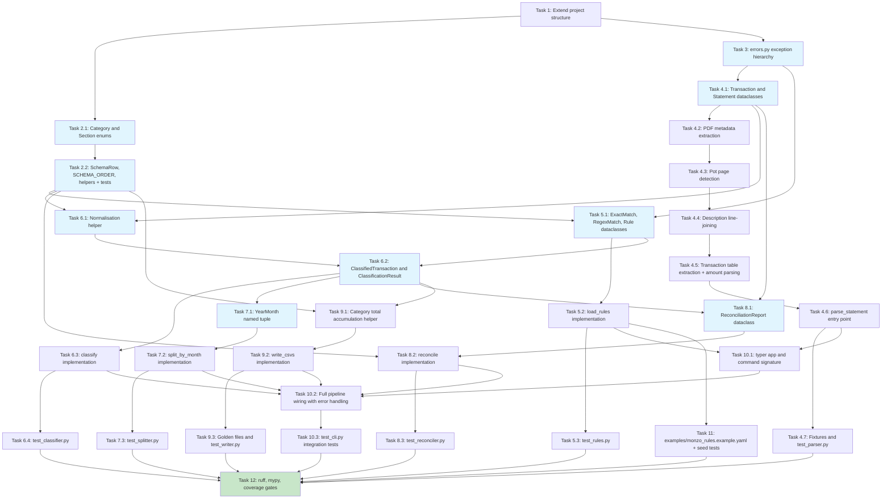

# Implementation Plan: Monzo Expense Tool

- [x] 1. Extend project structure for `monzo_expense` package
  - Create `src/monzo_expense/` package directory with `__init__.py` and `__main__.py` (`__main__.py` imports `app` from `cli.py` and calls `app()`)
  - Create `tests/monzo/` and `tests/monzo/fixtures/` directories with `__init__.py` files
  - In the existing `pyproject.toml`, add `monzo-expense = "monzo_expense.cli:app"` to `[project.scripts]` alongside the existing `lloyds-expense` entry
  - Add `src/monzo_expense` to `[tool.hatch.build.targets.wheel].packages`
  - In `[tool.coverage.run]`, ensure `src/monzo_expense/cli.py` is included in the `omit` list alongside the existing `lloyds_expense/cli.py` omission
  - _Requirements: R11.1, R14.4_

---

- [X] 2. Implement `schema.py` — budget shape definition
- [X] 2.1 Define `Category` and `Section` enums
  - Write `Category(enum.Enum)` with all 23 leaf category members. Use the same 22 members as `lloyds_expense.schema.Category` and add `MAIN_ACCOUNT_INFLOW = "Main Account Inflow"` in the Irregular Inflows group, positioned after `LOAN`
  - Write `Section(enum.Enum)` with all 6 section members (identical names to `lloyds_expense.schema.Section`)
  - _Requirements: R8.5, R11.3_

- [X] 2.2 Define `SchemaRow` dataclass and `SCHEMA_ORDER` constant
  - Write `SchemaRow(frozen=True)` with `kind: Literal["section_header", "line_item", "subtotal", "grand_total", "balance"]`, `section: Section | None`, `category: Category | None`, `label: str`, and `group: Literal["income", "expenditure"] | None` fields. The `group` field is populated on `section_header`, `subtotal`, `grand_total`, and `balance`-adjacent rows; inflow sections carry `group="income"`, outflow sections carry `group="expenditure"`.
  - Write `SCHEMA_ORDER: list[SchemaRow]` encoding all 38 rows in the fixed output order from R8.5: 6 section headers + 23 line items (including `MAIN_ACCOUNT_INFLOW` in Irregular Inflows, after `LOAN`) + 6 subtotals + 2 grand totals + 1 balance row. The Irregular Inflows section has 3 line items: `UNEXPECTED_REFUND`, `LOAN`, `MAIN_ACCOUNT_INFLOW`.
  - Implement `category_display_name(category: Category) -> str` and `section_for_category(category: Category) -> Section` helpers. `MAIN_ACCOUNT_INFLOW` maps to `Section.IRREGULAR_INFLOWS`.
  - Write `tests/monzo/test_schema.py` asserting: 23 categories; 6 sections; `SCHEMA_ORDER` length is 38; every `Category` member appears exactly once as a `line_item`; `MAIN_ACCOUNT_INFLOW` is present and in the `IRREGULAR_INFLOWS` section; `group` is correctly assigned on every section header, subtotal, and grand-total row; the `balance` row is last.
  - _Requirements: R8.5, R8.6, R8.7, R8.8, R8.9, R11.3_

---

- [X] 3. Implement `errors.py` — typed exception hierarchy
  - Write `StatementToCsvError(Exception)` base class
  - Write `ParseError` with attributes `message: str` and `page: int | None`
  - Write `RulesConfigError` with attributes `message: str`, `line_number: int | None`, and `violations: list[str]`
  - Write `UnmatchedTransactionsError` with attribute `unmatched: tuple[Transaction, ...]` (forward reference)
  - Write `ReconciliationError` with attribute `report: ReconciliationReport` (forward reference)
  - Write `InputError` with attribute `message: str`
  - _Requirements: R11.4_

---

- [X] 4. Implement `parser.py` — PDF to typed transactions
- [X] 4.1 Define `Transaction` and `Statement` frozen dataclasses
  - Write `Transaction(frozen=True)` with fields `date: date`, `description: str`, `amount: Decimal`, `direction: Literal["in", "out"]`, `running_balance: Decimal`. **Do not add a `type_code` field** — Monzo statements carry no transaction-type codes.
  - Write `Statement(frozen=True)` with fields `sort_code: str`, `account_number: str`, `period_start: date`, `period_end: date`, `opening_balance: Decimal`, `closing_balance: Decimal`, `total_deposits: Decimal`, `total_outgoings: Decimal`, `transactions: tuple[Transaction, ...]`. Use `total_deposits` / `total_outgoings` (not `money_in_total` / `money_out_total`) to match Monzo's stated labels.
  - _Requirements: R2.1, R2.2, R2.3, R11.5_

- [X] 4.2 Implement metadata extraction from PDF first page
  - Write `_extract_metadata(page_text: str) -> dict` that uses regex to parse: the statement period (`DD Mon YYYY to DD Mon YYYY` — Monzo PDFs use four-digit years throughout), opening balance, closing balance, `Total deposits`, and `Total outgoings` from the first page text
  - Both `total_deposits` and `total_outgoings` are always present as labelled fields on page 1; raise `ParseError` with a descriptive message when any required field cannot be located
  - _Requirements: R2.12, R2.13, R11.5_

- [X] 4.3 Implement Pot page detection
  - Write `_is_pot_page(page_text: str) -> bool` that returns `True` when the page text contains a Pot-section marker. The marker is a heading line matching the pattern `r"^[A-Z][A-Za-z\s]+ Pot\b"` within the first 20% of lines, or a standalone heading line `"Pots"`. Test this function in isolation with representative page text strings.
  - Pot pages always trail the personal-account section; once `_is_pot_page` returns `True` for any page, set a flag and skip all subsequent pages.
  - _Requirements: R2.7_

- [X] 4.4 Implement description line-joining for wrapped rows
  - Write `_is_continuation_row(row: list) -> bool` that returns `True` when the date cell is empty (or does not match a date pattern) AND the description cell is non-empty AND both the amount and balance cells are empty. Rows that have a non-empty amount cell despite an empty date are treated as new transactions, not continuations.
  - Implement a pending-row accumulator in the table-parsing loop:
    - When a row with a valid date is encountered and a pending transaction exists, construct and emit the pending `Transaction` with `" ".join(pending_desc_parts)` as the description.
    - When a continuation row is encountered, append `row[1].strip()` to `pending_desc_parts`.
    - After the last row in the table, emit any remaining pending transaction.
  - _Requirements: R2.6_

- [X] 4.5 Implement transaction table extraction and amount parsing
  - Write `_is_transaction_table(table: list) -> bool` that checks the header row for the expected Monzo column set `{"date", "description", "amount", "balance"}` (case-insensitive, normalised)
  - Write `_parse_amount_and_direction(raw: str) -> tuple[Decimal, Literal["in", "out"]]` that strips thousand-separator commas, constructs `Decimal(cleaned)`, derives `direction="in"` when `value >= 0` and `direction="out"` when `value < 0`, and returns `(abs(value), direction)`. Never use `float`.
  - Write `_parse_transaction_row(row: list, period_start: date, period_end: date, page: int | None) -> Transaction` that positionally extracts each column. Monzo PDFs include four-digit years — parse dates with `datetime.strptime(date_str, "%d %b %Y")`, no year-expansion heuristic needed.
  - Raise `ParseError` with the page number when any row cannot be parsed
  - _Requirements: R2.1, R2.2, R2.3, R2.4, R2.5, R2.8, R2.9, R2.10, R2.11_

- [X] 4.6 Implement `parse_statement(path: Path) -> Statement`
  - Open the PDF with `pdfplumber`; catch open failures and re-raise as `ParseError`
  - Extract metadata from first page text via `_extract_metadata`
  - Iterate pages: for each page call `_is_pot_page`; stop iterating once a Pot page is detected. On non-Pot pages, call `page.extract_tables()` and process any table passing `_is_transaction_table`, using the pending-row accumulator from Task 4.4 to handle continuation rows
  - After all pages: handle zero-transaction edge cases — return a `Statement` with an empty `transactions` tuple when zero rows AND `total_deposits == Decimal("0.00")` AND `total_outgoings == Decimal("0.00")`; raise `ParseError` when zero rows but either total is non-zero
  - Verify the balance equation as the final step: `opening_balance + total_deposits - total_outgoings == closing_balance` using exact `Decimal` equality; raise `ParseError` on failure with all four values and the computed difference
  - _Requirements: R1.2, R1.3, R1.5, R2.7, R2.9, R2.11, R2.14, R2.15, R7.3, R9.1, R9.2_

- [X] 4.7 Create fixtures and write `tests/monzo/test_parser.py`
  - Create `tests/monzo/fixtures/create_fixtures.py` using `reportlab` to generate all synthetic Monzo PDFs. Each fixture must produce correct `Total deposits` / `Total outgoings` summary values so the balance equation holds.
  - Create `tests/monzo/fixtures/statement_minimal.pdf` — a single-month PDF with 4 transactions (2 deposits, 2 withdrawals); one Faster Payments deposit whose description has a continuation `"Reference: ..."` row; amounts include a thousand-separator comma; no Pot pages.
  - Create `tests/monzo/fixtures/statement_multi_month.pdf` — a PDF spanning two calendar months (e.g. April and May 2026) with ~8 transactions per month, including at least one continuation-row description per month; a trailing Pot page.
  - Create `tests/monzo/fixtures/statement_empty.pdf` — zero transactions, `total_deposits = 0.00`, `total_outgoings = 0.00`.
  - Create `tests/monzo/fixtures/statement_bad_balance.pdf` — a statement where `opening + total_deposits - total_outgoings != closing_balance`.
  - Write tests: correct transaction count per fixture; continuation row joined onto preceding transaction (not a separate `Transaction`); Pot page in multi-month fixture produces zero extra `Transaction` records; both months present in multi-month fixture; amounts with thousand separators parse as correct `Decimal`; negative amounts produce `direction="out"` with positive `amount`; non-PDF file raises `ParseError`; `statement_empty.pdf` returns `Statement` with empty tuple (R9.1); `statement_bad_balance.pdf` raises `ParseError` (R7.3); `statement_minimal.pdf` balance equation holds.
  - _Requirements: R1.2, R1.3, R1.5, R2.1–R2.15, R7.3, R9.1, R9.2_

---

- [X] 5. Implement `rules.py` — YAML to validated Rule objects
- [X] 5.1 Define `ExactMatch`, `RegexMatch`, and `Rule` frozen dataclasses
  - Write `ExactMatch(frozen=True)` with `value: str` (normalised at load time)
  - Write `RegexMatch(frozen=True)` with `pattern: re.Pattern[str]` and `source: str`
  - Write `Rule(frozen=True)` with `matcher: ExactMatch | RegexMatch`, `direction: Literal["in", "out"] | None`, `category: Category`, and `line_number: int`. **Do not add a `type_code` field.**
  - _Requirements: R3.4, R11.6_

- [X] 5.2 Implement `load_rules(path: Path) -> list[Rule]`
  - Read the file and call `yaml.safe_load`; raise `RulesConfigError` on missing file or YAML parse error, including line/column information
  - Validate top-level structure: must be a mapping with a `rules` key whose value is a list; raise `RulesConfigError` otherwise
  - For each rule entry: **if the entry contains a `type` key, immediately raise `RulesConfigError`** with a message explaining that Monzo rules do not support type-code filtering and directing the user to remove the field (R3.5)
  - Validate exactly one of `match` / `match_regex` present; validate `category` against `Category` enum; validate `direction` as `"in"` or `"out"` if present; compile regex patterns and catch compile errors
  - Normalise `ExactMatch.value` with the same whitespace and hyphen normalisation as the classifier (trim, collapse internal whitespace, normalise Unicode dashes to ASCII hyphen-minus)
  - Detect duplicates: two rules are duplicates when their `direction` and matcher key are both equal. Matcher equality uses `("exact", normalised_value)` for `ExactMatch` and `("regex", source_string)` for `RegexMatch`. Do **not** compare `re.Pattern` objects directly. Collect all duplicate groups and raise `RulesConfigError` listing every duplicate's line number.
  - Preserve YAML file order; attach 1-based `line_number` to each `Rule` using the YAML AST (`yaml.compose`) for accuracy
  - _Requirements: R3.1, R3.2, R3.3, R3.4, R3.5, R3.6, R3.7, R3.8, R3.9, R3.10, R3.11, R3.12_

- [X] 5.3 Write `tests/monzo/test_rules.py` unit tests
  - Write tests: valid file produces `Rule` list in file order with correct matchers and directions; rule with `type` field raises `RulesConfigError` with a message mentioning Monzo; duplicate rule (same matcher + direction) raises `RulesConfigError` naming both line numbers; unknown category raises `RulesConfigError`; invalid regex raises `RulesConfigError` with pattern source; missing `rules` key raises `RulesConfigError`; both `match` and `match_regex` present raises `RulesConfigError`; `ExactMatch.value` is normalised at load time; `Rule` dataclass has no `type_code` attribute
  - _Requirements: R3.4–R3.12_

---

- [X] 6. Implement `classifier.py` — two-pass transaction matching
- [X] 6.1 Implement description normalisation helper
  - Write `_normalise(text: str) -> str` that trims whitespace, collapses internal whitespace runs to a single space, and replaces all Unicode hyphen/dash variants (U+2010 to U+2014) with ASCII hyphen-minus. This is identical in logic to `lloyds_expense.classifier._normalise`; it is duplicated by design (no cross-package imports).
  - _Requirements: R4.1_

- [X] 6.2 Define `ClassifiedTransaction` and `ClassificationResult` dataclasses
  - Write `ClassifiedTransaction(frozen=True)` with `transaction: Transaction` and `category: Category` (using the `monzo_expense` versions of both types)
  - Write `ClassificationResult(frozen=True)` with `matched: tuple[ClassifiedTransaction, ...]` and `unmatched: tuple[Transaction, ...]`
  - _Requirements: R11.7_

- [X] 6.3 Implement `classify(transactions, rules) -> ClassificationResult`
  - Separate rules into `exact_rules` and `regex_rules` lists (preserving file order within each group)
  - For each transaction in document order: normalise description, run Pass 1 (exact match with optional direction filter only — no `type_code` filter), run Pass 2 only if Pass 1 failed (regex match in file order with optional direction filter), add to `unmatched` if both passes fail
  - Return `ClassificationResult` with tuples preserving document order
  - _Requirements: R4.1, R4.2, R4.3, R4.4, R4.5, R4.6, R11.7_

- [X] 6.4 Write `tests/monzo/test_classifier.py` unit tests
  - Write tests: exact match takes priority over a regex match for the same description regardless of YAML order; direction filter rejects a mismatched transaction (e.g. `direction: out` rule does not match a deposit); first regex in file order wins when multiple patterns match; transaction with no matching rule appears in `result.unmatched`; hyphen normalisation — `O Okwu-Boms` matches a rule defined as `O Okwu Boms`; document order preserved in `result.matched`; classifier does not reference or test `type_code` at all (verify by inspecting `Transaction` has no such attribute)
  - _Requirements: R4.1–R4.6_

---

- [X] 7. Implement `splitter.py` — calendar month grouping
- [X] 7.1 Define `YearMonth` named tuple
  - Write `class YearMonth(NamedTuple): year: int; month: int`
  - _Requirements: R6.1_

- [X] 7.2 Implement `split_by_month(result: ClassificationResult) -> dict[YearMonth, ClassificationResult]`
  - Iterate `result.matched` in document order; use `setdefault` to accumulate `ClassifiedTransaction` objects into per-`YearMonth` lists
  - After iteration, build the output dict by converting each list to a `ClassificationResult(matched=tuple(cts), unmatched=())`. Unmatched transactions are excluded because the splitter is only called after the unmatched check has passed.
  - Return the dict with keys sorted in ascending `YearMonth` order (`sorted(buckets.items())`)
  - The function is a pure function: no mutation of the input, no I/O, no side effects
  - _Requirements: R6.1, R6.2, R6.3, R6.4, R6.6_

- [X] 7.3 Write `tests/monzo/test_splitter.py` unit tests
  - Write tests: single-month input produces a dict with exactly one key; all matched transactions appear in the single bucket in document order; two-month input produces two keys in ascending chronological order; each bucket contains only transactions from that month; total transaction count is preserved across both buckets; transactions on the last day of one month and first day of the next land in separate buckets; empty `ClassificationResult` (zero matched) returns an empty dict; `unmatched=()` on every output `ClassificationResult`
  - _Requirements: R6.1–R6.6_

---

- [X] 8. Implement `reconciler.py` — period-level arithmetic verification
- [X] 8.1 Define `ReconciliationReport` dataclass
  - Write `ReconciliationReport(frozen=True)` with `ok: bool`, `deposits_expected: Decimal`, `deposits_actual: Decimal`, `outgoings_expected: Decimal`, `outgoings_actual: Decimal`
  - Add `@property` computed attributes `deposits_diff` and `outgoings_diff` (actual minus expected)
  - _Requirements: R11.9_

- [X] 8.2 Implement `reconcile(result: ClassificationResult, statement: Statement) -> ReconciliationReport`
  - Determine inflow vs outflow sections using `schema.section_for_category`; inflow sections are `REGULAR_INFLOWS`, `IRREGULAR_INFLOWS`, `ASSET_LIQUIDATION`; outflow sections are `REGULAR_OUTFLOWS`, `IRREGULAR_OUTFLOWS`, `ASSETS`. This is period-level: `result` is the full `ClassificationResult` across all months combined, passed to reconcile before splitting.
  - Sum `ct.transaction.amount` for all matched transactions whose category maps to an inflow section (`actual_deposits`) and those mapping to an outflow section (`actual_outgoings`)
  - Return `ReconciliationReport(ok=True)` when `actual_deposits == statement.total_deposits` and `actual_outgoings == statement.total_outgoings`; return `ReconciliationReport(ok=False)` with diff fields otherwise
  - The reconciler does **not** verify the balance equation (`opening + total_deposits - total_outgoings == closing`) — that check belongs to the parser. The reconciler never raises; it always returns a `ReconciliationReport`.
  - _Requirements: R7.1, R7.2, R7.4, R7.5, R7.6, R7.7, R11.9_

- [X] 8.3 Write `tests/monzo/test_reconciler.py` unit tests
  - Write tests: returns `ok=True` when actual totals match `total_deposits` and `total_outgoings` exactly; returns `ok=False` with correct `deposits_diff` when deposit total differs by `Decimal("0.01")`; returns `ok=False` with correct `outgoings_diff` when outgoings total differs; reconciler never raises (pass a `Statement` with a bad balance equation — the reconciler must still return a report without raising); all arithmetic uses `Decimal` (assert no `float` types in report); `MAIN_ACCOUNT_INFLOW` transactions correctly contribute to `actual_deposits`
  - _Requirements: R7.1, R7.2, R7.4, R7.5, R7.6, R7.7_

---

- [X] 9. Implement `writer.py` — multi-month CSV output
- [X] 9.1 Implement category total accumulation helper
  - Write `_build_category_totals(result: ClassificationResult) -> dict[Category, Decimal]` that iterates all `ClassifiedTransaction` objects and sums `amount` per category. Absent categories are not included in the dict; callers use `.get(cat, Decimal("0.00"))`.
  - _Requirements: R8.6, R8.7_

- [X] 9.2 Implement `write_csvs(by_month, statement, out_dir) -> list[Path]`
  - Create `out_dir` (and any missing parents) if absent
  - Sort `by_month` keys in ascending `YearMonth` order
  - For each `(year_month, month_result)`: open `out_dir / f"{year_month.year}-{year_month.month:02d}.csv"` with `encoding="utf-8"`, `newline=""`, and `csv.writer` with `csv.QUOTE_MINIMAL` and `lineterminator="\n"`
  - Write two metadata header rows: `["Period start", str(statement.period_start)]` and `["Period end", str(statement.period_end)]` — this records the full statement period, not just the current month
  - Iterate `SCHEMA_ORDER` once per file: for `section_header` rows write label + empty value; for `line_item` rows look up the month's category total (default `Decimal("0.00")`) and write label + `str(value.quantize(Decimal("0.01")))`; for `subtotal` rows sum all line items accumulated since the last section header; for `grand_total` rows sum all subtotals whose `SchemaRow.group` matches; for `balance` rows compute `income_grand_total - expenditure_grand_total`
  - Overwrite existing files silently
  - Append each written path to `written_paths` list; return it in chronological order after all files are written
  - _Requirements: R8.1, R8.2, R8.3, R8.4, R8.5, R8.6, R8.7, R8.8, R8.9, R8.10, R11.10_

- [X] 9.3 Create golden files and write `tests/monzo/test_writer.py`
  - Create `tests/monzo/fixtures/expected_april.csv` and `tests/monzo/fixtures/expected_may.csv` — the golden CSV outputs corresponding to `statement_multi_month.pdf` with all transactions matched
  - Write tests: golden file test asserts byte-for-byte match for both months against the committed expected files; zero-fill test asserts a category with no transactions in a month emits `"0.00"`; schema row count test asserts each output file has 38 schema rows (section headers, line items, subtotals, grand totals, balance) plus 2 metadata header rows = 40 rows total; `MAIN_ACCOUNT_INFLOW` row is present in every output file; `\n` line endings throughout; `csv.QUOTE_MINIMAL` (no unnecessary quoting); `out_dir` is created if absent; overwrite test (run writer twice, assert same files); returned list is in ascending chronological month order; files named `YYYY-MM.csv` with zero-padded month
  - _Requirements: R8.1–R8.10_

---

- [X] 10. Implement `cli.py` — entry point and I/O boundary
- [X] 10.1 Set up `typer` app and command signature
  - Create `app = typer.Typer(name="monzo-expense", add_completion=False)` and define the `main` command with positional `statement_pdf: Path` and options `--rules: Optional[Path] = None`, `--out-dir: Path` (required), `--report-unmatched: Optional[Path] = None`
  - Validate `--out-dir` is supplied (exit 4 with usage message via `rich` if not)
  - Resolve the default rules path to `~/.config/monzo-expense/rules.yaml` when `--rules` is not provided; if neither `--rules` nor the default path exists, exit 4 with a usage message
  - Validate that `statement_pdf` exists and is a readable file (exit 4 with `rich` error if not)
  - Wire `__main__.py` to call `app()`
  - _Requirements: R1.1, R1.2, R1.4, R10.1, R10.2, R10.3, R10.4, R11.2_

- [X] 10.2 Wire the full pipeline with error handling
  - Call `parser.parse_statement`, catch `ParseError`, format with `rich` to stderr, exit 3
  - Call `rules.load_rules`, catch `RulesConfigError`; format the `message` and, if `violations` is non-empty, list each violation as an indented bullet via `rich` to stderr; exit 4
  - Call `classifier.classify`; if `result.unmatched` is non-empty: print a `rich` table to stderr (columns: Date, Description, Amount, Direction); write a plain-text report to `--report-unmatched` path if supplied (one line per transaction: `"{date} | {description} | {amount} | {direction}"`); exit 1. No CSVs are written.
  - Call `splitter.split_by_month` — this is a pure function that cannot raise; no try/except needed
  - Call `reconciler.reconcile` with the **pre-split full `ClassificationResult`** and the `Statement`; if `report.ok` is `False`: print a `rich` table to stderr showing `deposits_expected`, `deposits_actual`, `deposits_diff`, `outgoings_expected`, `outgoings_actual`, `outgoings_diff`; exit 2
  - Call `writer.write_csvs`; print each written path to stdout via `rich`; exit 0
  - All `rich` error output goes to stderr; stdout is clean unless writing success paths
  - _Requirements: R1.3, R1.5, R5.1, R5.2, R5.3, R5.4, R7.4, R7.5, R7.6, R9.1, R9.5, R9.6, R10.1–R10.6, R12.1–R12.5_

- [X] 10.3 Write `tests/monzo/test_cli.py` integration tests using `typer.testing.CliRunner`
  - Write tests: happy path single month (`statement_minimal.pdf` + `rules_example.yaml`) → exit 0, one CSV in `tmp_path/out/`, written path printed to stdout; happy path two months (`statement_multi_month.pdf` + full rules) → exit 0, two CSVs with names `YYYY-MM.csv`, both paths in stdout; unmatched transactions → exit 1, `rich` table on stderr, no CSVs written; `--report-unmatched` with unmatched transactions → exit 1, report file written at the specified path; reconciliation mismatch → exit 2, diff table on stderr, no CSVs written; non-existent PDF → exit 4; missing `--out-dir` → exit 4, usage message; rules file with a `type` field → exit 4, descriptive error mentioning Monzo; zero-transaction statement with zero totals → exit 0, one all-zero CSV written (R9.1); `--help` → exit 0, all options listed
  - _Requirements: R1.1–R1.6, R5.1–R5.4, R7.4–R7.7, R9.1, R9.2, R10.1–R10.6_

---

- [X] 11. Create example rules file and seed data
  - Create `examples/monzo_rules.example.yaml` with rules covering all known counterparties documented in the steering file (`product.md`). Include all entries under "Domain notes — known classifications for the Monzo account":
    - Inflows: `O Okwu-Boms (Faster Payments)` direction `in` → `Main Account Inflow`; `Somtochukwu Nchekwubechukwu Obiana (Faster Payments)` direction `in` → `Unexpected / Refund`; `WWW.HL.CO.UK BRISTOL GBR` direction `in` → `Stocks & Shares`
    - Bills: `Lebara Mobile Limited London GBR` and `THREE MOTO GLASGOW GBR` → `Bill - Phone & Internet`
    - Food Supplies: `W M MORRISONS DUMFRIES GBR`, `WM MORRISONS STORE DUMFRIES GBR`, `Lidl GB DUMFRIES GBR`, `TESCO STORES 2388 DUMFRIES GBR`, `MARKS&SPENCER PLC SACA DUMFRIES GBR`, `POUNDLAND LTD - 2114 DUMFRIES GBR`
    - Eating Out: `DGHB CATERING DUMFRIES GBR`, `MARCHBANK BAKERS THORNHILL DG3 GBR`, `La Dolce Vita Dumfries GBR`, `Enish Glasgow Glasgow GBR`, `PPOINT_*McEwans Premie Dumfries GBR`, `match_regex: "^NYX\*DCVendingLtd"`, `DC7 VENDING LIMITED AYRSHIRE GBR`
    - Sundry: `RCGP (Direct Debit)`, `GENERAL MEDICAL C (Direct Debit)`, `match_regex: "^MEDCOUNCIL/CONSEILMED"` (to tolerate the variable CAD conversion suffix), `RP*My Local Surgery Lt Romsey GBR`, `DUMFRIES HOSPITALS LEA DUMFRIES GBR`, `SAVERS HEALTH & BEAUTY DUMFRIES GBR`, `SUPERDRUG STORES PLC DUMFRIES GBR`, `HOLLAND AND BARRETT DUMFRIES GBR`, `BOOTS 2265 LUTON GBR`, `Ali Mohammad Almasri (Bank Transfer)`
    - Holidays & Travel: `HOUSTONS MINI COACHES LOCKERBIE GBR`, `UBER *TRIP London GBR`, `UBER * PENDING London GBR`, `HARTHILL NORTH SF CONN SHOTTS LANARK GBR`, `ACA KIRKCALDY MG KIRKCALDY GBR`, `VF SERVICES (UK) LTD LONDON GBR`, `SumUp *McLeans taxi Dumfries GBR`
    - Car & Gas: `Adamira Driving School (Faster Payments)`, `DVSA SWANSEA GBR`, `HASTINGS DIRECT BEXHILL ON SE GBR`
    - Gifts/Entertainment/Misc: `AMAZON.CO.UK LONDON GBR`, `T K MAXX DUMFRIES GBR`, `BLUE INC - DUMFRIES DUMFRIES GBR`, `Vinted Vilnius GBR`
    - Charity/Donations: `Somtochukwu Nchekwubechukwu Obiana (Faster Payments)` direction `out`
    - Assets outflows: `Transfer to Pot` → `Active Savings`; `WWW.HL.CO.UK BRISTOL GBR` direction `out` → `Stocks & Shares ISA`
    - Do **not** include a blanket rule for `Omasirichi Okwu-Boms (Faster Payments)` with `direction: out` (R13.12)
  - Write a test in `tests/monzo/test_examples.py` that loads `examples/monzo_rules.example.yaml` and asserts: the file loads without error; the key rules are present with correct matcher, direction, and category; `MAIN_ACCOUNT_INFLOW` is used for the `O Okwu-Boms (Faster Payments)` rule; the `MEDCOUNCIL` rule uses `match_regex`; no rule has a `type` field; the `WWW.HL.CO.UK` counterparty has two separate rules (one `direction: in`, one `direction: out`) with different categories
  - _Requirements: R13.1–R13.12_

---

- [X] 12. Enforce code quality and coverage gates
  - Run `ruff check src/monzo_expense/` and `ruff format --check src/monzo_expense/`; fix all reported issues
  - Run `mypy --strict src/monzo_expense/` and resolve all type errors. Pay particular attention to: `tuple[Transaction, ...]` forward references in `errors.py`; `dict[YearMonth, ClassificationResult]` return type of `splitter.split_by_month`; `list[Path]` return type of `writer.write_csvs`
  - Run `pytest tests/monzo/ --cov=monzo_expense --cov-fail-under=90` (CLI omit is configured in `pyproject.toml`) and add tests for any uncovered lines in `schema`, `errors`, `parser`, `rules`, `classifier`, `splitter`, `reconciler`, `writer` until the 90% floor is met
  - Verify all exit-code paths in `cli.py` are exercised by `test_cli.py`
  - Verify the determinism property: run the full pipeline twice against `statement_multi_month.pdf` in the same `tmp_path` and assert that both runs produce byte-identical CSVs
  - _Requirements: R14.1, R14.2, R14.3, R14.5_

---

## Task Dependency Diagram

