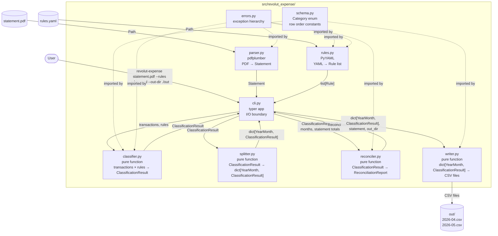
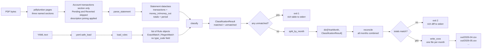
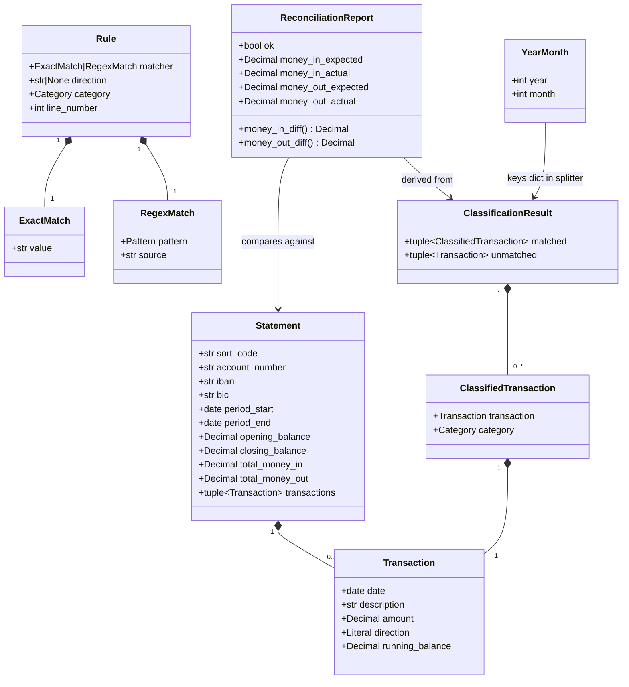
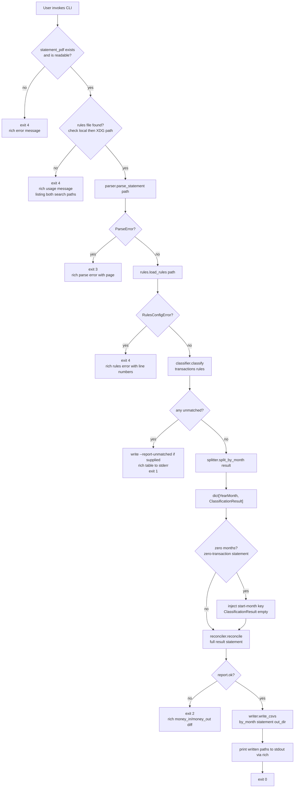
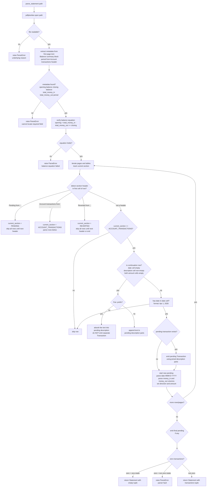
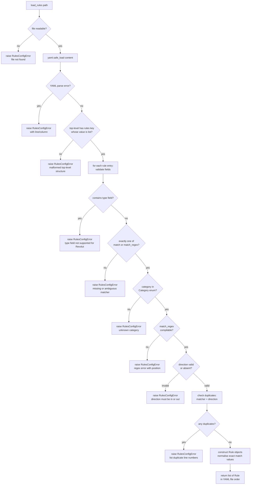
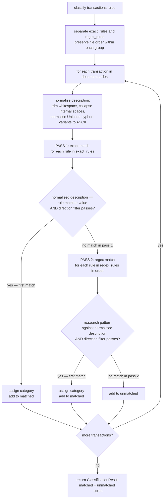
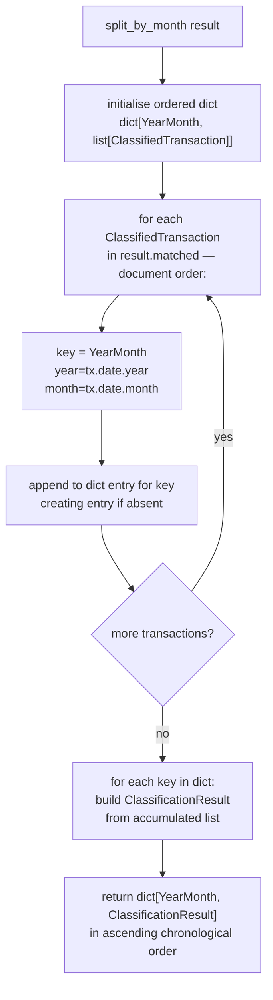
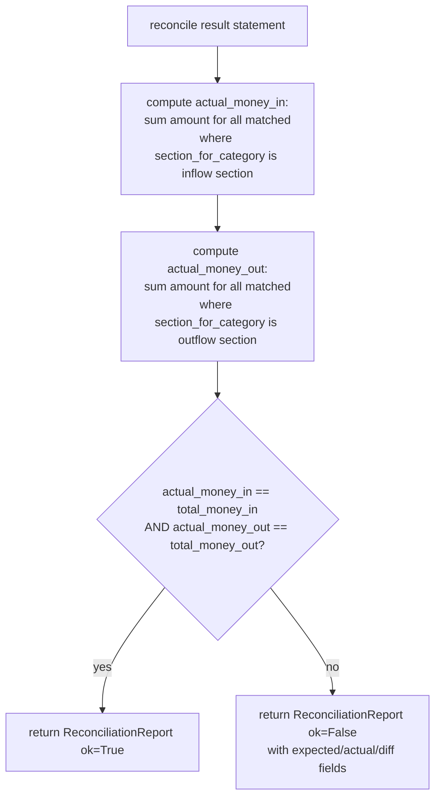
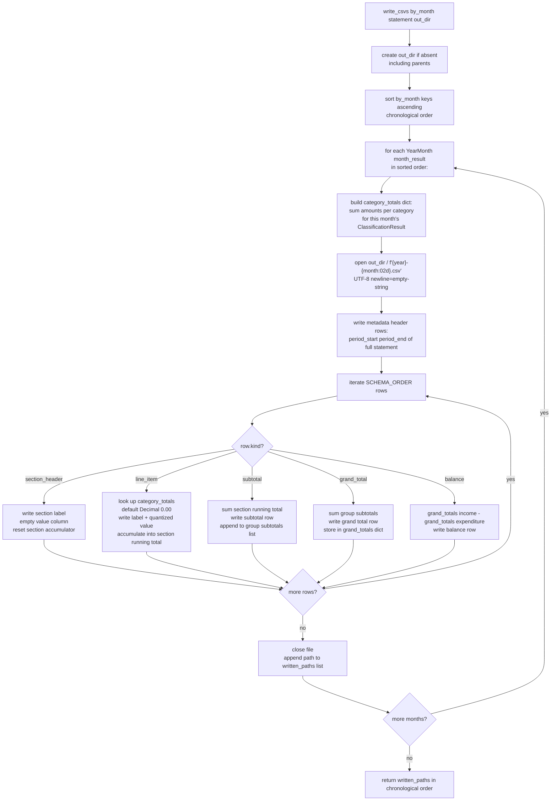

# Design Document: Revolut Expense Tool

## Overview

The Revolut Expense Tool is a single-invocation CLI that transforms one Revolut GBP personal-account statement PDF into one categorised monthly cash-flow CSV per calendar month covered by the statement. The design is a strict linear pipeline: parse PDF → load rules → classify transactions → split by calendar month → reconcile totals → write CSVs. Each stage is an isolated module with a single public function; the CLI wires the stages together and is the only module allowed to touch I/O boundaries (argv, stdout, stderr, sys.exit).

The tool is a deliberate sibling of `lloyds-expense` and `monzo-expense`, not a generalisation of either. The three share output schema shape and pipeline structure but differ in every parsing detail. Revolut is closest to Monzo in structure (multi-month PDFs, no type codes, same schema including `MAIN_ACCOUNT_INFLOW`) and closest to Lloyds in amount layout (two separate `Money in` / `Money out` columns rather than a signed single column). Its key unique challenge is the presence of three named sections in the PDF — **Pending**, **Account transactions**, and **Reverted** — of which only Account transactions contains completed transaction records. Description wrapping uses Revolut-specific continuation patterns (`To:`, `From:`, `Card:`, `Reference:`, `Revolut Rate …`, `Fee:`).

Design principles:
- Every monetary value is `decimal.Decimal` from parse boundary to CSV write.
- All data objects are `frozen=True` dataclasses — mutation is never needed after construction.
- Errors surface as typed exceptions; the CLI layer is the sole exception handler and exit-code mapper.
- Output is deterministic: same inputs always produce byte-identical CSVs.

---

## Architecture Design

### System Architecture Diagram



### Data Flow Diagram



---

## Component Design

### `schema.py` — Budget Shape Definition

- **Responsibilities:** Define the closed enumeration of all valid categories (including `MAIN_ACCOUNT_INFLOW`), declare the canonical output row order, expose the section-to-category mapping, and provide iteration helpers. Structurally identical to `monzo_expense/schema.py`; duplicated by design.
- **Interfaces:**
  - `Category(enum.Enum)` — all 23 leaf categories as enum members, including `MAIN_ACCOUNT_INFLOW = "Main Account Inflow"` in the Irregular Inflows group.
  - `Section(enum.Enum)` — 6 section headers (`REGULAR_INFLOWS`, `IRREGULAR_INFLOWS`, `ASSET_LIQUIDATION`, `REGULAR_OUTFLOWS`, `IRREGULAR_OUTFLOWS`, `ASSETS`).
  - `SchemaRow` (frozen dataclass): `kind: Literal["section_header", "line_item", "subtotal", "grand_total", "balance"]`, `section: Section | None`, `category: Category | None`, `label: str`, `group: Literal["income", "expenditure"] | None`.
  - `SCHEMA_ORDER: list[SchemaRow]` — 35 rows in fixed output order (6 section headers, 23 line items, 6 subtotals, 2 grand totals, 1 balance row).
  - `category_display_name(category: Category) -> str`
  - `section_for_category(category: Category) -> Section`
- **Dependencies:** stdlib only (`enum`, `dataclasses`). No other project modules.

### `errors.py` — Exception Hierarchy

- **Responsibilities:** Define all typed exceptions used across the codebase. No logic.
- **Interfaces:**
  - `StatementToCsvError(Exception)` — base class.
  - `ParseError(StatementToCsvError)` — PDF parse failures; maps to exit code 3. Attributes: `message: str`, `page: int | None`.
  - `RulesConfigError(StatementToCsvError)` — invalid or unloadable rules; maps to exit code 4. Attributes: `message: str`, `line_number: int | None`, `violations: list[str]`.
  - `UnmatchedTransactionsError(StatementToCsvError)` — unmatched transactions remain after classification; maps to exit code 1.
  - `ReconciliationError(StatementToCsvError)` — classified totals do not match statement totals; maps to exit code 2.
  - `InputError(StatementToCsvError)` — bad CLI arguments; maps to exit code 4.
- **Dependencies:** stdlib only.

### `parser.py` — PDF to Typed Transactions

- **Responsibilities:** Accept a PDF file path; detect and skip the Pending and Reverted sections; extract and re-join the transaction rows from the Account transactions section; return a typed `Statement` dataclass. All Revolut-specific PDF layout knowledge lives here and nowhere else.
- **Interfaces:**
  - `parse_statement(path: Path) -> Statement`
  - `Statement` (frozen dataclass): `sort_code: str`, `account_number: str`, `iban: str`, `bic: str`, `period_start: date`, `period_end: date`, `opening_balance: Decimal`, `closing_balance: Decimal`, `total_money_in: Decimal`, `total_money_out: Decimal`, `transactions: tuple[Transaction, ...]`.
  - `Transaction` (frozen dataclass): `date: date`, `description: str`, `amount: Decimal`, `direction: Literal["in", "out"]`, `running_balance: Decimal`. **No `type_code` field.**
- **Internal helpers (not part of public API):**
  - `_extract_metadata(page_text: str) -> dict` — regex-based extraction of balance summary and period from page 1.
  - `_detect_section(row_text: str) -> Literal["pending", "account_transactions", "reverted"] | None` — identifies section-header rows.
  - `_is_continuation_row(row: list) -> bool` — identifies description-only continuation rows.
  - `_is_fee_continuation(text: str) -> bool` — identifies `Fee: £X.XX` rows to absorb into parent.
  - `_parse_amount_columns(money_in: str, money_out: str) -> tuple[Decimal, Literal["in", "out"]]`
- **Dependencies:** `pdfplumber`, `decimal`, `datetime`, `pathlib`; raises `ParseError`.

### `rules.py` — YAML to Rule Objects

- **Responsibilities:** Load, validate, and compile the rules YAML into an ordered list of `Rule` objects. Validate categories against `schema.py`. Reject rules that contain a `type` field (Lloyds-only concept).
- **Interfaces:**
  - `load_rules(path: Path) -> list[Rule]`
  - `Rule` (frozen dataclass): `matcher: ExactMatch | RegexMatch`, `direction: Literal["in", "out"] | None`, `category: Category`, `line_number: int`. **No `type_code` field.**
  - `ExactMatch` (frozen dataclass): `value: str` (normalised at load time).
  - `RegexMatch` (frozen dataclass): `pattern: re.Pattern[str]`, `source: str`.
- **Dependencies:** `yaml`, `re`, `schema.py`; raises `RulesConfigError`.

### `classifier.py` — Two-Pass Matching

- **Responsibilities:** Accept transactions and rules; return a `ClassificationResult` containing matched and unmatched transactions. Pure function, no I/O. Direction filter is the only optional filter (no type-code filter, because Revolut has no type codes).
- **Interfaces:**
  - `classify(transactions: tuple[Transaction, ...], rules: list[Rule]) -> ClassificationResult`
  - `ClassifiedTransaction` (frozen dataclass): `transaction: Transaction`, `category: Category`.
  - `ClassificationResult` (frozen dataclass): `matched: tuple[ClassifiedTransaction, ...]`, `unmatched: tuple[Transaction, ...]`.
- **Dependencies:** `schema.py`, `errors.py` (type imports only).

### `splitter.py` — Calendar Month Grouping

- **Responsibilities:** Accept a `ClassificationResult` and group its matched transactions by `(year, month)` of their transaction date. Return a `dict[YearMonth, ClassificationResult]`. Pure function, no I/O.
- **Interfaces:**
  - `split_by_month(result: ClassificationResult) -> dict[YearMonth, ClassificationResult]`
  - `YearMonth` (NamedTuple): `year: int`, `month: int`.
- **Dependencies:** `classifier.py` (for `ClassificationResult` type); no schema dependency.

### `reconciler.py` — Arithmetic Verification

- **Responsibilities:** Sum classified inflows and outflows across all months combined; compare to the statement's `total_money_in` and `total_money_out`. Return a structured report — does not raise for inflow/outflow mismatches, does not exit. Reconciliation is always period-level because Revolut PDFs only print period totals. Pending and Reverted rows are already excluded from the transaction list and therefore from the reconciliation sum.
- **Interfaces:**
  - `reconcile(result: ClassificationResult, statement: Statement) -> ReconciliationReport`
  - `ReconciliationReport` (frozen dataclass): `ok: bool`, `money_in_expected: Decimal`, `money_in_actual: Decimal`, `money_out_expected: Decimal`, `money_out_actual: Decimal`.
  - Derived properties: `money_in_diff: Decimal`, `money_out_diff: Decimal` (computed as `actual - expected`).
- **Dependencies:** `decimal`, `schema.py` (to determine inflow vs outflow sections).

### `writer.py` — Multi-Month CSV Output

- **Responsibilities:** For each calendar month in the split result, iterate the canonical schema row order, compute per-category totals, emit every row to a CSV file (zero-filled when no activity). Create the output directory if absent. Return the list of written paths in chronological order.
- **Interfaces:**
  - `write_csvs(by_month: dict[YearMonth, ClassificationResult], statement: Statement, out_dir: Path) -> list[Path]`
- **Dependencies:** `csv`, `decimal`, `pathlib`, `schema.py`.

### `cli.py` — Entry Point and I/O Boundary

- **Responsibilities:** Parse argv via `typer`, resolve default paths, invoke pipeline stages in order, catch all `StatementToCsvError` subclasses, map them to exit codes, produce `rich`-formatted output on stderr, and print written file paths to stdout on success.
- **Interfaces:**
  - `app = typer.Typer()` — the typer application object.
  - `main(statement_pdf: Path, rules: Optional[Path], out_dir: Optional[Path], report_unmatched: Optional[Path])` — the single typer command. `out_dir` defaults to `./output`.
- **Dependencies:** `typer`, `rich`, all other project modules.

### `__main__.py`

- Imports `app` from `cli.py` and calls `app()`. Enables `python -m revolut_expense`.

---

## Data Models

### Core Data Structure Definitions

```python
# schema.py  — structurally identical to monzo_expense/schema.py
from enum import Enum
from dataclasses import dataclass
from typing import Literal

class Category(Enum):
    # Regular Inflows
    SALARY = "Salary"
    # Irregular Inflows
    UNEXPECTED_REFUND = "Unexpected / Refund"
    LOAN = "Loan"
    MAIN_ACCOUNT_INFLOW = "Main Account Inflow"   # shared with Monzo
    # Asset Liquidation
    SAVINGS = "Savings"
    STOCKS_AND_SHARES = "Stocks & Shares"
    # Regular Outflows
    RENT = "Rent"
    BILL_COUNCIL_TAX = "Bill - Council Tax"
    BILL_ELECTRICITY_GAS = "Bill - Electricity & Gas"
    BILL_PHONE_INTERNET = "Bill - Phone & Internet"
    FOOD_SUPPLIES = "Food Supplies"
    DEBT = "Debt"
    CAR_AND_GAS = "Car & Gas"
    # Irregular Outflows
    CHARITY_DONATIONS = "Charity / Donations"
    GIFTS_ENTERTAINMENT_MISC = "Gifts/Entertainment/Misc"
    SUNDRY = "Sundry"
    HOLIDAYS_TRAVEL = "Holidays & Travel"
    EDUCATION = "Education"
    EATING_OUT = "Eating Out"
    # Assets
    ACTIVE_SAVINGS = "Active Savings"
    LIFETIME_ISA = "Lifetime ISA"
    STOCKS_SHARES_ISA = "Stocks & Shares ISA"
    DIVIDEND_PORTFOLIO = "Dividend Portfolio"

class Section(Enum):
    REGULAR_INFLOWS = "Regular Inflows"
    IRREGULAR_INFLOWS = "Irregular Inflows"
    ASSET_LIQUIDATION = "Asset Liquidation"
    REGULAR_OUTFLOWS = "Regular Outflows"
    IRREGULAR_OUTFLOWS = "Irregular Outflows"
    ASSETS = "Assets"

@dataclass(frozen=True)
class SchemaRow:
    kind: Literal["section_header", "line_item", "subtotal", "grand_total", "balance"]
    section: Section | None
    category: Category | None
    label: str
    group: Literal["income", "expenditure"] | None

# parser.py
from dataclasses import dataclass
from datetime import date
from decimal import Decimal
from typing import Literal

@dataclass(frozen=True)
class Transaction:
    date: date
    description: str
    # No type_code field — Revolut statements carry no transaction-type codes.
    amount: Decimal
    direction: Literal["in", "out"]
    running_balance: Decimal

@dataclass(frozen=True)
class Statement:
    sort_code: str
    account_number: str
    iban: str                    # Revolut-specific; not present in Monzo or Lloyds
    bic: str                     # Revolut-specific; not present in Monzo or Lloyds
    period_start: date
    period_end: date
    opening_balance: Decimal
    closing_balance: Decimal
    total_money_in: Decimal      # from Balance summary "Money in" row
    total_money_out: Decimal     # from Balance summary "Money out" row
    transactions: tuple[Transaction, ...]

# rules.py
import re
from dataclasses import dataclass
from typing import Literal

@dataclass(frozen=True)
class ExactMatch:
    value: str                 # normalised at load time

@dataclass(frozen=True)
class RegexMatch:
    pattern: re.Pattern[str]   # compiled at load time
    source: str                # original pattern string for dedup checks

@dataclass(frozen=True)
class Rule:
    matcher: ExactMatch | RegexMatch
    # No type_code field — Revolut has no transaction-type codes.
    direction: Literal["in", "out"] | None
    category: Category
    line_number: int           # 1-based, for error messages

# classifier.py
from dataclasses import dataclass

@dataclass(frozen=True)
class ClassifiedTransaction:
    transaction: Transaction
    category: Category

@dataclass(frozen=True)
class ClassificationResult:
    matched: tuple[ClassifiedTransaction, ...]
    unmatched: tuple[Transaction, ...]

# splitter.py
from typing import NamedTuple

class YearMonth(NamedTuple):
    year: int
    month: int

# reconciler.py
from dataclasses import dataclass
from decimal import Decimal

@dataclass(frozen=True)
class ReconciliationReport:
    ok: bool
    money_in_expected: Decimal
    money_in_actual: Decimal
    money_out_expected: Decimal
    money_out_actual: Decimal

    @property
    def money_in_diff(self) -> Decimal:
        return self.money_in_actual - self.money_in_expected

    @property
    def money_out_diff(self) -> Decimal:
        return self.money_out_actual - self.money_out_expected
```

### Data Model Relationships



---

## Business Process

### Process 1: CLI Invocation and Pipeline Orchestration



### Process 2: PDF Parsing Detail



### Process 3: Rules Loading and Validation



### Process 4: Two-Pass Classification



### Process 5: Calendar Month Splitting



### Process 6: Reconciliation Check



### Process 7: Multi-Month CSV Output



---

## Error Handling Strategy

### Exception Hierarchy

```
StatementToCsvError (base)
├── ParseError              — exit code 3
│   Attributes: message: str, page: int | None
├── RulesConfigError        — exit code 4
│   Attributes: message: str, line_number: int | None, violations: list[str]
├── UnmatchedTransactionsError — exit code 1
│   Attributes: unmatched: tuple[Transaction, ...]
├── ReconciliationError     — exit code 2
│   Attributes: report: ReconciliationReport
└── InputError              — exit code 4
    Attributes: message: str
```

### Exit Code Mapping

| Exit Code | Condition | Exception |
|---|---|---|
| 0 | All stages passed, CSVs written | (no exception) |
| 1 | One or more unmatched transactions | `UnmatchedTransactionsError` |
| 2 | Reconciliation mismatch | `ReconciliationError` |
| 3 | PDF parse failure, balance equation invalid, non-GBP product | `ParseError` |
| 4 | Bad input (missing file, malformed YAML, unknown category, `type` field in rule, invalid CLI args) | `InputError`, `RulesConfigError` |

### Error Handling Principles

1. Library modules (`parser`, `rules`, `classifier`, `splitter`, `reconciler`, `writer`) raise typed exceptions. They never call `print`, `sys.exit`, or access `sys.stderr`.
2. `cli.py` wraps each pipeline call in a `try/except StatementToCsvError` block, formats the error via `rich` to stderr, and calls `raise typer.Exit(code=N)`.
3. `RulesConfigError.violations` is populated for multi-violation errors (duplicate rules) so all failures are reported at once.
4. The balance equation check (`opening + total_money_in - total_money_out == closing`) is performed inside `parser.parse_statement` because a failure indicates the statement's own page-1 summary figures are internally inconsistent — a parser fault, not a user-correctable condition.
5. Unexpected exceptions (bugs, library failures) propagate uncaught to Python's default traceback handler. A crash with a traceback is more diagnosable than a swallowed exception.

---

## Key Algorithms

### Revolut PDF Section Detection

Revolut PDFs contain three named sections per statement period, each prefixed by a recognisable header phrase:

| Section header phrase | Rows below | Action |
|---|---|---|
| `Pending from <start> to <end>` | Pending (incomplete) transactions | Skip entirely |
| `Account transactions from <start> to <end>` | Completed transactions | Parse and emit |
| `Reverted from <start> to <end>` | Transactions reversed by the bank | Skip entirely |

The section header is detected by checking whether the raw text of the first cell in a table row starts with one of the three keyword phrases (case-insensitive). A `current_section` state variable tracks which section is currently active; it starts as `None` (before the first header) and transitions on each header row.

```
current_section: str | None = None

for row in all_table_rows:
    first_cell = (row[0] or "").strip().lower()
    if first_cell.startswith("pending from"):
        current_section = "pending"
        continue
    if first_cell.startswith("account transactions from"):
        current_section = "account_transactions"
        continue
    if first_cell.startswith("reverted from"):
        current_section = "reverted"
        continue
    if current_section != "account_transactions":
        continue  # skip pending, reverted, and pre-first-header rows
    # process transaction row ...
```

This state machine is the sole mechanism for excluding Pending and Reverted rows; no further filtering is needed in classifier or reconciler.

### Description Line-Joining Algorithm

Revolut describes each transaction in the PDF as a primary row followed by one or more continuation rows. The primary row contains the date, a merchant name fragment in the description column, money-in or money-out amount, and running balance. Continuation rows have the date and amount cells empty; their description cell contains a structured line beginning with a recognised prefix.

**Recognised continuation prefixes:**

| Prefix | Meaning |
|---|---|
| `To: ` | Merchant address or counterparty name (card payments, outbound Faster Payments) |
| `From: ` | Counterparty name and account number (inbound Faster Payments) |
| `Card: ` | Card number used (e.g. `Card: 535456******1161`) |
| `Reference: ` | Payment reference text |
| `Revolut Rate ` | Foreign-currency exchange rate annotation |
| `<amount> <CCY>` | Converted amount following a Revolut Rate line |
| `Fee: £` | FX fee charged on a currency conversion |

**Fee absorption:** When a `Fee: £X.XX` continuation is encountered, the fee text is appended to the parent transaction's description and no separate `Transaction` is emitted. The fee amount is already included in the parent row's printed `Money out` value; emitting a separate Transaction would double-count it.

**Join algorithm (pending-row accumulator):**

```
pending_date = None
pending_desc_parts: list[str] = []
pending_money_in = ""
pending_money_out = ""
pending_balance = ""

for row in account_transaction_rows:
    date_cell = (row[0] or "").strip()
    desc_cell = (row[1] or "").strip()
    money_out_cell = (row[2] or "").strip()
    money_in_cell  = (row[3] or "").strip()
    balance_cell   = (row[4] or "").strip()

    if date_cell matches MMM D, YYYY pattern:
        if pending_date is not None:
            emit Transaction(
                date=pending_date,
                description=" ".join(pending_desc_parts),
                ...
            )
        pending_date = parse_date(date_cell)
        pending_desc_parts = [desc_cell] if desc_cell else []
        pending_money_in = money_in_cell
        pending_money_out = money_out_cell
        pending_balance = balance_cell
    elif desc_cell and not money_out_cell and not money_in_cell:
        # continuation row — append description text
        pending_desc_parts.append(desc_cell)

if pending_date is not None:
    emit Transaction(pending_date, " ".join(pending_desc_parts), ...)
```

The joined description retains all continuation segments separated by a single space. Rules that match Revolut descriptions should use `^` anchors and target the merchant short-name that appears in the primary row (the part before `To:`), because the joined string includes continuation segments after a space.

### Amount Parsing and Direction

Revolut PDFs have two amount columns (`Money out`, `Money in`) like Lloyds. Direction is determined by which column is populated:

```
def _parse_amount_columns(
    money_out: str, money_in: str
) -> tuple[Decimal, Literal["in", "out"]]:
    out_str = money_out.lstrip("£").replace(",", "").strip()
    in_str  = money_in.lstrip("£").replace(",", "").strip()

    if out_str and not in_str:
        return Decimal(out_str), "out"
    if in_str and not out_str:
        return Decimal(in_str), "in"
    raise ParseError("Row has values in both Money out and Money in columns")
```

Both the `£` prefix and thousand-separator commas are stripped before constructing the `Decimal`. Floats are never used.

### Date Parsing

Revolut PDFs use long-form month abbreviation format with a comma: `Apr 1, 2026`, `May 24, 2026`. The four-digit year is always explicit. Dates are parsed with:

```python
datetime.strptime(date_str, "%b %d, %Y").date()
```

No year-expansion heuristic is needed — unlike Lloyds which uses two-digit years.

### Two-Pass Classification Algorithm

Classification is structurally identical to `monzo_expense.classifier`, with the same two-pass exact-then-regex strategy and the same normalisation. There is no type-code filter because Revolut has no type codes.

**Normalisation** (applied to both transaction descriptions and exact rule values at load/classify time):

```python
normalised = text.strip()
normalised = re.sub(r"\s+", " ", normalised)
normalised = re.sub(r"[‐-—]", "-", normalised)  # Unicode dashes → ASCII hyphen-minus
```

**Pass 1 — Exact matching:** Iterate `exact_rules` in YAML file order. For each rule:
- Check `normalised_description == rule.matcher.value`.
- Check `rule.direction is None or rule.direction == transaction.direction`.
- On the first match, record the category.

**Pass 2 — Regex matching:** Run only when Pass 1 found no match. Iterate `regex_rules` in YAML file order. For each rule:
- Check `rule.matcher.pattern.search(normalised_description) is not None`.
- Check `rule.direction is None or rule.direction == transaction.direction`.
- On the first match, record the category. File order determines priority.

**No match:** The transaction is added to the unmatched list.

Because Revolut description joining produces strings like `"Morrisons To: 8 Glasgow Road, Dumfries"`, rules use `^` anchors to match only the leading merchant name (e.g. `match_regex: "^Morrisons "`).

### Calendar Month Splitting Algorithm

```python
def split_by_month(result: ClassificationResult) -> dict[YearMonth, ClassificationResult]:
    buckets: dict[YearMonth, list[ClassifiedTransaction]] = {}
    for ct in result.matched:
        key = YearMonth(ct.transaction.date.year, ct.transaction.date.month)
        buckets.setdefault(key, []).append(ct)
    return {
        key: ClassificationResult(matched=tuple(cts), unmatched=())
        for key, cts in sorted(buckets.items())
    }
```

Key properties:
- Iteration order over `result.matched` is document order, so each bucket's list is also in document order.
- `sorted(buckets.items())` yields months in ascending chronological order.
- Each output `ClassificationResult` has `unmatched=()` — unmatched transactions were handled before the split.
- The function is pure: no mutation of the input, no I/O.

### Metadata Extraction from Page 1

The Balance summary on page 1 prints four labelled values for the `"Account (E-Money)"` product row: opening balance, money out total, money in total, and closing balance. The period is extracted from the `"Account transactions from <start> to <end>"` heading.

```
# Balance summary extraction (regex against page 1 text)
_OPENING_BALANCE_RE  = re.compile(r"Opening balance\s+£([\d,]+\.\d{2})")
_CLOSING_BALANCE_RE  = re.compile(r"Closing balance\s+£([\d,]+\.\d{2})")
_MONEY_IN_RE         = re.compile(r"Money in\s+£([\d,]+\.\d{2})")
_MONEY_OUT_RE        = re.compile(r"Money out\s+£([\d,]+\.\d{2})")

# Period extraction
_PERIOD_RE = re.compile(
    r"Account transactions from\s+"
    r"(\w+ \d{1,2}, \d{4})\s+to\s+(\w+ \d{1,2}, \d{4})",
    re.IGNORECASE,
)
```

Account metadata (sort code, account number, IBAN, BIC) are extracted from labelled lines near the top of page 1. They are stored on the `Statement` object for debugging purposes.

### CSV Row Ordering Algorithm

Each monthly CSV is written by iterating `SCHEMA_ORDER` exactly once, in sequence:

```
[section_header "Regular Inflows",
 line_item SALARY,
 subtotal "Regular Inflows subtotal",
 section_header "Irregular Inflows",
 line_item UNEXPECTED_REFUND,
 line_item LOAN,
 line_item MAIN_ACCOUNT_INFLOW,
 subtotal "Irregular Inflows subtotal",
 section_header "Asset Liquidation",
 line_item SAVINGS,
 line_item STOCKS_AND_SHARES,
 subtotal "Asset Liquidation subtotal",
 grand_total "Total Income",
 section_header "Regular Outflows",
 line_item RENT,
 line_item BILL_COUNCIL_TAX,
 line_item BILL_ELECTRICITY_GAS,
 line_item BILL_PHONE_INTERNET,
 line_item FOOD_SUPPLIES,
 line_item DEBT,
 line_item CAR_AND_GAS,
 subtotal "Regular Outflows subtotal",
 section_header "Irregular Outflows",
 line_item CHARITY_DONATIONS,
 line_item GIFTS_ENTERTAINMENT_MISC,
 line_item SUNDRY,
 line_item HOLIDAYS_TRAVEL,
 line_item EDUCATION,
 line_item EATING_OUT,
 subtotal "Irregular Outflows subtotal",
 section_header "Assets",
 line_item ACTIVE_SAVINGS,
 line_item LIFETIME_ISA,
 line_item STOCKS_SHARES_ISA,
 line_item DIVIDEND_PORTFOLIO,
 subtotal "Assets subtotal",
 grand_total "Total Expenditure",
 balance "Balance"]
```

**Subtotal:** Sum of all `line_item` amounts since the last `section_header`, defaulting absent categories to `Decimal("0.00")`.

**Grand total:** Sum of the subtotals for all sections in the same group (`"income"` or `"expenditure"`).

**Balance:** `Total Income − Total Expenditure`, computed from the two stored grand totals.

**Decimal quantization:** All amounts are formatted as `str(value.quantize(Decimal("0.01")))` at write time only.

---

## Testing Strategy

### Test Module Layout

| Source module | Test module | Primary focus |
|---|---|---|
| `schema.py` | `test_schema.py` | Enum completeness (23 categories), `MAIN_ACCOUNT_INFLOW` present and in Irregular Inflows, row count (35), schema order integrity |
| `errors.py` | (tested via integration) | Exception hierarchy and attribute correctness |
| `parser.py` | `test_parser.py` | Section detection, description joining, fee absorption, Pending/Reverted exclusion, amount columns, zero-transaction cases |
| `rules.py` | `test_rules.py` | YAML loading, `type` field rejection, validation, error paths |
| `classifier.py` | `test_classifier.py` | Two-pass matching, normalisation, direction filter, no type-code filter |
| `splitter.py` | `test_splitter.py` | Single month, multi-month, document order preservation |
| `reconciler.py` | `test_reconciler.py` | Period-level arithmetic, pass/fail, balance equation in parser |
| `writer.py` | `test_writer.py` | Schema order, zero-fill, multi-file, golden files |
| `cli.py` | `test_cli.py` | End-to-end, exit codes, stderr/stdout |

### Test Fixtures

`tests/revolut/fixtures/` contains:

- `statement_minimal.pdf` — a single-month Revolut PDF with a small number of transactions (at least one money-in, one money-out, one with `To:` and `Reference:` continuation rows). No Pending or Reverted section.
- `statement_multi_month.pdf` — a PDF spanning two calendar months with transactions in both months. Includes at least one continuation-row description per month.
- `statement_with_pending_and_reverted.pdf` — a PDF containing at least one Pending row and at least one Reverted row alongside normal Account transactions rows. Tests assert that the Pending and Reverted rows produce zero `Transaction` records and do not appear in the reconciliation sum.
- `statement_empty.pdf` — zero completed transactions, `total_money_in = 0.00`, `total_money_out = 0.00`.
- `statement_bad_balance.pdf` — a statement where `opening + total_money_in - total_money_out != closing_balance`.
- `rules_example.yaml` — a representative rules file covering all fixture transactions plus deliberate gaps for unmatched-path testing.
- `expected_month1.csv`, `expected_month2.csv` — golden output files for the multi-month fixture with a fully-matching rules file.

Fixtures are generated by `tests/revolut/fixtures/create_fixtures.py` using `reportlab` and are checked in. Tests never reach the network.

### Unit Test Approach per Module

**`test_parser.py`**
- Parse `statement_minimal.pdf`; assert transaction count, correct `Decimal` amounts, correct directions, correct dates.
- Assert `opening_balance + total_money_in - total_money_out == closing_balance` for all fixtures.
- Assert continuation rows (`To:`, `From:`, `Reference:`) are joined onto the preceding transaction (not emitted as separate `Transaction` records).
- Assert `Fee: £X.XX` continuation rows are absorbed into the parent description and not emitted separately.
- Assert Pending and Reverted rows in `statement_with_pending_and_reverted.pdf` produce zero `Transaction` records.
- Assert only rows under the Account transactions section are emitted.
- Supply a non-PDF file; assert `ParseError`.
- Assert amounts with `£` prefix and thousand separators parse as correct `Decimal` values.
- Assert rows with values in both `Money in` and `Money out` raise `ParseError`.
- Assert `statement_empty.pdf` returns `Statement` with empty tuple (R9.1).
- Assert `statement_bad_balance.pdf` raises `ParseError` (R7.3).

**`test_rules.py`**
- Load a valid rules file; assert `Rule` objects in file order with correct matchers and directions.
- Supply a rule with a `type` field; assert `RulesConfigError` with a message mentioning Revolut.
- Supply a duplicate rule (same matcher + direction); assert `RulesConfigError` naming both line numbers.
- Supply a rule with an unknown category; assert `RulesConfigError`.
- Supply a rule with an invalid regex; assert `RulesConfigError` with pattern source.
- Supply a YAML file missing the `rules` key; assert `RulesConfigError`.
- Supply a rule with both `match` and `match_regex`; assert `RulesConfigError`.
- Assert `ExactMatch.value` is normalised at load time.
- Assert `Rule` has no `type_code` attribute.

**`test_classifier.py`**
- Exact match takes priority over a regex match for the same description, regardless of YAML order.
- Direction filter: a rule with `direction: out` does not match a money-in transaction with the same description.
- First regex in file order wins when multiple regex rules match.
- Transaction with no matching rule appears in `result.unmatched`.
- Joined description (including `To:` continuation) matches an anchored `^` regex correctly.
- Document order of matched transactions is preserved in `result.matched`.

**`test_splitter.py`**
- Single-month input: returned dict has exactly one key; all transactions in the single bucket, document order preserved.
- Two-month input: returned dict has exactly two keys in ascending chronological order; each bucket contains only transactions from that month; total matched count unchanged.
- Empty `ClassificationResult` (zero matched): returned dict is empty.
- Transactions on the last day of one month and the first day of the next are assigned to separate buckets.

**`test_reconciler.py`**
- Returns `ok=True` when computed totals match `total_money_in` and `total_money_out` exactly.
- Returns `ok=False` with correct diffs when either total differs by `Decimal("0.01")`.
- Reconciler never raises; balance equation is checked by the parser.
- All arithmetic uses `Decimal`; no float comparison.
- `MAIN_ACCOUNT_INFLOW` transactions contribute to the money-in total.

**`test_writer.py`**
- Golden file test: known `dict[YearMonth, ClassificationResult]` + `Statement` produces CSVs matching `expected_month1.csv` and `expected_month2.csv` byte-for-byte.
- Zero-fill test: a month with no transactions in a category still emits that category's row with `"0.00"`.
- Schema row count test: each output CSV has 35 schema rows plus 2 metadata header rows = 37 rows total; balance row is last.
- Output directory is created if absent; test uses `tmp_path`.
- `\n` line endings throughout; `csv.QUOTE_MINIMAL`.
- Files returned and written in ascending chronological month order.
- Overwrite test: running writer twice with the same output produces identical files.

**`test_cli.py`** (via `typer.testing.CliRunner`)
- Happy path single month: minimal PDF + rules → exit 0, one CSV in `--out-dir`, path printed to stdout.
- Happy path two months: multi-month PDF + full rules → exit 0, two CSVs with names `YYYY-MM.csv`, both paths in stdout.
- Unmatched transactions: rules missing one rule → exit 1, rich table on stderr, no CSVs written.
- `--report-unmatched <path>` with unmatched → exit 1, report file written.
- Reconciliation mismatch → exit 2, diff on stderr, no CSVs written.
- Non-existent PDF → exit 4.
- Rules file with a `type` field → exit 4, descriptive error mentioning Revolut.
- Zero-transaction statement with zero totals → exit 0, one all-zero CSV (R9.1).
- `--help` → exit 0, all options listed.
- Pending and Reverted rows in fixture → excluded from output, reconciliation passes.

### Coverage Target

Coverage is measured by `pytest-cov` on the non-CLI source modules. The minimum floor is **90% line coverage**. `cli.py` is excluded from the floor because its I/O-heavy paths are covered by `test_cli.py` integration tests.

```
pytest tests/revolut/ --cov=revolut_expense --cov-fail-under=90
```

### Determinism Test

A dedicated test asserts that running the full pipeline twice with the same inputs produces byte-identical output files. This guards against accidental non-determinism (dict ordering, timestamp injection, float rounding). The two-month fixture is used because it exercises both the splitter and the multi-file writer.
