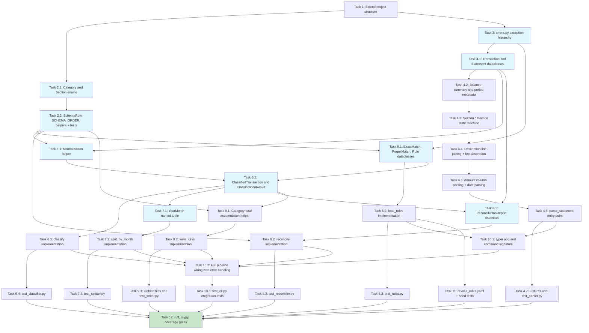

# Implementation Plan: Revolut Expense Tool

- [x] 1. Extend project structure for `revolut_expense` package
  - Create `src/revolut_expense/` package directory with `__init__.py` and `__main__.py` (`__main__.py` imports `app` from `cli.py` and calls `app()`)
  - Create `tests/revolut/` and `tests/revolut/fixtures/` directories with `__init__.py` files
  - In the existing `pyproject.toml`, add `revolut-expense = "revolut_expense.cli:app"` to `[project.scripts]` alongside the existing `lloyds-expense` and `monzo-expense` entries
  - Add `src/revolut_expense` to `[tool.hatch.build.targets.wheel].packages`
  - In `[tool.coverage.run]`, add `src/revolut_expense/cli.py` to the `omit` list alongside the existing omissions
  - _Requirements: R11.1, R14.4_

---

- [x] 2. Implement `schema.py` — budget shape definition
- [x] 2.1 Define `Category` and `Section` enums
  - Write `Category(enum.Enum)` with all 23 leaf category members. This is structurally identical to `monzo_expense.schema.Category` — use the same 22 base members and include `MAIN_ACCOUNT_INFLOW = "Main Account Inflow"` in the Irregular Inflows group, after `LOAN`. Duplicate the file; do **not** import from `monzo_expense`.
  - Write `Section(enum.Enum)` with all 6 section members (identical names to `monzo_expense.schema.Section`)
  - _Requirements: R8.5, R11.3, R11.12_

- [x] 2.2 Define `SchemaRow` dataclass and `SCHEMA_ORDER` constant
  - Write `SchemaRow(frozen=True)` with `kind: Literal["section_header", "line_item", "subtotal", "grand_total", "balance"]`, `section: Section | None`, `category: Category | None`, `label: str`, and `group: Literal["income", "expenditure"] | None` fields
  - Write `SCHEMA_ORDER: list[SchemaRow]` encoding all 38 rows in the fixed output order from R8.5: 6 section headers + 23 line items (including `MAIN_ACCOUNT_INFLOW` in Irregular Inflows after `LOAN`) + 6 subtotals + 2 grand totals + 1 balance row. The Irregular Inflows section has 3 line items: `UNEXPECTED_REFUND`, `LOAN`, `MAIN_ACCOUNT_INFLOW`. Balance row is last.
  - Implement `category_display_name(category: Category) -> str` and `section_for_category(category: Category) -> Section` helpers. `MAIN_ACCOUNT_INFLOW` maps to `Section.IRREGULAR_INFLOWS`.
  - Write `tests/revolut/test_schema.py` asserting: 23 categories; 6 sections; `SCHEMA_ORDER` length is 38; every `Category` member appears exactly once as a `line_item`; `MAIN_ACCOUNT_INFLOW` is present and in the `IRREGULAR_INFLOWS` section; `group` is correctly assigned on every section header, subtotal, and grand-total row; the `balance` row is last.
  - _Requirements: R8.5, R8.6, R8.7, R8.8, R8.9, R11.3_

---

- [x] 3. Implement `errors.py` — typed exception hierarchy
  - Write `StatementToCsvError(Exception)` base class
  - Write `ParseError` with attributes `message: str` and `page: int | None`
  - Write `RulesConfigError` with attributes `message: str`, `line_number: int | None`, and `violations: list[str]`
  - Write `UnmatchedTransactionsError` with attribute `unmatched: tuple[Transaction, ...]` (forward reference)
  - Write `ReconciliationError` with attribute `report: ReconciliationReport` (forward reference)
  - Write `InputError` with attribute `message: str`
  - _Requirements: R11.4_

---

- [x] 4. Implement `parser.py` — PDF to typed transactions
- [x] 4.1 Define `Transaction` and `Statement` frozen dataclasses
  - Write `Transaction(frozen=True)` with fields `date: date`, `description: str`, `amount: Decimal`, `direction: Literal["in", "out"]`, `running_balance: Decimal`. **Do not add a `type_code` field** — Revolut statements carry no transaction-type codes.
  - Write `Statement(frozen=True)` with fields `sort_code: str`, `account_number: str`, `iban: str`, `bic: str`, `period_start: date`, `period_end: date`, `opening_balance: Decimal`, `closing_balance: Decimal`, `total_money_in: Decimal`, `total_money_out: Decimal`, `transactions: tuple[Transaction, ...]`. Use `total_money_in` / `total_money_out` (matching Revolut's "Money in" / "Money out" column labels) — these differ from Monzo's `total_deposits` / `total_outgoings` naming.
  - _Requirements: R2.1, R2.2, R2.3, R2.17, R11.5_

- [x] 4.2 Implement Balance summary and period metadata extraction
  - Write `_extract_metadata(page_text: str) -> dict` that uses regex to parse from the first page text:
    - Balance summary (`Account (E-Money)` row): opening balance, total money out, total money in, closing balance — all as `Decimal` values with `£` prefix and optional thousand-separator commas stripped. **Important:** in real Revolut PDFs, `extract_text()` renders all four balance values sequentially on the `Account (E-Money)` row (the column header labels appear on a separate preceding line). Use a single regex that captures all four values in order:
      - `_ACCOUNT_EMONEY_RE = re.compile(r"Account \\(E-Money\\)\\s+£([\\d,]+\\.\\d{2})\\s+£([\\d,]+\\.\\d{2})\\s+£([\\d,]+\\.\\d{2})\\s+£([\\d,]+\\.\\d{2})")` where group 1 = opening balance, group 2 = money out total, group 3 = money in total, group 4 = closing balance
    - Statement period: extracted from the `"Account transactions from <start> to <end>"` header using **full** month names (e.g. `April 1, 2026 to May 24, 2026`); parse with `datetime.strptime(date_str, "%B %d, %Y")`
      - `_PERIOD_RE = re.compile(r"Account transactions from\\s+(\\w+ \\d{1,2}, \\d{4})\\s+to\\s+(\\w+ \\d{1,2}, \\d{4})", re.IGNORECASE)`
    - Account metadata: `sort_code`, `account_number`, `iban`, `bic` from labelled lines near the top of page 1. Sort code appears without dashes in real PDFs (e.g. `Sort Code 042909`); extract raw digits and format as `XX-XX-XX`:
      - `re.search(r"Sort Code\\s+(\\d+)", page_text, re.IGNORECASE)` then `f"{raw[:2]}-{raw[2:4]}-{raw[4:6]}"` if `len(raw) == 6`
  - Raise `ParseError` with a descriptive message when any required field (balance summary, period) cannot be located
  - _Requirements: R2.15, R2.16, R2.17, R11.5_

- [x] 4.3 Implement section detection state machine
  - Write `_detect_section(row_text: str) -> Literal["pending", "account_transactions", "reverted"] | None` that returns the section name when the **full row text** (all words joined, stripped, lowercased) starts with one of the three header phrases: `"pending from"`, `"account transactions from"`, `"reverted from"`. Returns `None` for non-header rows. **Note:** because real Revolut PDFs have no table structure (see Task 4.6), the argument is the full concatenated row string, not a cell value.
  - In the main page-iteration loop, maintain `current_section: str | None = None`. On each row:
    - Build `row_text = " ".join(w["text"] for w in row_words)` first
    - If `_detect_section(row_text)` returns a non-None value, emit any pending transaction, update `current_section`, and continue to the next row (do not emit a transaction from the header row itself)
    - If `current_section != "account_transactions"`, skip the row entirely (this covers both Pending and Reverted sections, and any rows before the first header)
    - Only when `current_section == "account_transactions"` do rows get processed as transactions
  - This is the sole mechanism for excluding Pending and Reverted rows — no further filtering is needed downstream
  - _Requirements: R2.8, R2.9, R2.10, R2.13_

- [x] 4.4 Implement description line-joining with continuation patterns and fee absorption
  - Maintain a pending-row accumulator across word-grouped rows. The accumulator holds: `pending_date`, `pending_desc_parts: list[str]`, `pending_money_in`, `pending_money_out`, `pending_balance`.
  - A row is a **new transaction row** when its date-column words (x0 < 120) join to match `_TX_DATE_RE = re.compile(r"^[A-Za-z]{3} \\d{1,2}, \\d{4}$")`. On encountering a new transaction row: if an accumulator is pending, emit the accumulated `Transaction` first; then start a new accumulator from the current row.
  - A row is a **continuation row** when no date-column words are present, description-column words (120 ≤ x0 < 330) are present, and a pending transaction is open.
  - Write `_is_valid_continuation(desc_text: str) -> bool` that returns `True` only when the description text starts with one of the recognised prefixes in `_CONTINUATION_PREFIXES = ("To:", "From:", "Card:", "Reference:", "Revolut Rate", "Fee: £")` OR starts with a digit (currency-amount lines that follow a `Revolut Rate` line). This guard is **required** to prevent legal footer lines (e.g. `Reference 900562). Registered address:`) that happen to appear in the description column x-range from being silently absorbed into the last transaction on the page. Only rows where `_is_valid_continuation` returns `True` are appended to `pending_desc_parts`.
  - Fee continuation rows (`"Fee: £"` prefix) are appended to `pending_desc_parts` (they become part of the description) — they do NOT emit a separate `Transaction`. The fee amount is already embedded in the parent row's `Money out` value.
  - After all rows, emit the final pending accumulator (if any) as a `Transaction`.
  - Build the final `description` as `" ".join(pending_desc_parts)`.
  - _Requirements: R2.6, R2.7, R2.12_

- [x] 4.5 Implement amount column parsing and date parsing
  - Words are split into columns by x0 coordinate (derived from real PDF word positions):
    - Date column: x0 < 120.0 (e.g. `Apr` at 42.7, `1,` at 57.5, `2026` at 65.8)
    - Description column: 120.0 ≤ x0 < 330.0
    - Money out column: 330.0 ≤ x0 < 415.0 (header `Money` at 335.1; amounts LEFT-aligned at 335.1)
    - Money in column: 415.0 ≤ x0 < 510.0 (header `Money` at 417.1; amounts LEFT-aligned at 417.1)
    - Balance column: x0 ≥ 510.0 (header `Balance` at 526.3; amounts RIGHT-aligned)
  - Constants: `_DATE_COL_X_MAX = 120.0`, `_DESC_COL_X_MAX = 330.0`, `_MONEY_OUT_COL_X_MAX = 415.0`, `_BALANCE_COL_X_MIN = 510.0`
  - Write `_parse_amount_columns(money_out: str, money_in: str) -> tuple[Decimal, Literal["in", "out"]]`:
    - Strip `£` prefix and thousand-separator commas from each string
    - If `money_out` is non-empty and `money_in` is empty: `return Decimal(money_out_cleaned), "out"`
    - If `money_in` is non-empty and `money_out` is empty: `return Decimal(money_in_cleaned), "in"`
    - If both are non-empty: raise `ParseError("Row has values in both Money out and Money in columns")` — this is R2.4, a parser fault
    - Never use `float`. Construct `Decimal` directly from the cleaned string.
  - Parse transaction dates with `datetime.strptime(date_str, "%b %d, %Y").date()` — abbreviated month names (`Apr 1, 2026`, `May 24, 2026`). Do not use system date for year expansion; the year is always explicit in Revolut PDFs.
  - _Requirements: R2.2, R2.3, R2.4, R2.5, R2.11_

- [x] 4.6 Implement `parse_statement(path: Path) -> Statement`
  - Open the PDF with `pdfplumber`; catch open failures and re-raise as `ParseError`
  - Extract metadata from first page text via `page.extract_text()` → `_extract_metadata` (Task 4.2); raise `ParseError` on missing fields. **Note:** `extract_text()` is used only for metadata on page 1 — real Revolut PDFs have no recognisable table structure, so `extract_tables()` returns empty lists on all pages and cannot be used.
  - Verify the balance equation immediately after metadata extraction: `opening_balance + total_money_in - total_money_out == closing_balance` using exact `Decimal` equality. Raise `ParseError` if it fails, reporting all four values and the computed difference. This check runs before any transaction parsing (R7.3).
  - Iterate all pages. For each page call `page.extract_words()` to get a list of word dicts (`text`, `x0`, `top`, etc.), then call `_group_words_by_y(words)` to produce a list of rows sorted top-to-bottom, each row sorted left-to-right by x0. Write `_group_words_by_y(words, y_tolerance=3.0)` to group words whose `top` coordinates are within 3 pixels of each other into the same row.
  - Maintain the section-detection state machine from Task 4.3 across all pages; run the description-joining accumulator from Task 4.4 on Account transactions rows
  - After all pages: handle zero-transaction edge cases — return `Statement` with an empty `transactions` tuple when zero rows AND both `total_money_in` and `total_money_out` are `Decimal("0.00")`; raise `ParseError` when zero rows but either total is non-zero (R9.2)
  - Non-transaction content (column headers, page headers, "Page N of M" markers, footer disclaimers, QR-code legal text) falls through all pattern checks and is silently ignored
  - _Requirements: R1.2, R1.3, R1.5, R1.6, R2.1–R2.19, R7.3, R9.1, R9.2_

- [x] 4.7 Create fixtures and write `tests/revolut/test_parser.py`
  - Create `tests/revolut/fixtures/create_fixtures.py` using `reportlab` to generate all synthetic Revolut PDFs. Each fixture must include a page-1 Balance summary block and an `Account transactions from … to …` header so `_extract_metadata` succeeds. Balance equation must hold for all non-bad-balance fixtures.
  - Create `tests/revolut/fixtures/statement_minimal.pdf` — a single-month PDF with 4 transactions (2 money-in, 2 money-out), at least one with a `To:` continuation row and one with a `Reference:` continuation row; amounts include a thousand-separator comma; no Pending or Reverted section.
  - Create `tests/revolut/fixtures/statement_multi_month.pdf` — a PDF spanning two calendar months (e.g. April and May 2026) with ~8 transactions per month, including at least one continuation-row description per month; one transaction with a `Revolut Rate` and `Fee:` continuation.
  - Create `tests/revolut/fixtures/statement_with_pending_and_reverted.pdf` — a PDF containing at least one row in a Pending section and at least one row in a Reverted section, alongside normal Account transactions rows. Tests against this fixture assert that the Pending and Reverted rows produce zero `Transaction` records, do not appear in `Statement.total_money_in` / `total_money_out`, and are not counted in reconciliation.
  - Create `tests/revolut/fixtures/statement_empty.pdf` — zero Account transactions rows, `total_money_in = 0.00`, `total_money_out = 0.00`, balance equation holds.
  - Create `tests/revolut/fixtures/statement_bad_balance.pdf` — a statement where `opening + total_money_in - total_money_out != closing_balance`.
  - Write tests:
    - Correct transaction count per fixture (minimal: 4, multi-month: ~16, with-pending-reverted: only Account transactions counted)
    - `To:` and `Reference:` continuation rows are joined onto the preceding transaction (not separate `Transaction` records)
    - `Fee: £X.XX` continuation absorbed into parent description; not emitted as a separate `Transaction`
    - Both months present in multi-month fixture with correct per-month transaction counts
    - Amounts with thousand-separator commas parse as correct `Decimal` values
    - `money_in` column value → `direction="in"` with positive `amount`
    - `money_out` column value → `direction="out"` with positive `amount` (not negative)
    - Row with both columns populated raises `ParseError`
    - Non-PDF file raises `ParseError`
    - `statement_empty.pdf` returns `Statement` with empty `transactions` tuple (R9.1)
    - `statement_bad_balance.pdf` raises `ParseError` (R7.3)
    - Pending and Reverted rows in `statement_with_pending_and_reverted.pdf` produce zero `Transaction` records
    - `Statement.iban` and `Statement.bic` are present and non-empty strings on valid fixtures
    - `Transaction` has no `type_code` attribute
  - _Requirements: R1.2, R1.3, R1.5, R2.1–R2.19, R7.3, R9.1, R9.2, R14.5_

---

- [x] 5. Implement `rules.py` — YAML to validated Rule objects
- [x] 5.1 Define `ExactMatch`, `RegexMatch`, and `Rule` frozen dataclasses
  - Write `ExactMatch(frozen=True)` with `value: str` (normalised at load time)
  - Write `RegexMatch(frozen=True)` with `pattern: re.Pattern[str]` and `source: str`
  - Write `Rule(frozen=True)` with `matcher: ExactMatch | RegexMatch`, `direction: Literal["in", "out"] | None`, `category: Category`, and `line_number: int`. **Do not add a `type_code` field.**
  - _Requirements: R3.4, R11.6_

- [x] 5.2 Implement `load_rules(path: Path) -> list[Rule]`
  - Read the file and call `yaml.safe_load`; raise `RulesConfigError` on missing file or YAML parse error, including line/column information
  - Validate top-level structure: must be a mapping with a `rules` key whose value is a list; raise `RulesConfigError` otherwise
  - For each rule entry: **if the entry contains a `type` key, immediately raise `RulesConfigError`** with a message explaining that Revolut rules do not support type-code filtering and directing the user to remove the field. (This field is valid in the Lloyds rules format but has no meaning for Revolut — R3.5.)
  - Validate exactly one of `match` / `match_regex` present; validate `category` against the Revolut `Category` enum; validate `direction` as `"in"` or `"out"` if present; compile regex patterns and catch compile errors
  - Normalise `ExactMatch.value` with the same whitespace and hyphen normalisation as the classifier (trim, collapse internal whitespace to single space, normalise Unicode dashes to ASCII hyphen-minus)
  - Detect duplicates: two rules are duplicates when their `direction` and matcher key are both equal. Use `("exact", normalised_value)` for `ExactMatch` and `("regex", source_string)` for `RegexMatch`. Collect all duplicate groups and raise `RulesConfigError` with `violations` listing every duplicate's line number.
  - Preserve YAML file order; attach 1-based `line_number` to each `Rule` using the YAML AST (`yaml.compose`) for accuracy
  - _Requirements: R3.1–R3.12_

- [x] 5.3 Write `tests/revolut/test_rules.py` unit tests
  - Write tests: valid file produces `Rule` list in file order with correct matchers and directions; rule with `type` field raises `RulesConfigError` with a message mentioning Revolut; duplicate rule (same matcher + direction) raises `RulesConfigError` naming both line numbers; unknown category raises `RulesConfigError`; invalid regex raises `RulesConfigError` with pattern source; missing `rules` key raises `RulesConfigError`; both `match` and `match_regex` present raises `RulesConfigError`; `ExactMatch.value` is normalised at load time; `Rule` dataclass has no `type_code` attribute
  - _Requirements: R3.4–R3.12_

---

- [x] 6. Implement `classifier.py` — two-pass transaction matching
- [x] 6.1 Implement description normalisation helper
  - Write `_normalise(text: str) -> str` that trims whitespace, collapses internal whitespace runs to a single space, and replaces all Unicode hyphen/dash variants (U+2010 to U+2014) with ASCII hyphen-minus. This is structurally identical to `monzo_expense.classifier._normalise`; it is duplicated by design — no cross-package imports.
  - _Requirements: R4.1, R11.12_

- [x] 6.2 Define `ClassifiedTransaction` and `ClassificationResult` dataclasses
  - Write `ClassifiedTransaction(frozen=True)` with `transaction: Transaction` and `category: Category` (using the `revolut_expense` versions of both types)
  - Write `ClassificationResult(frozen=True)` with `matched: tuple[ClassifiedTransaction, ...]` and `unmatched: tuple[Transaction, ...]`
  - _Requirements: R11.7_

- [x] 6.3 Implement `classify(transactions, rules) -> ClassificationResult`
  - Separate rules into `exact_rules` and `regex_rules` lists (preserving file order within each group)
  - For each transaction in document order: normalise description, run Pass 1 (exact match with optional direction filter — no `type_code` filter because Revolut has no type codes), run Pass 2 only if Pass 1 failed (regex match in file order with optional direction filter using `re.search`), add to `unmatched` if both passes fail
  - Return `ClassificationResult` with tuples preserving document order
  - _Requirements: R4.1, R4.2, R4.3, R4.4, R4.5, R4.6, R11.7_

- [x] 6.4 Write `tests/revolut/test_classifier.py` unit tests
  - Write tests: exact match takes priority over a regex match for the same description regardless of YAML order; direction filter rejects a mismatched transaction (e.g. `direction: out` rule does not match a money-in transaction); first regex in file order wins when multiple patterns match; transaction with no matching rule appears in `result.unmatched`; `^` anchored regex matches the leading merchant short-name in a joined description that includes `To: <address>` continuation text (e.g. `"Morrisons To: 8 Glasgow Road, Dumfries"` matches `^Morrisons `); document order preserved in `result.matched`; classifier does not reference `type_code` (assert `Transaction` has no such attribute)
  - _Requirements: R4.1–R4.6_

---

- [x] 7. Implement `splitter.py` — calendar month grouping
- [x] 7.1 Define `YearMonth` named tuple
  - Write `class YearMonth(NamedTuple): year: int; month: int`
  - _Requirements: R6.1_

- [x] 7.2 Implement `split_by_month(result: ClassificationResult) -> dict[YearMonth, ClassificationResult]`
  - Iterate `result.matched` in document order; use `setdefault` to accumulate `ClassifiedTransaction` objects into per-`YearMonth` lists keyed by `YearMonth(tx.date.year, tx.date.month)`
  - After iteration, build the output dict by converting each list to `ClassificationResult(matched=tuple(cts), unmatched=())`. Unmatched transactions are excluded because the splitter is only called after the unmatched check has passed.
  - Return the dict with keys in ascending `YearMonth` order (`sorted(buckets.items())`)
  - Pure function: no mutation of input, no I/O, no side effects
  - _Requirements: R6.1, R6.2, R6.3, R6.4, R6.6_

- [x] 7.3 Write `tests/revolut/test_splitter.py` unit tests
  - Write tests: single-month input produces a dict with exactly one key; all matched transactions appear in the single bucket in document order; two-month input produces two keys in ascending chronological order; each bucket contains only transactions from that month; total transaction count is preserved across both buckets; transactions on the last day of one month and first day of the next land in separate buckets; empty `ClassificationResult` (zero matched) returns an empty dict; `unmatched=()` on every output `ClassificationResult`
  - _Requirements: R6.1–R6.6_

---

- [x] 8. Implement `reconciler.py` — period-level arithmetic verification
- [x] 8.1 Define `ReconciliationReport` dataclass
  - Write `ReconciliationReport(frozen=True)` with `ok: bool`, `money_in_expected: Decimal`, `money_in_actual: Decimal`, `money_out_expected: Decimal`, `money_out_actual: Decimal`
  - Add `@property` computed attributes `money_in_diff` and `money_out_diff` (actual minus expected)
  - Note: field names use `money_in`/`money_out` (not `deposits`/`outgoings` as in `monzo_expense`) to match `Statement.total_money_in` / `Statement.total_money_out`
  - _Requirements: R11.9_

- [x] 8.2 Implement `reconcile(result: ClassificationResult, statement: Statement) -> ReconciliationReport`
  - Determine inflow vs outflow sections using `schema.section_for_category`; inflow sections are `REGULAR_INFLOWS`, `IRREGULAR_INFLOWS`, `ASSET_LIQUIDATION`; outflow sections are `REGULAR_OUTFLOWS`, `IRREGULAR_OUTFLOWS`, `ASSETS`. Operate period-level: `result` is the full `ClassificationResult` across all months combined (passed before splitting).
  - Sum `ct.transaction.amount` for all matched transactions whose category maps to an inflow section (`actual_money_in`) and those mapping to an outflow section (`actual_money_out`)
  - Return `ReconciliationReport(ok=True)` when `actual_money_in == statement.total_money_in` and `actual_money_out == statement.total_money_out`; return `ReconciliationReport(ok=False)` with diff fields otherwise
  - The reconciler does **not** verify the balance equation — that check belongs to the parser (R7.3). The reconciler never raises; it always returns a `ReconciliationReport`.
  - Pending and Reverted rows are already absent from `result` (excluded by the parser), so they do not need to be filtered here
  - _Requirements: R7.1, R7.2, R7.4, R7.5, R7.6, R7.7, R7.8, R11.9_

- [x] 8.3 Write `tests/revolut/test_reconciler.py` unit tests
  - Write tests: returns `ok=True` when actual totals match `total_money_in` and `total_money_out` exactly; returns `ok=False` with correct `money_in_diff` when money-in total differs by `Decimal("0.01")`; returns `ok=False` with correct `money_out_diff` when money-out total differs; reconciler never raises (pass a `Statement` with a bad balance equation — the reconciler must still return a report); all arithmetic uses `Decimal` (assert no `float` types in report); `MAIN_ACCOUNT_INFLOW` transactions correctly contribute to `actual_money_in`
  - _Requirements: R7.1, R7.2, R7.4, R7.5, R7.6, R7.7, R7.8_

---

- [x] 9. Implement `writer.py` — multi-month CSV output
- [x] 9.1 Implement category total accumulation helper
  - Write `_build_category_totals(result: ClassificationResult) -> dict[Category, Decimal]` that iterates all `ClassifiedTransaction` objects and sums `amount` per category. Absent categories are not included in the dict; callers use `.get(cat, Decimal("0.00"))`.
  - _Requirements: R8.6, R8.7_

- [x] 9.2 Implement `write_csvs(by_month, statement, out_dir) -> list[Path]`
  - Create `out_dir` (and any missing parents) if absent
  - Sort `by_month` keys in ascending `YearMonth` order
  - For each `(year_month, month_result)`: open `out_dir / f"{year_month.year}-{year_month.month:02d}.csv"` with `encoding="utf-8"`, `newline=""`, and `csv.writer` with `csv.QUOTE_MINIMAL` and `lineterminator="\n"`
  - Write two metadata header rows: `["Period start", str(statement.period_start)]` and `["Period end", str(statement.period_end)]` — this records the full statement period, not just the current month
  - Iterate `SCHEMA_ORDER` once per file: for `section_header` rows write label + empty value cell; for `line_item` rows look up the month's category total (default `Decimal("0.00")`) and write label + `str(value.quantize(Decimal("0.01")))`; for `subtotal` rows sum all line items accumulated since the last section header; for `grand_total` rows sum all subtotals whose `SchemaRow.group` matches; for `balance` rows compute `income_grand_total - expenditure_grand_total`
  - Overwrite existing files silently
  - Append each written path to `written_paths` list; return it in chronological order after all files are written
  - _Requirements: R8.1, R8.2, R8.3, R8.4, R8.5, R8.6, R8.7, R8.8, R8.9, R8.10, R11.10_

- [x] 9.3 Create golden files and write `tests/revolut/test_writer.py`
  - Create `tests/revolut/fixtures/expected_month1.csv` and `tests/revolut/fixtures/expected_month2.csv` — the golden CSV outputs corresponding to the two months of `statement_multi_month.pdf` with all transactions matched
  - Write tests: golden file test asserts byte-for-byte match for both months against the committed expected files; zero-fill test asserts a category with no transactions in a month still emits that row with `"0.00"`; schema row count test asserts each output file has 38 schema rows plus 2 metadata header rows = 40 rows total; `MAIN_ACCOUNT_INFLOW` row is present in every output file; `\n` line endings throughout; `csv.QUOTE_MINIMAL` (no unnecessary quoting); `out_dir` is created if absent (use `tmp_path`); overwrite test (run writer twice, assert same files); returned list is in ascending chronological month order; files named `YYYY-MM.csv` with zero-padded month; balance row is last
  - _Requirements: R8.1–R8.10_

---

- [x] 10. Implement `cli.py` — entry point and I/O boundary
- [x] 10.1 Set up `typer` app and command signature
  - Create `app = typer.Typer(name="revolut-expense", add_completion=False)` and define the `main` command with positional `statement_pdf: Path` and options `--rules: Optional[Path] = None`, `--out-dir: Optional[Path] = None` (defaults to `./output`), `--report-unmatched: Optional[Path] = None`
  - When `--out-dir` is not supplied, default to `Path.cwd() / "output"` (no error, no message)
  - Resolve the default rules path when `--rules` is not provided: check `Path.cwd() / "rules" / "revolut_rules.yaml"` first, then `Path.home() / ".config" / "revolut-expense" / "rules.yaml"`; if neither exists, exit 4 with a `rich` message listing both paths
  - Validate that `statement_pdf` exists and is a readable file (exit 4 with `rich` error if not)
  - Wire `__main__.py` to call `app()`
  - _Requirements: R1.1, R1.2, R1.4, R10.1, R10.2, R10.3, R10.4, R11.2_

- [x] 10.2 Wire the full pipeline with error handling
  - Call `parser.parse_statement`, catch `ParseError`, format with `rich` to stderr (include page number if `exc.page` is not None), exit 3
  - Call `rules.load_rules`, catch `RulesConfigError`; format the `message` and, if `violations` is non-empty, list each violation as an indented bullet via `rich` to stderr; exit 4
  - Call `classifier.classify`; if `result.unmatched` is non-empty: print a `rich` table to stderr (columns: Date, Description, Amount, Direction — no Type Code column); write a plain-text report to `--report-unmatched` path if supplied (one line per transaction: `"{date} | {description} | {amount} | {direction}"`); exit 1. No CSVs are written.
  - Call `splitter.split_by_month` on the full `ClassificationResult` to get `by_month` — this is a pure function that cannot raise; no try/except needed
  - Call `reconciler.reconcile` with the **pre-split full `ClassificationResult`** and the `Statement`; if `report.ok` is `False`: print a `rich` table to stderr showing `money_in_expected`, `money_in_actual`, `money_in_diff`, `money_out_expected`, `money_out_actual`, `money_out_diff`; exit 2
  - Handle zero-transaction case before splitting: when `statement.transactions` is empty and both totals are zero, inject a single entry into `by_month` for the statement's start month with an empty `ClassificationResult`, skip reconciliation (both totals are zero by definition), and call `write_csvs` directly (R9.1)
  - Call `writer.write_csvs`; print each written path to stdout via `rich`; exit 0
  - All `rich` error output goes to stderr; stdout is clean unless writing success paths
  - _Requirements: R1.3, R1.5, R1.6, R5.1, R5.2, R5.3, R5.4, R7.4, R7.5, R7.6, R9.1, R9.2, R10.1–R10.6, R12.1–R12.5_

- [x] 10.3 Write `tests/revolut/test_cli.py` integration tests using `typer.testing.CliRunner`
  - Write tests:
    - Happy path single month (`statement_minimal.pdf` + `rules_example.yaml`) → exit 0, one CSV in `tmp_path/out/`, written path printed to stdout
    - Happy path two months (`statement_multi_month.pdf` + full rules) → exit 0, two CSVs named `YYYY-MM.csv`, both paths in stdout in chronological order
    - Unmatched transactions → exit 1, `rich` table on stderr, no CSVs written; table has no "Type Code" column
    - `--report-unmatched <path>` with unmatched transactions → exit 1, report file written at the specified path
    - Reconciliation mismatch → exit 2, `money_in`/`money_out` diff table on stderr, no CSVs written
    - Non-existent PDF → exit 4
    - Rules file with a `type` field → exit 4, descriptive error message mentioning Revolut
    - Zero-transaction statement (`statement_empty.pdf`) with zero totals + full matching rules → exit 0, one all-zero CSV for the start month (R9.1)
    - `statement_with_pending_and_reverted.pdf` with fully-matching rules → exit 0, reconciliation passes (Pending and Reverted rows excluded), CSV values reflect only Account transactions rows
    - `--help` → exit 0, all options listed (including `--out-dir` default)
  - _Requirements: R1.1–R1.6, R5.1–R5.4, R7.4–R7.8, R9.1, R9.2, R10.1–R10.6_

---

- [x] 11. Create live rules file `rules/revolut_rules.yaml`
  - The live rules file lives at `rules/revolut_rules.yaml` (project-local default discovered by the CLI). Write it to that path. It includes (in YAML rule list order):
    - **Main Account Inflow**: `match_regex: "^Payment from O OKWU-BOMS"` direction `in` → `Main Account Inflow`; `match_regex: "^Payment from OMASIRICHI OKWU BOMS"` direction `in` → `Main Account Inflow` (uppercase variant; reference text is irrelevant — all top-up variants map to the same category)
    - **Salary**: `match_regex: "^Payment from NATWEST HRPS PAYRO"` direction `in` → `Salary`
    - **Savings (Asset Liquidation)**: `match_regex: "^Payment from ACTIVE SAVINGS CASH HUB"` direction `in` → `Savings`
    - **Self-transfers to main Lloyds account (Charity / Donations)**: `match_regex: "^To Omasirichi Okwu.Boms"` direction `out` → `Charity / Donations` (the `.` covers both space and hyphen between `Okwu` and `Boms`); `match_regex: "^To Somtochukwu Nchekwubechukwu Obiana"` direction `out` → `Charity / Donations`
    - **Personal-name outbound Faster Payments (Charity / Donations)**: `match_regex: "^To ER Li"` direction `out`; `match_regex: "^To Williams Obiegbu"` direction `out`; `match_regex: "^To JOHN ADEBOLA SAMUEL"` direction `out`; `match_regex: "^To QUEEN IME OKPONGETE"` direction `out`; `match_regex: "^Transfer to Annabel Aigbodion"` direction `out`; `match_regex: "^Transfer to Hersh Hamad"` direction `out` — all → `Charity / Donations`
    - **Phone & Internet**: `match_regex: "^Lebara"` → `Bill - Phone & Internet`
    - **Food Supplies**: `match_regex: "^Morrisons "`, `match_regex: "^Tesco "`, `match_regex: "^Lidl"`, `match_regex: "^ALDI"`, `match_regex: "^Aldi"`, `match_regex: "^Marks & Spencer"`, `match_regex: "^Poundland"`, `match_regex: "^Iceland"`, `match_regex: "^Albaraka Halal"`, `match_regex: "^SPAR"`, `match_regex: "^KeyStore"`, `match_regex: "^Fruits Roots"` — all → `Food Supplies`
    - **Eating Out**: `match_regex: "^Dghb Catering"`, `match_regex: "^Greggs"`, `match_regex: "^Costa Coffee"`, `match_regex: "^Starbucks"`, `match_regex: "^Enish Glasgow"`, `match_regex: "^The Corner Eatery"`, `match_regex: "^Top Stop Take Away"`, `match_regex: "^Embankment Cafe"`, `match_regex: "^Shanghai Shanghai"`, `match_regex: "^Indian Greedy Coo"`, `match_regex: "^The Flavour Hi"`, `match_regex: "^Royal Outpost"`, `match_regex: "^Premier"` — all → `Eating Out` (the merchant short-name for the Sumup/The Flavour merchant is `The Flavour Hi`; `Sumup *the Flavour Hi` only appears in the `To:` continuation row)
    - **Holidays & Travel**: `match_regex: "^Trainline"`, `match_regex: "^Travelodge"`, `match_regex: "^Bee Network"`, `match_regex: "^Metrolink"`, `match_regex: "^Manchester Central"`, `match_regex: "^Euro Car Parks"`, `match_regex: "^TransferGo"`, `match_regex: "^The Halston"` — all → `Holidays & Travel` (no `^Sumup \\*manchester` rule — `Manchester Central` already handles that merchant)
    - **Car & Gas**: `match_regex: "^Shell"`, `match_regex: "^Halfords"`, `match_regex: "^Focus Motor Store"` — all → `Car & Gas`
    - **Sundry**: `match_regex: "^Medcouncil"`, `match_regex: "^Holland & Barrett"`, `match_regex: "^Superdrug"`, `match_regex: "^Savers"`, `match_regex: "^Merlin Office"`, `match_regex: "^British Heart Foundation"`, `match_regex: "^Anthropic"`, `match_regex: "^Fonetech"` — all → `Sundry`
    - **Gifts/Entertainment/Misc**: `match_regex: "^The Range"`, `match_regex: "^A1 Trading"`, `match_regex: "^Vue"`, `match_regex: "^Boom Battle Bar"`, `match_regex: "^Steam"`, `match_regex: "^The Stove Network"` — all → `Gifts/Entertainment/Misc`
    - **Stocks & Shares ISA**: `match_regex: "^Hargreaves Lansdown"` direction `out` → `Stocks & Shares ISA`
  - Create `tests/revolut/fixtures/rules_example.yaml` — a subset of the live rules sufficient to classify all transactions in `statement_minimal.pdf` and `statement_multi_month.pdf`. Used by `test_cli.py` and `test_parser.py`.
  - Write a test in `tests/revolut/test_examples.py` that loads `rules/revolut_rules.yaml` and asserts: the file loads without error; the `^Payment from O OKWU-BOMS` rule is present with `direction: in` and `category: Main Account Inflow`; the `^Payment from NATWEST HRPS PAYRO` rule maps to `Salary`; the `^Hargreaves Lansdown` rule has `direction: out` and maps to `Stocks & Shares ISA`; no rule has a `type` field; all `match_regex` patterns compile without error; the self-transfer rules (`^To Omasirichi Okwu.Boms`, `^To Somtochukwu Nchekwubechukwu Obiana`) have `direction: out` and map to `Charity / Donations`; the `^Payment from ACTIVE SAVINGS CASH HUB` rule maps to `Savings`
  - _Requirements: R13.1–R13.13_

---

- [x] 12. Enforce code quality and coverage gates
  - Run `ruff check src/revolut_expense/` and `ruff format --check src/revolut_expense/`; fix all reported issues
  - Run `mypy --strict src/revolut_expense/` and resolve all type errors. Pay particular attention to: `Literal["in", "out"]` on `Transaction.direction`; `tuple[Transaction, ...]` forward references in `errors.py`; `dict[YearMonth, ClassificationResult]` return type of `splitter.split_by_month`; `list[Path]` return type of `writer.write_csvs`; `@property` return types on `ReconciliationReport`
  - Run `pytest tests/revolut/ --cov=revolut_expense --cov-fail-under=90` (CLI omit is configured in `pyproject.toml`) and add tests for any uncovered lines in `schema`, `errors`, `parser`, `rules`, `classifier`, `splitter`, `reconciler`, `writer` until the 90% floor is met
  - Verify all exit-code paths in `cli.py` are exercised by `test_cli.py`
  - Verify the determinism property: run the full pipeline twice against `statement_multi_month.pdf` with `rules_example.yaml` in the same `tmp_path` and assert that both runs produce byte-identical CSVs
  - _Requirements: R14.1, R14.2, R14.3, R14.5_

---

## Task Dependency Diagram

